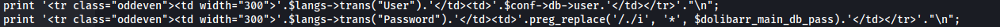

---
---

# HTB - BoardLight

NMAP


- From the website we get the domain name:


Add board.htb to /etc/hosts

- Subdomain enum:

`gobuster vhost -u http://board.htb -w /usr/share/seclists/Discovery/DNS/subdomains-top1million-110000.txt -t 64 --append-domain`


We get:

**crm.board.htb**:

- Got a login site:


Guessed **admin : admin**

- And we're in:


- We can see it runs **Dolibarr 17.0.0**

**<u>RCE exploit:</u>**

On the website tab - we can get RCE
<https://www.swascan.com/security-advisory-dolibarr-17-0-0/>

(The website resets quite often)

- Create new website
- Import website template
(I chose the first template and used the About Us page)
- Edit HTML Source

- I tested with:
\<?php includeContainer('header'); ?\>

\<section id="mysection1" contenteditable="true"\>

```bash
\<?**PHP** echo system("whoami");?\>

```
\</section\>

\<?php includeContainer('footer'); ?\>


- Now if we use Pentestmonkey PHP rev shell and paste that inside the boilerplate code:
\<?php includeContainer('header'); ?\>

\<section id="mysection1" contenteditable="true"\>

**\<Pentest Monkey code - Change to Capital PHP\>**

\</section\>

\<?php includeContainer('footer'); ?\>


- Set up listener
- Click save


```bash
/usr/bin/script -qc /bin/bash /dev/null

```
- Upload LinPEAS

We can see port 3306 open - MySQL


Also, it found a database.php file:

/var/www/html/crm.board.htb/htdocs/admin/system/database.php




The file itself shows us the variables imported from the conf.php file ie. \$dolibarr_main_db_pass

- The conf file is located in:
/var/www/html/crm.board.htb/htdocs/conf/conf.php


And here we get MySQL creds

\$dolibarr_main_db_user='**dolibarrowner**';

\$dolibarr_main_db_pass='**serverfun2\$2023!!**';


```bash
show databases;
use dolibarr;
show tables;

```
There are a lot of tables in the DB

To find which have data do:

```bash
SELECT TABLE_NAME,TABLE_ROWS FROM INFORMATION_SCHEMA.TABLES WHERE TABLE_SCHEMA = 'dolibarr';

```


- After messing around with trying to crack the hash - which is a dead end and not needed:

I reused the mysql user password for larissa.

```bash
su larissa

# serverfun2\$2023!!
```


- We can now SSH in


```bash
cat user.txt

```
**<u>Priv Esc</u>**

- In LinPEAS (updated version) - we see the unknown SUID binaries - enlightenment:


- There is an exploit for this:
<https://www.exploit-db.com/exploits/51180>

- Run the bash script:


- Root:

