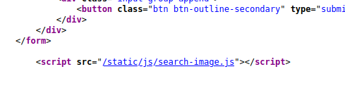
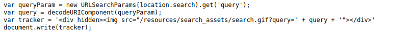
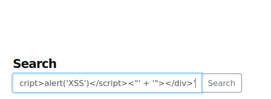
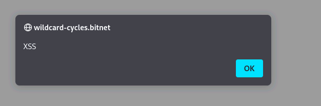

---
---

# IML - Cross-Site Scripting: Ep.4 – DOM-Based XSS






**<u>Original query:</u>**
```bash
var tracker = '<div hidden></div>'

```
**<u>Inject the following:</u>**
```bash
'"\>\<script\>alert('XSS')\</script\>\<"'

```
**<u>Malicious query:</u>**
```bash
var tracker = '<div hidden><script>alert('XSS')</script><"' + '"></div>'

```
Paste entire malicious code above into Search box





