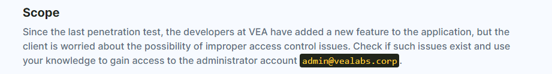
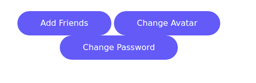
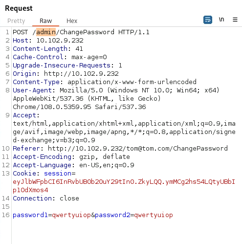
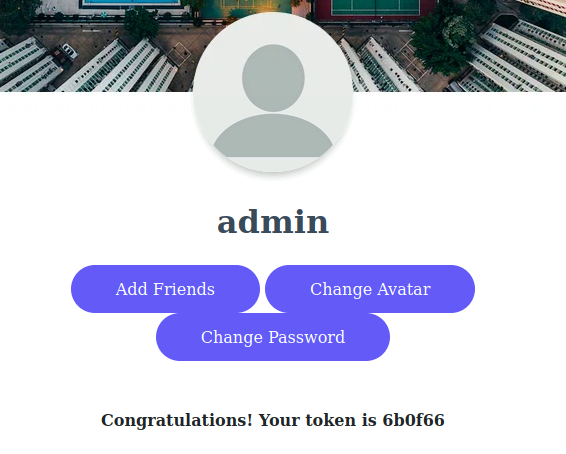

---
---

# IML - Mini CTF: Vulnerable Web App – Ep.2

- Register again (don't need that email as a username)

- We get change password:

- Capture in Burp - change the username to admin:

- Login with the admin email and password you made

