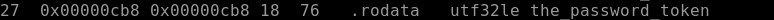
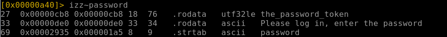
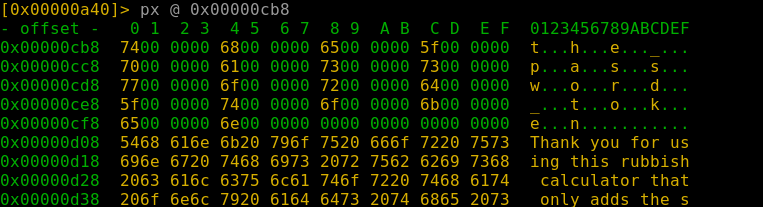
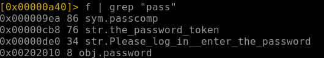

---
---

# IML - Radare2 Reverse Engineering: Ep.2 – Windows Binary Part 2

- We can read all the strings in the binary with:

```bash
izz

```



or to be more precise - we can do:

```bash
izz~password

```



- And we get the password:  
  **the_password_token**

- Now if we take the address of the password - we can print out a block starting at that position:



And we get the address of the 7th character

- To get the password compare function we can do:

```bash
f | grep "pass"

```


