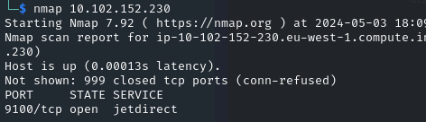
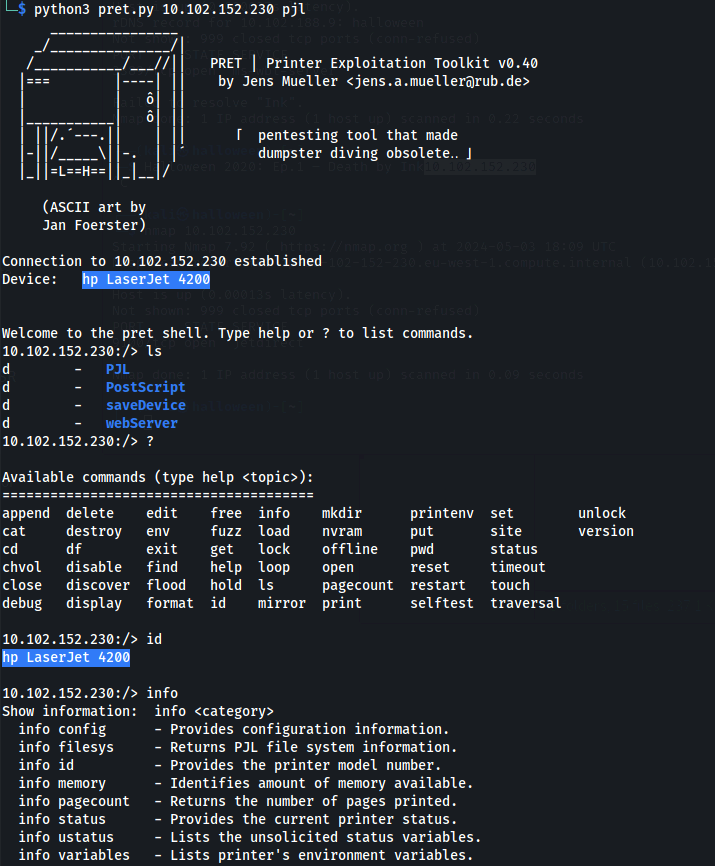
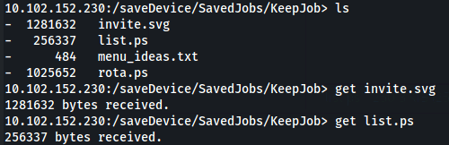

---
---

# IML - Halloween 2020: Ep.1 – Death by Ink (PRET)

This lab is about exploiting port 9100 - used by network printers and using PRET to do it

- After a scan, we see port 9100 is open:



- And we have PRET on the Desktop
<https://github.com/RUB-NDS/PRET>

```bash
python3 pret.py 10.102.152.230 pjl

```



- If we look in:



- And download list.ps

- We get the flag
